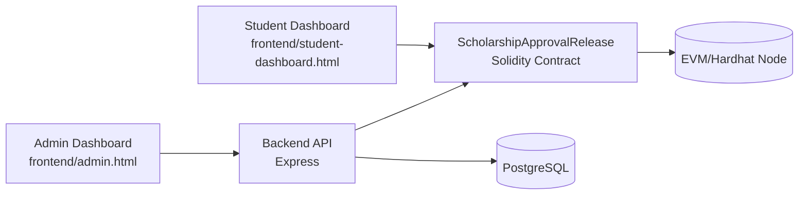
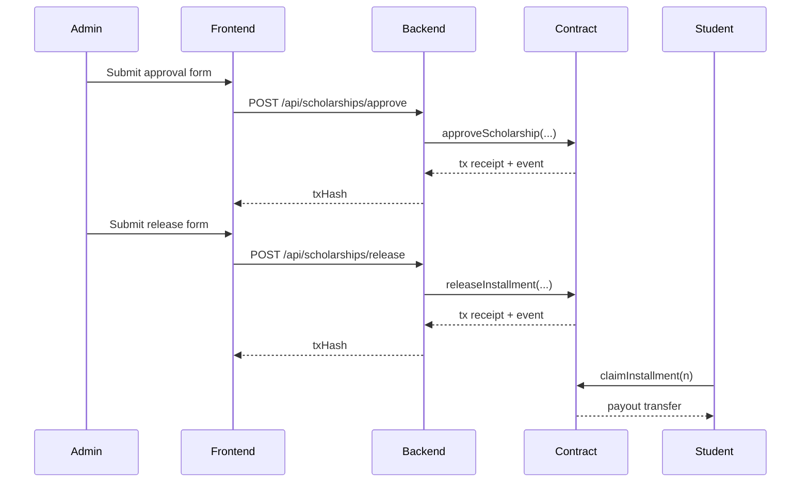
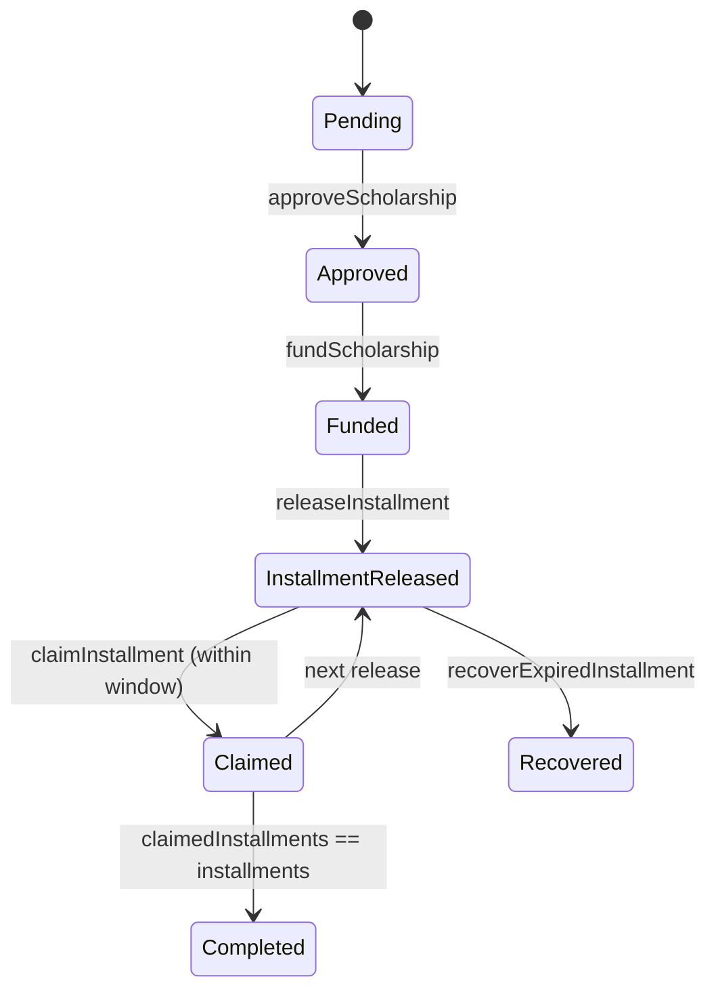
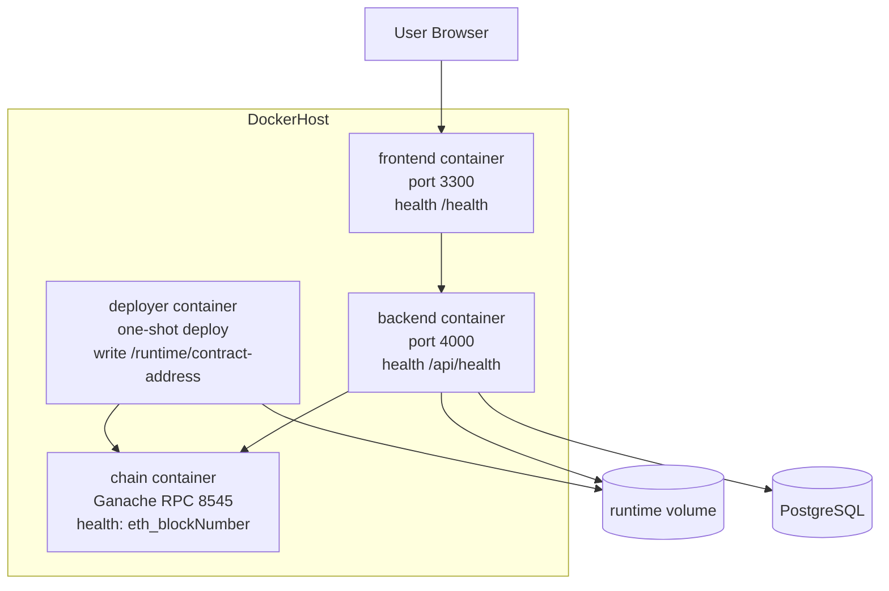
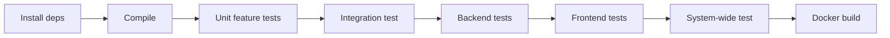

# Quickstart

This guide explains how to set up, run, test, and operate the Scholarship Disbursement system in a local environment and with Docker.

Project runtime entry points:
- Frontend pages: `frontend/index.html`, `frontend/admin.html`, `frontend/student-dashboard.html`
- Frontend scripts: `frontend/js/admin-dashboard.js`, `frontend/js/student-dashboard.js`
- Backend app: `backend/src/app.js` and `backend/src/server.js`

## 1) Prerequisites

- Node.js 20+
- npm 10+
- Docker + Docker Compose
- (Optional) MetaMask for dashboard interactions
- (Optional) Hardhat local node for blockchain interactions

## 2) Clone and install

```bash
git clone https://github.com/shyan179/ScholarshipDisbursement.git
cd ScholarshipDisbursement
npm install
```

## 3) Configure environment

Create `.env` from example and fill values:

```bash
cp .env.example .env
```

Minimum values for local backend API:

- `PORT=4000`
- `RPC_URL=http://127.0.0.1:8545`
- `DOCKER_RPC_URL=http://chain:8545`
- `CHAIN_ID=31337`
- `CONTRACT_ADDRESS=<deployed-contract-address>`
- `ADMIN_PRIVATE_KEY=<admin-wallet-private-key>`

Docker behavior:

- `CONTRACT_ADDRESS` may be empty; backend bootstrap deploys contract automatically in Docker and reads from `/app/runtime/contract-address`
- if `ADMIN_PRIVATE_KEY` is empty, default Hardhat local dev key is used

Optional audit persistence (PostgreSQL):

- `DATABASE_URL=postgresql://<user>:<password>@<host>:5432/<db>`
- `DOCKER_DATABASE_URL=postgresql://<user>:<password>@postgres:5432/<db>` (used by backend container)

## 4) Compile and test first (recommended)

Compile contract:

```bash
npm run compile
```

Run complete tests:

```bash
npm run test:all
```

Windows PowerShell note:
- If `npm` is blocked by execution policy, use `npm.cmd` instead (for example `npm.cmd run test:all`).

## 5) Local environment run (without Docker)

### Step 5.1 Start local blockchain node

In terminal A:

```bash
npx hardhat node
```

### Step 5.2 Deploy contract

In terminal B:

```bash
npm run deploy:local
```

Copy printed contract address into `.env` as `CONTRACT_ADDRESS`.

### Step 5.3 Start backend

In terminal C:

```bash
npm run start:backend
```

Health check:

```bash
curl http://localhost:4000/api/health
```

### Step 5.4 Start frontend

In terminal D:

```bash
npm run start:frontend
```

Open:

- Frontend: `http://localhost:3300`
- Backend: `http://localhost:4000`

## 6) Docker setup

This path supports two profiles:

- `hardhat` profile: local chain + auto deploy
- `sepolia` profile: external RPC only (no local chain container)

Services:
- `postgres` (audit persistence with auto-applied schema)
- `backend` (API)
- `frontend` (dashboard hosting)
- `chain` + `deployer` (only when `hardhat` profile is enabled)

Build images:

```bash
docker compose build
```

Run containers (Hardhat):

```bash
docker compose --profile hardhat up -d --build
```

Run containers (Sepolia):

```bash
docker compose up -d --build
```

For Sepolia mode set in `.env` before startup:
- `NETWORK_PROFILE=sepolia`
- `SEPOLIA_RPC_URL=<provider-url>`
- `SEPOLIA_ADMIN_PRIVATE_KEY=<deployer/admin-key>`
- `SEPOLIA_CONTRACT_ADDRESS=<already-deployed-address>`

Check status:

```bash
docker compose ps
```

Expected:
- Hardhat mode: `postgres`, `chain`, `backend`, `frontend` healthy, `deployer` exits `0`.
- Sepolia mode: `postgres`, `backend`, `frontend` healthy.

Optional check:

```bash
curl http://localhost:4000/api/health
curl http://localhost:4000/api/runtime/network
```

Stop:

```bash
docker compose down
```

## 7) API smoke examples

Protected API endpoints require authentication/session and role.
For legacy local testing, the backend currently accepts `x-user-role` header path.

Approve scholarship:

```bash
curl -X POST http://localhost:4000/api/scholarships/approve \
  -H "x-user-role: admin" \
  -H "Content-Type: application/json" \
  -d '{"studentAddress":"0x0000000000000000000000000000000000000001","amountWei":"1000000000000000000","installments":2,"claimWindowSeconds":86400}'
```

Release installment:

```bash
curl -X POST http://localhost:4000/api/scholarships/release \
  -H "x-user-role: admin" \
  -H "Content-Type: application/json" \
  -d '{"studentAddress":"0x0000000000000000000000000000000000000001","installmentNumber":1}'
```

List approved students:

```bash
curl -H "x-user-role: auditor" http://localhost:4000/api/scholarships/approved
```

## 8) Test matrix

- Feature unit tests:
  - `npm run test:feature:approval`
  - `npm run test:feature:release`
  - `npm run test:feature:claim`
  - `npm run test:feature:audit`
- Integration test:
  - `npm run test:integration`
- System-wide test:
  - `npm run test:system`
- Backend tests:
  - `npm run test:backend`
- Frontend tests:
  - `npm run test:frontend`
- Full suite:
  - `npm run test:all`

## 9) Mermaid diagrams

### 9.1 High-level architecture



### 9.2 Approval and release sequence



### 9.3 Contract state transitions



### 9.4 Container deployment



### 9.5 CI test pipeline concept



## 10) Troubleshooting

- Backend 503 `Contract client not configured`
  - local mode: check `.env` for `CONTRACT_ADDRESS`, `ADMIN_PRIVATE_KEY`, and `RPC_URL`
  - docker mode: check `chain` is healthy and backend bootstrap logs (`docker compose logs backend`)
- Docker health stuck `starting`
  - check logs: `docker compose logs chain` / `docker compose logs backend` / `docker compose logs frontend`
- Failing chain interactions
  - local mode: ensure `npx hardhat node` is running
  - docker mode: ensure `chain` service is healthy
- Hardhat `MultiProcessMutexTimeoutError` on compiler cache lock
  - wait and rerun (interrupted runs can leave transient locks)
  - avoid running multiple Hardhat test/compile commands in parallel
  - run tests sequentially (feature tests first, then integration/system)
