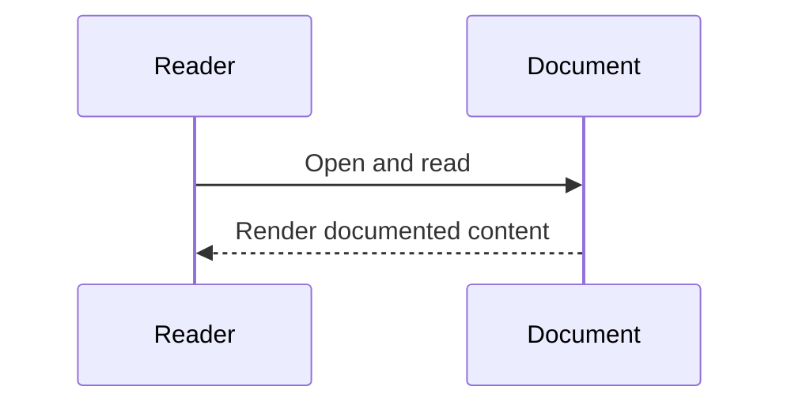

# Scholarship Disbursement

Scholarship approval and release platform with a Solidity contract, Hardhat tests, admin/student dashboards, and an Express backend ready for local and containerized delivery.

## Verified Architecture Docs

- Canonical engineering diagrams and subsystem documentation are in:
  - [docs/README.md](C:\Users\Ahmed\Desktop\projects\blockchain\ScholarshipDisbursement\docs\README.md)
- Those docs are generated/updated from implemented code paths (routes/services/repositories/schema/compose/scripts), including:
  - session/RBAC auth flows
  - MetaMask student login flow
  - telemetry + export flows
  - hardhat/sepolia profile deployment wiring

## Requirement Check (Ahmed Banby scope)

The requested scope was checked against this project and implemented where missing:

- `Scholarship Approval and Release Contract` -> implemented in `contracts/ScholarshipApprovalRelease.sol`
- `Approved student list` -> `getApprovedStudents()` and `isApproved()`
- `Amount per recipient` -> approval stores `totalAmount` per student
- `Payout transaction` -> admin releases installment; student claims payout
- `Admin-only approval` -> enforced via `onlyOwner`
- `Installment release` -> `releaseInstallment(student, installmentNumber)`
- `Claim window` -> `claimWindowSeconds` + per-installment `claimDeadline`
- `Audit event log` -> events emitted for approval/funding/release/claim/recovery

## Current Scope

- Active contract: `contracts/ScholarshipApprovalRelease.sol`
- Active dashboards: `frontend/admin.html`, `frontend/student-dashboard.html`, `frontend/index.html`
- Active backend: `backend/src/app.js`, `backend/src/server.js`
- Legacy files removed from repository

## Stack

- Solidity payable contract
- Hardhat + ethers.js
- Admin dashboard (`frontend/admin.html`) and student dashboard (`frontend/student-dashboard.html`)
- Node.js/Express backend (`backend/src`)
- PostgreSQL persistence for audit history

## Test Strategy and Status

All requested layers are present and passing:

- Single-feature tests
  - `test/unit/approval.feature.test.js`
  - `test/unit/release.feature.test.js`
  - `test/unit/claim-window.feature.test.js`
  - `test/unit/audit-events.feature.test.js`
- Unit level: bundled via `npm run test:unit`
- Integration level: `test/integration/workflow.integration.test.js`
- System-wide level: `test/system/system-wide.e2e.test.js`
- Backend API tests: `test/backend/api.test.js`
- Frontend structure tests: `test/frontend/pages.test.js`

Run all criteria in one command:

```bash
npm run test:all
```

## Quickstart

- A detailed step-by-step setup guide is available in `QUICKSTART.md`
- Includes:
  - local setup
  - Docker setup
  - full test strategy
  - Mermaid architecture and workflow diagrams

## Docker Delivery

```bash
docker compose build
docker compose --profile hardhat up -d
docker compose ps
```

Hardhat profile auto-bootstraps:

- `chain` service (dedicated image) starts local Ganache RPC (`8545`)
- `deployer` service (dedicated image) waits for chain, deploys `ScholarshipApprovalRelease`, writes address to shared runtime volume
- `backend` service (dedicated image) starts with prod dependencies and reads contract address from shared runtime volume
- `frontend` waits for backend health

Services expose:

- chain -> `http://localhost:8545`
- deployer -> one-shot job (exits after successful deployment)
- frontend -> `http://localhost:3300` (`/health`)
- backend -> `http://localhost:4000` (`/api/health`)

So after `docker compose up -d`, the stack is ready without manual blockchain/deployment steps.

Sepolia profile:

- use `docker compose up -d` (without `--profile hardhat`)
- set `NETWORK_PROFILE=sepolia`
- set `SEPOLIA_RPC_URL`, `SEPOLIA_ADMIN_PRIVATE_KEY`, `SEPOLIA_CONTRACT_ADDRESS`
- `chain` and `deployer` services are not started in this mode

## Deployment Plan

### 1) PostgreSQL (database)

- Use Docker service `postgres` (auto-initialized) or any managed PostgreSQL
- Run schema in `postgres/init/001_schema.sql` if not using the Docker bootstrap
- Set `DATABASE_URL` in backend env

### 2) Render (backend)

- Create a new Web Service from this repo
- Build command: `npm install`
- Start command: `npm run start:backend`
- Set env vars from `.env.example`
- Confirm health endpoint: `/api/health`

### 3) Vercel (frontend)

- Import the same repo
- Framework preset: Other
- Build command: leave empty
- Output directory: `.`
- Set frontend API target (if needed) to your Render URL

## Dependency Update Notes

- Updated incrementally and re-tested after changes:
  - `dotenv` -> `17.4.2`
  - `express` -> `5.2.1`
  - `mocha` -> `11.7.5`
- Completed migration to Hardhat 3-compatible stack:
  - `hardhat` -> `3.4.2`
  - `@nomicfoundation/hardhat-ethers` -> `4.0.9`
  - `@nomicfoundation/hardhat-ethers-chai-matchers` -> `3.0.0`
  - `@nomicfoundation/hardhat-mocha` -> `3.0.17`
  - `@nomicfoundation/hardhat-network-helpers` -> `3.0.6`
  - `chai` -> `5.2.2`
- Removed deprecated chain from dependencies (`inflight` and `glob@7` no longer present)

## Environment Setup

- `.env` is included for ready local/dev startup
- Key values used:
  - `RPC_URL=http://127.0.0.1:8545` (local backend)
  - `DOCKER_RPC_URL=http://chain:8545` (backend in Docker)
  - `CHAIN_ID=31337`
  - `CONTRACT_ADDRESS` can be left empty in Docker (backend bootstrap auto-deploys and resolves from file)
  - `ADMIN_PRIVATE_KEY` defaults to Hardhat local dev key if omitted

## Network Switching (Hardhat <-> Sepolia)

Use `.env` only, no code changes required:

1. Set `NETWORK_PROFILE=hardhat` or `NETWORK_PROFILE=sepolia`.
2. Fill profile-specific vars:
   - Hardhat: `HARDHAT_RPC_URL`, `HARDHAT_CHAIN_ID`, `HARDHAT_ADMIN_PRIVATE_KEY`, `HARDHAT_CONTRACT_ADDRESS`
   - Sepolia: `SEPOLIA_RPC_URL`, `SEPOLIA_CHAIN_ID`, `SEPOLIA_ADMIN_PRIVATE_KEY`, `SEPOLIA_CONTRACT_ADDRESS`
3. Keep generic keys (`RPC_URL`, `CHAIN_ID`, `ADMIN_PRIVATE_KEY`, `CONTRACT_ADDRESS`) as fallback only.

Deploy commands:

```bash
npm run deploy:local
npm run deploy:sepolia
```

## Notes

- Core requested features are implemented and tested in contract + tests:
  - Installment Release
  - Claim Window
  - Audit Event Log

## Sequence Diagram

