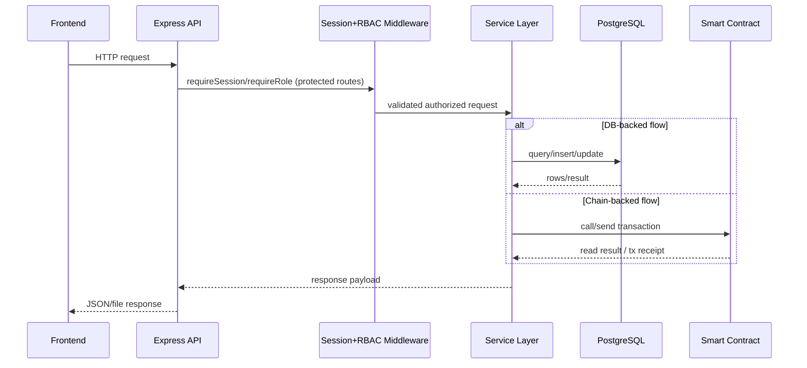
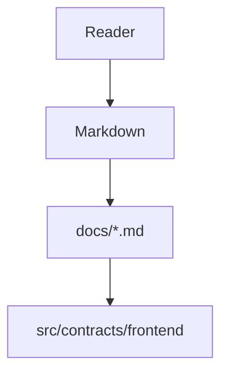
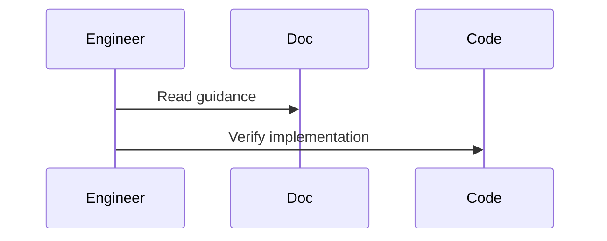

# Requirements Execution Tasks

## Context
This task plan is derived from:
- `requirements.md`
- `gap_missing.md`

Functional requirements (R1-R8) are already implemented.  
Current work focuses on **delivery/submission completeness**, **demo artifacts**, and **reproducible validation**.

## Execution Rules
- Keep API contracts and protocol behavior unchanged unless explicitly approved.
- Prefer additive documentation/artifact work first.
- Every task must have an objective completion signal.

## Priority Board

## P0 - Submission Packet Completion (Blocking)

### T-001: Build canonical submission narrative document
- Status: `done`
- Priority: `P0`
- Output:
  - `docs/submission-packet.md`
- Must include sections (exact grading alignment):
  1. Project title
  2. Problem statement
  3. Why blockchain is appropriate
  4. System architecture diagram
  5. Smart contract design
  6. Frontend/backend stack and rationale
  7. Demo evidence references
  8. Limitations and future improvements
- Acceptance criteria:
  - Document exists and is complete.
  - Mermaid diagram renders and matches implementation (`docker-compose.yml`, frontend/backend/contract paths).
  - No contradictions with `docs/codebase.md`.

### T-002: Add focused security/design decisions section
- Status: `done`
- Priority: `P0`
- Output:
  - Add section in `docs/submission-packet.md` named `Security Controls and Design Decisions`
- Must cover:
  - owner-only admin controls
  - installment ordering invariant
  - claim window enforcement + recovery path
  - payout safety assumptions
  - audit trails (events + PostgreSQL)
- Acceptance criteria:
  - Each design decision links to a concrete code path (file/function names).

### T-003: Create demo evidence artifacts directory and index
- Status: `done`
- Priority: `P0`
- Output:
  - `docs/demo/README.md`
  - `docs/demo/screenshots/` (placeholder structure)
- Must define required captures:
  1. Admin approve success
  2. Admin release success
  3. Student wallet connected
  4. Student claim success
  5. Audit history populated
  6. Expired claim/recovery case (optional bonus)
- Acceptance criteria:
  - Demo index includes naming convention + capture checklist + insertion points for final image/video links.

## P1 - Reproducible Validation and Runbook

### T-004: Publish deterministic runbook for local + Docker demo
- Status: `done`
- Priority: `P1`
- Output:
  - `docs/runbook-e2e.md`
- Must include:
  - local flow commands
  - docker flow commands
  - expected service health outputs
  - expected API success/failure samples
  - known lock/network mitigations for Hardhat wrapper
- Acceptance criteria:
  - A reviewer can execute command sequence without discovering hidden prerequisites.

### T-005: Add validation matrix tied to requirements IDs
- Status: `done`
- Priority: `P1`
- Output:
  - Add `Requirements Validation Matrix` section in `docs/submission-packet.md`
- Matrix columns:
  - Requirement ID
  - Evidence (file/function/test)
  - Validation command
  - Result placeholder
- Acceptance criteria:
  - Covers R1-R9 completely.

## P2 - Documentation Consistency and Packaging

### T-006: Cross-link all docs and enforce one canonical entrypoint
- Status: `done`
- Priority: `P2`
- Output:
  - `docs/README.md` with reading order
  - links to `codebase.md`, `submission-packet.md`, runbook, domain docs
- Acceptance criteria:
  - New contributor can navigate the full doc set from one page.

### T-007: Add assumptions and limitations appendix
- Status: `done`
- Priority: `P2`
- Output:
  - `docs/assumptions-limitations.md`
- Must include:
  - trust assumptions (owner key, chain environment)
  - operational limitations (single owner, direct student on-chain claim)
  - future improvements roadmap
- Acceptance criteria:
  - Referenced by `submission-packet.md`.

---

## Implementation Sequence (Do First)
1. T-001
2. T-002
3. T-003
4. T-004
5. T-005
6. T-006
7. T-007

## Verification Commands
- `npm.cmd run compile`
- `npm.cmd run test:unit`
- `npm.cmd run test:integration`
- `npm.cmd run test:system`
- `npm.cmd run test:backend`
- `npm.cmd run test:frontend`
- `docker compose up -d --build`
- `docker compose ps`

## Immediate Next Action
- Capture and attach real demo evidence files in `docs/demo/screenshots/`, then set matrix `Result` values in `docs/submission-packet.md`.

## Sequence Diagram

## How this feature implemented ?

### 1. Feature Overview
This markdown describes implemented repository behavior and links to source-backed docs under `docs/`.

### 2. Entry Points

#### Diagram Explanation
This file is documentation-level entry. Technical entry points are in referenced implementation docs and source files.

### 3. Internal Execution Flow
Behavior unclear from current codebase in this documentation-only artifact; execution details live in implementation files.

#### Diagram Explanation
Expected verification workflow from documentation to code.

### 4-14
Implementation not found directly in this documentation artifact; use implementation-specific docs in `docs/` for full architecture, data flow, lifecycle, error handling, security, performance, tradeoffs, and risk analysis.
