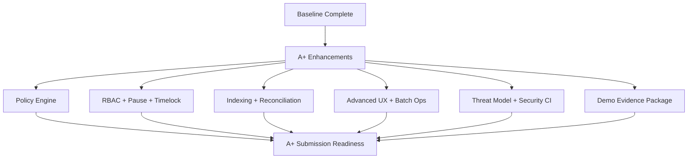
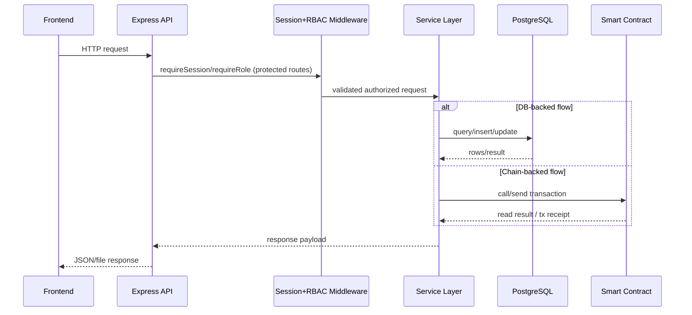
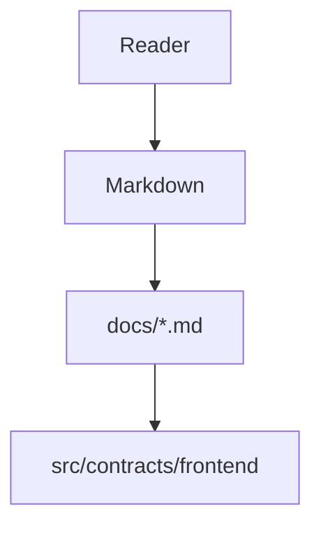
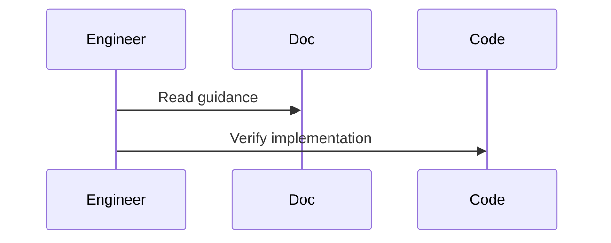

# advances.md

Assumption: all requirements in `requirements.md`, `gap_missing.md`, and `assume_gap` are fully completed.

Goal: identify **additional features and deliverables** that push the project to **A+ quality** against the `Submission_Grading` rubric.

## 1) A+ Strategy by Grading Weight

## Problem understanding and use-case fit (20%)
Add:
1. Multi-stakeholder workflow modes
- University admin mode
- Sponsor/funder mode
- Student self-service mode

2. Policy templates
- Need-based scholarship template
- Merit-based scholarship template
- Emergency aid template

3. Explainability dashboard
- Why each approval/release action occurred
- Rule trace (which policy condition passed/failed)

A+ effect:
- Moves from "working app" to "real institutional workflow fit".

## Smart contract logic and correctness (25%)
Add:
1. Role-based access control (beyond single owner)
- `DEFAULT_ADMIN_ROLE`, `APPROVER_ROLE`, `RELEASER_ROLE`, `AUDITOR_ROLE`

2. Formal invariant checks and property-based tests
- Total claimed <= total approved
- Released installments monotonicity
- No double-claim under all transitions

3. Upgrade-safe architecture (if required)
- UUPS/transparent proxy pattern with governance guardrails
- Versioned storage-layout documentation

4. Emergency controls
- Pause/unpause (`circuit breaker`)
- Timelocked sensitive actions

A+ effect:
- Stronger correctness guarantees and operational safety.

## Blockchain integration and transaction flow (15%)
Add:
1. Event indexing layer
- Real-time event listener service
- Deterministic projection tables for fast querying

2. Transaction lifecycle UX
- pending -> confirmed -> finalized states
- replacement transaction handling (speed-up/cancel)

3. Chain abstraction
- Local Hardhat + testnet profile support
- Network capability matrix and guardrails

A+ effect:
- Production-like chain operations instead of demo-only flow.

## UI/API quality (15%)
Add:
1. Full API contract spec
- OpenAPI 3.1 with request/response examples
- Error model catalog with stable codes

2. Advanced admin UX
- Batch approvals/releases
- Filterable audit ledger
- CSV export and reconciliation tools

3. Student UX improvements
- Claim countdown timer
- Eligibility/release timeline visualization
- Wallet/network diagnostics panel

A+ effect:
- Better usability, clarity, and API professionalism.

## Security, privacy, and design decisions (15%)
Add:
1. Threat model package
- STRIDE/LINDDUN style threat matrix
- Mitigation-to-code traceability

2. Security controls
- Rate limits + anti-abuse policies
- Input canonicalization and strict schema validation
- Secret scanning + dependency vulnerability checks in CI

3. Privacy enhancements
- Optional pseudonymous student identifiers (hashed IDs)
- Minimal on-chain personally identifiable data strategy

A+ effect:
- Demonstrable security engineering maturity.

## Presentation, explanation, and demo quality (10%)
Add:
1. Guided demo mode
- Seed script creating realistic scenario data
- One-command walkthrough with expected outputs

2. Evidence-quality package
- Time-stamped screenshots for each key flow
- 3�5 minute narrated demo video
- Failure-mode demos (unauthorized access, expired claim, insufficient funds)

3. Story-driven documentation
- Before/after architecture evolution
- Design tradeoffs and rejected alternatives

A+ effect:
- Clear evaluator confidence and polished communication.

## 2) High-Impact New Features (Beyond Rubric Minimum)

1. Scholarship policy engine
- Rule DSL for eligibility/release policies
- Policy simulation before on-chain commit

2. Dispute and exception workflow
- Student dispute submission
- Admin review with decision audit trail

3. Oracle-backed verification (optional)
- Verified enrollment status feed
- GPA/attendance attestation feed

4. Treasury analytics
- Funding runway forecast
- Released vs claimed vs recovered trend analysis

5. Governance and transparency
- Multi-sig admin actions
- Public audit dashboard (read-only)

## 3) A+ Documentation Additions (Mermaid-First)

Add dedicated sections with these diagrams:
1. System context diagram
2. Sequence diagrams for success + failure paths
3. State machine for scholarship/installment lifecycle
4. Threat model data-flow diagram
5. CI/CD and test-quality pipeline diagram

## 4) A+ Verification Matrix

| Area | A+ Evidence |
|---|---|
| Correctness | Invariant/property tests + edge-case suite + deterministic replay |
| Security | Threat model + mitigations + automated security checks |
| UX/API | OpenAPI spec + stable error codes + advanced operator workflows |
| Blockchain Flow | Event indexer + tx lifecycle handling + network profiles |
| Demo | Scripted walkthrough + screenshots + narrated video + failure demos |
| Documentation | Comprehensive architecture/security/design docs with Mermaid |

## 5) Suggested Prioritized Build Order

1. RBAC + pause/timelock + invariant tests
2. Event indexer + reconciliation layer
3. API contract (OpenAPI) + standardized error model
4. Admin batch operations + student claim timeline UX
5. Threat model + security automation in CI
6. Final demo evidence pack + polished narrative documentation

If all above is implemented with stable tests and clear documentation, the project moves from �complete� to **A+ caliber** against the grading sheet.

## Sequence Diagram

## How this feature implemented ?

### 1. Feature Overview
This markdown describes implemented repository behavior and links to source-backed docs under `docs/`.

### 2. Entry Points

#### Diagram Explanation
This file is documentation-level entry. Technical entry points are in referenced implementation docs and source files.

### 3. Internal Execution Flow
Behavior unclear from current codebase in this documentation-only artifact; execution details live in implementation files.

#### Diagram Explanation
Expected verification workflow from documentation to code.

### 4-14
Implementation not found directly in this documentation artifact; use implementation-specific docs in `docs/` for full architecture, data flow, lifecycle, error handling, security, performance, tradeoffs, and risk analysis.
