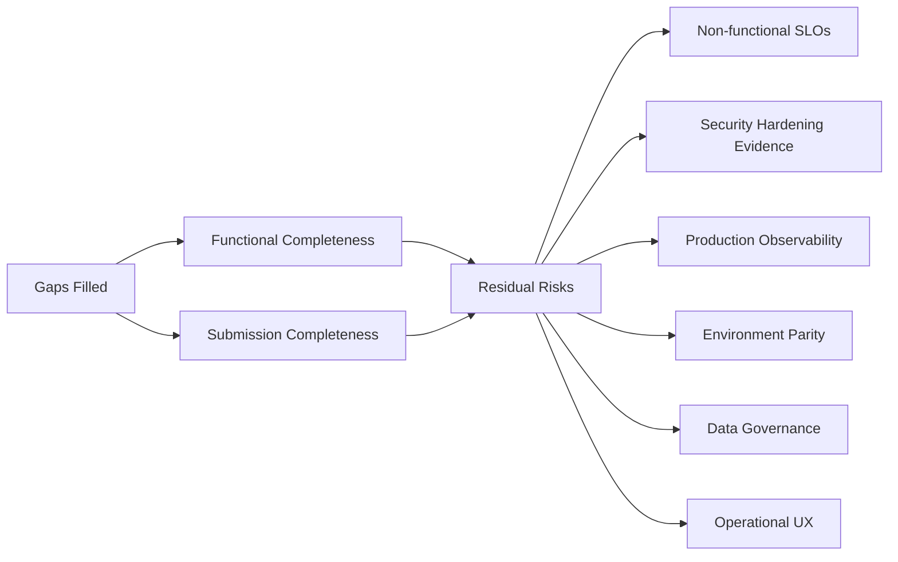
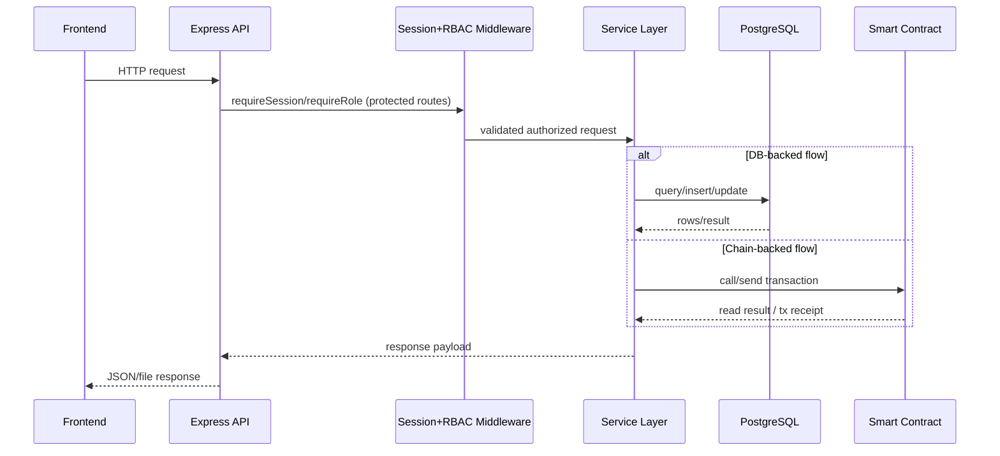
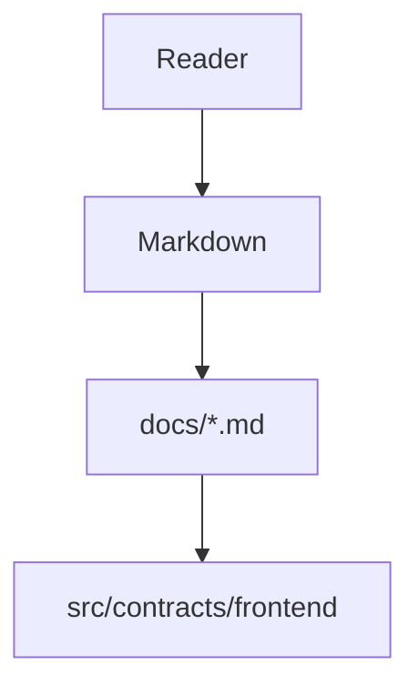
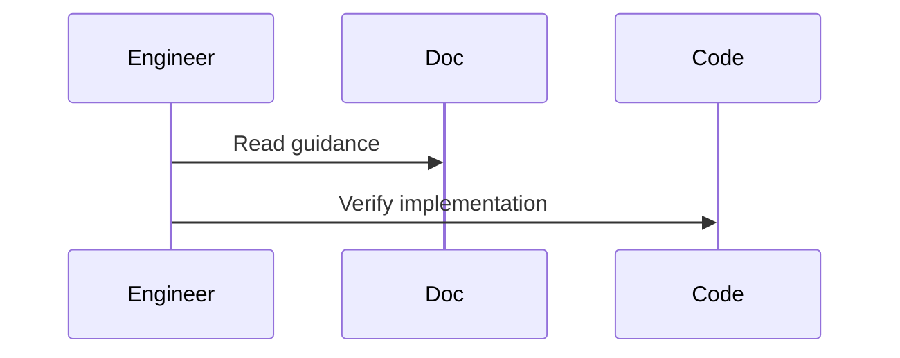

# assume_gap

Assumption: all identified gaps in `gap_missing.md` are fully addressed and completed.

Question answered: **After filling those gaps, what could still be missing?**

## 1) Residual Missing Items (Post-Gap)

Even after current known gaps are closed, the system may still miss:

1. Formal non-functional SLOs
- Target latency per inference/transaction path
- Availability/retry expectations
- Throughput expectations under load

2. Security hardening evidence
- Threat model document
- Key management policy (admin key custody/rotation)
- Abuse scenarios (spam funding, repeated claim attempts, malformed payload abuse)

3. Production-grade observability package
- Structured logs schema
- Metrics dashboard definition (API latency, tx success rate, claim failures)
- Alerting thresholds and incident-response runbook

4. Deployment environment parity
- Explicit dev/staging/prod config matrix
- Version pinning strategy and upgrade policy
- Disaster recovery and backup/restore instructions

5. Data governance clarity (if Supabase is used in production)
- Retention policy for audit rows
- Access policy / least privilege for service-role key
- Data consistency reconciliation process (on-chain events vs DB rows)

6. UX completeness for operational users
- Admin troubleshooting UI (tx pending/reverted reasons)
- Student guidance for wallet/network mismatch
- Error taxonomy displayed in user-friendly language

## 2) Quality Gate Still Needed

A final �definition of done� gate should still require:
- Full automated test pass in a clean environment
- End-to-end demo script run with reproducible outputs
- Security checklist sign-off
- Documentation peer review for diagram renderability and section completeness

## 3) Mermaid Residual View

## 4) Practical Next Checklist
1. Add SLO + load expectations document.
2. Add security threat model + key management policy.
3. Add observability and alerting runbook.
4. Add environment parity matrix and rollback plan.
5. Add on-chain/off-chain reconciliation procedure.

This is what can still be missing **even after** the currently known requirement gaps are fully resolved.

## Sequence Diagram

## How this feature implemented ?

### 1. Feature Overview
This markdown describes implemented repository behavior and links to source-backed docs under `docs/`.

### 2. Entry Points

#### Diagram Explanation
This file is documentation-level entry. Technical entry points are in referenced implementation docs and source files.

### 3. Internal Execution Flow
Behavior unclear from current codebase in this documentation-only artifact; execution details live in implementation files.

#### Diagram Explanation
Expected verification workflow from documentation to code.

### 4-14
Implementation not found directly in this documentation artifact; use implementation-specific docs in `docs/` for full architecture, data flow, lifecycle, error handling, security, performance, tradeoffs, and risk analysis.
