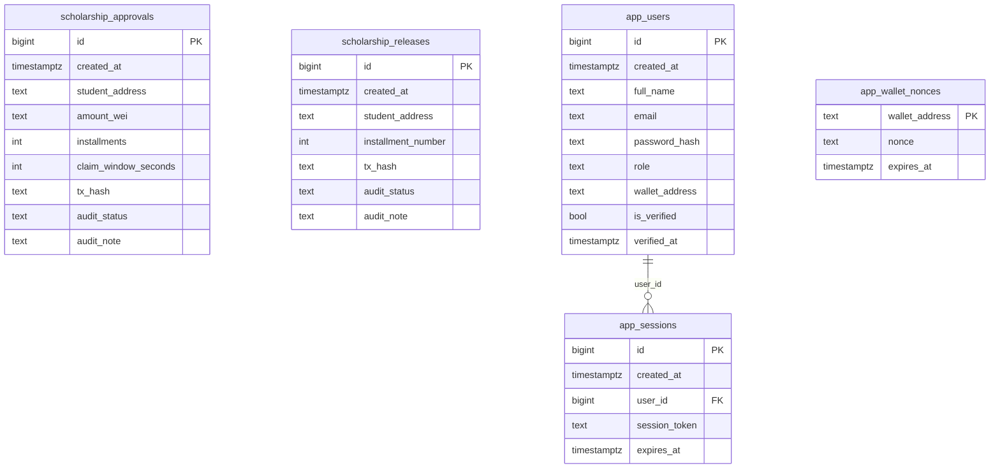
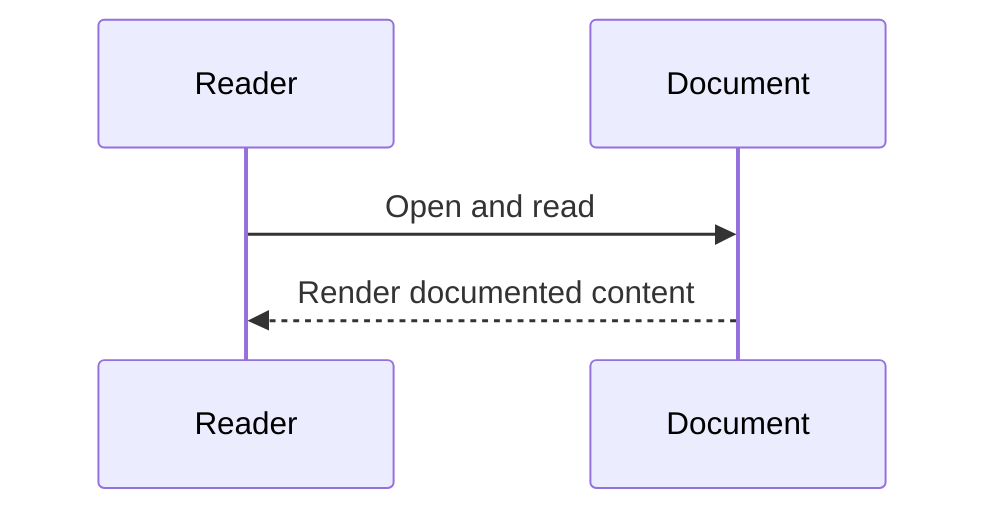

# Diagram Title
Database ER from 001_schema.sql

## Diagram Type
Database ER Diagram

## Scope
PostgreSQL tables, keys, and explicit FK constraints from initialization SQL.

## Verification Summary
Only SQL-defined entities/constraints included.

## Evidence Sources
- postgres/init/001_schema.sql:1-79

## Mermaid Diagram

## Confidence Level
High

## Unverified/Missing Areas
- No FK from app_wallet_nonces.wallet_address to app_users.wallet_address is defined.

## Sequence Diagram

