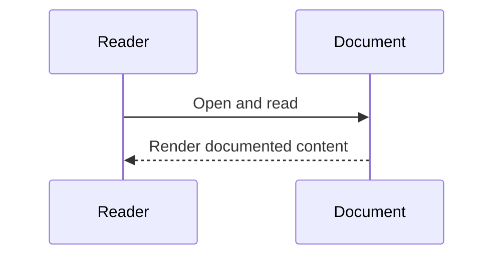

# Documentation Index (Implementation-Verified)

## Purpose
This index links architecture and engineering diagrams generated from current implemented code/config only.

## Verification Rules Used
- Diagram nodes/edges are derived from source files, SQL schema, Docker config, and test scripts.
- If implementation evidence is missing, the area is marked **UNVERIFIED**.

## Core Architecture Docs
1. [Codebase Map](C:\Users\Ahmed\Desktop\projects\blockchain\ScholarshipDisbursement\docs\codebase.md)
2. [Diagram Coverage Matrix](C:\Users\Ahmed\Desktop\projects\blockchain\ScholarshipDisbursement\docs\diagram-coverage.md)
3. [Backend Architecture](C:\Users\Ahmed\Desktop\projects\blockchain\ScholarshipDisbursement\docs\backend.md)
4. [Frontend Architecture](C:\Users\Ahmed\Desktop\projects\blockchain\ScholarshipDisbursement\docs\frontend.md)
5. [Contract Architecture](C:\Users\Ahmed\Desktop\projects\blockchain\ScholarshipDisbursement\docs\contracts.md)
6. [Database Architecture](C:\Users\Ahmed\Desktop\projects\blockchain\ScholarshipDisbursement\docs\database.md)
7. [Cross-System Interactions](C:\Users\Ahmed\Desktop\projects\blockchain\ScholarshipDisbursement\docs\cross-interactions.md)
8. [Blockchain Lifecycle](C:\Users\Ahmed\Desktop\projects\blockchain\ScholarshipDisbursement\docs\blockchain-lifecycle.md)
9. [Testing Architecture](C:\Users\Ahmed\Desktop\projects\blockchain\ScholarshipDisbursement\docs\testing.md)

## Script/Config-Specific Diagram Docs
- [app.js](C:\Users\Ahmed\Desktop\projects\blockchain\ScholarshipDisbursement\docs\app.js.md)
- [auth-routes.js](C:\Users\Ahmed\Desktop\projects\blockchain\ScholarshipDisbursement\docs\auth-routes.js.md)
- [auth-session.js](C:\Users\Ahmed\Desktop\projects\blockchain\ScholarshipDisbursement\docs\auth-session.js.md)
- [scholarship-routes.js](C:\Users\Ahmed\Desktop\projects\blockchain\ScholarshipDisbursement\docs\scholarship-routes.js.md)
- [admin-dashboard.js](C:\Users\Ahmed\Desktop\projects\blockchain\ScholarshipDisbursement\docs\admin-dashboard.js.md)
- [student-dashboard.js](C:\Users\Ahmed\Desktop\projects\blockchain\ScholarshipDisbursement\docs\student-dashboard.js.md)
- [ScholarshipApprovalRelease.sol](C:\Users\Ahmed\Desktop\projects\blockchain\ScholarshipDisbursement\docs\ScholarshipApprovalRelease.sol.md)
- [001_schema.sql](C:\Users\Ahmed\Desktop\projects\blockchain\ScholarshipDisbursement\docs\001_schema.sql.md)
- [docker-compose.yml](C:\Users\Ahmed\Desktop\projects\blockchain\ScholarshipDisbursement\docs\docker-compose.yml.md)
- [package.json](C:\Users\Ahmed\Desktop\projects\blockchain\ScholarshipDisbursement\docs\package.json.md)

## Additional Reference Docs
- [API Method Matrix](C:\Users\Ahmed\Desktop\projects\blockchain\ScholarshipDisbursement\docs\api-method-matrix.md)
- [Runbook E2E](C:\Users\Ahmed\Desktop\projects\blockchain\ScholarshipDisbursement\docs\runbook-e2e.md)
- [Submission Packet](C:\Users\Ahmed\Desktop\projects\blockchain\ScholarshipDisbursement\docs\submission-packet.md)

## CI/CD Coverage
- **UNVERIFIED**: no GitHub Actions/Jenkins/GitLab pipeline files are present in repository root/docs at time of generation.

## Sequence Diagram

