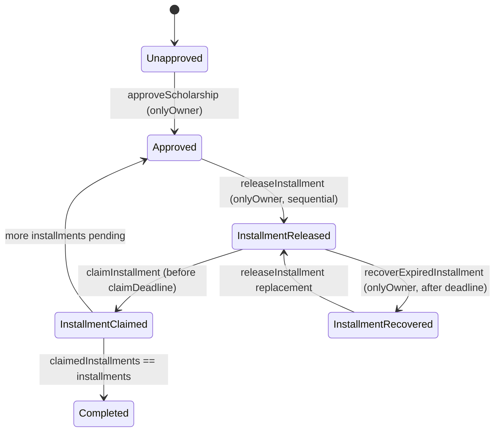
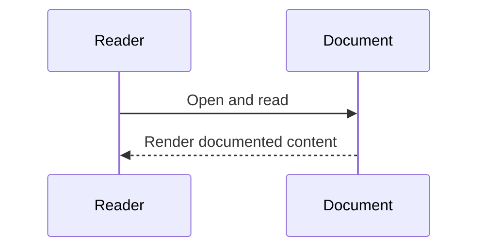

# Diagram Title
Contract State Machine from ScholarshipApprovalRelease.sol

## Diagram Type
State Machine Diagram

## Scope
Lifecycle transitions enforced by contract write functions and guards.

## Verification Summary
States inferred only from explicit function guards/counters in Solidity code.

## Evidence Sources
- contracts/ScholarshipApprovalRelease.sol:103-202
- contracts/ScholarshipApprovalRelease.sol:239-273

## Mermaid Diagram

## Confidence Level
Medium-High

## Unverified/Missing Areas
- No explicit enum state variable exists; state derives from struct fields and counters.

## Sequence Diagram

