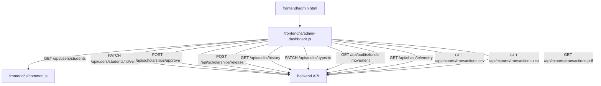
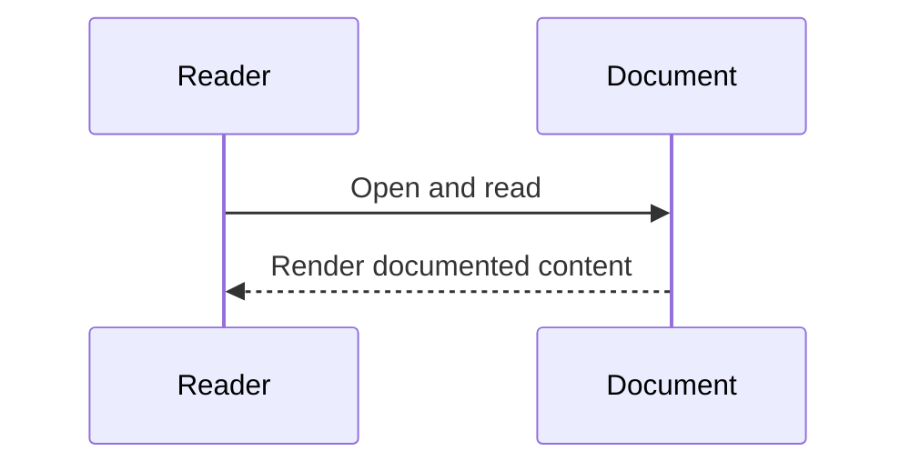

# Diagram Title
Frontend Hierarchy from admin-dashboard.js

## Diagram Type
Frontend Component Hierarchy (Script/DOM)

## Scope
DOM sections and API interactions orchestrated by admin dashboard script.

## Verification Summary
Based on direct `getElementById`, fetch calls, and event listeners.

## Evidence Sources
- frontend/js/admin-dashboard.js:3-31
- frontend/js/admin-dashboard.js:202-434
- frontend/admin.html (IDs consumed by script)

## Mermaid Diagram

## Confidence Level
High

## Unverified/Missing Areas
- No framework component tree (React/Vue) exists.

## Sequence Diagram

