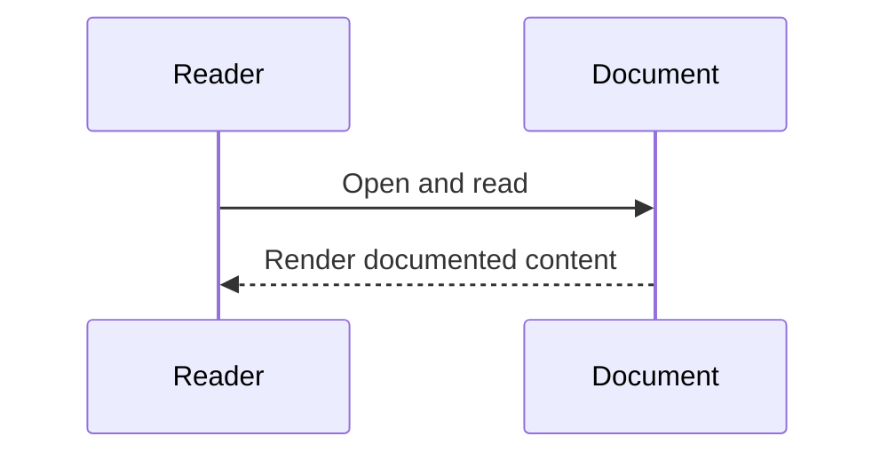

# API Method Matrix

## Read APIs (`GET`)
- `GET /api/health`
- `GET /api/runtime/network`
- `GET /api/users/students` (admin/auditor)
- `GET /api/scholarships/approved`
- `GET /api/audits/history`
- `GET /api/audits/funds-movement`
- `GET /api/chain/telemetry`
- `GET /api/exports/transactions.csv` (admin only)
- `GET /api/exports/transactions.xlsx` (admin only)
- `GET /api/exports/transactions.pdf` (admin only)

## Create/Action APIs (`POST`)
- `POST /api/auth/register`
- `POST /api/auth/login`
- `POST /api/auth/metamask/nonce`
- `POST /api/auth/metamask/login`
- `POST /api/scholarships/approve` (admin only)
- `POST /api/scholarships/release` (admin only)

## Update APIs (`PATCH`)
- `PATCH /api/users/students/:id/verify` (admin only)
- `PATCH /api/audits/:type/:id` (admin only)

## Auditability and Edit Boundaries
- On-chain events: funding, release, claim, recovery, approval.
- Off-chain audit rows: `scholarship_approvals`, `scholarship_releases`.
- Only `admin` can edit audit metadata/status.
- `auditor` and `student` have view-only access where allowed by role.

## Sequence Diagram

