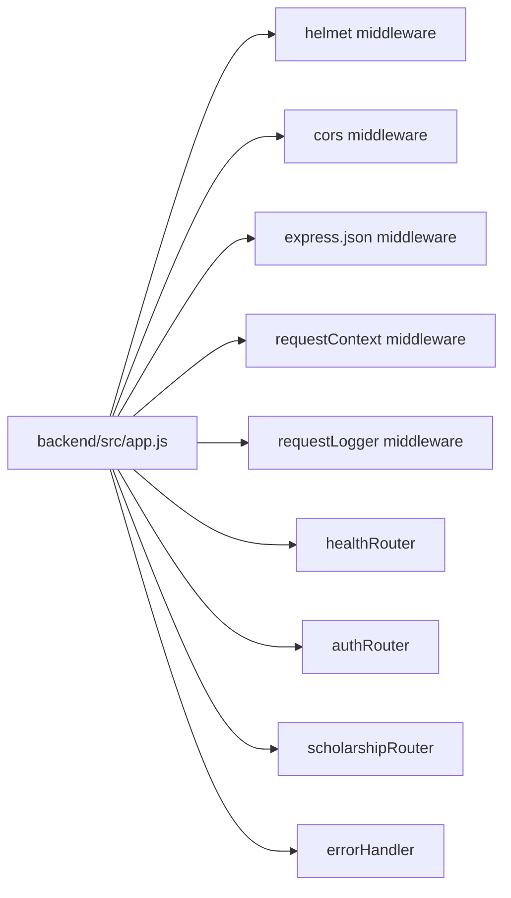
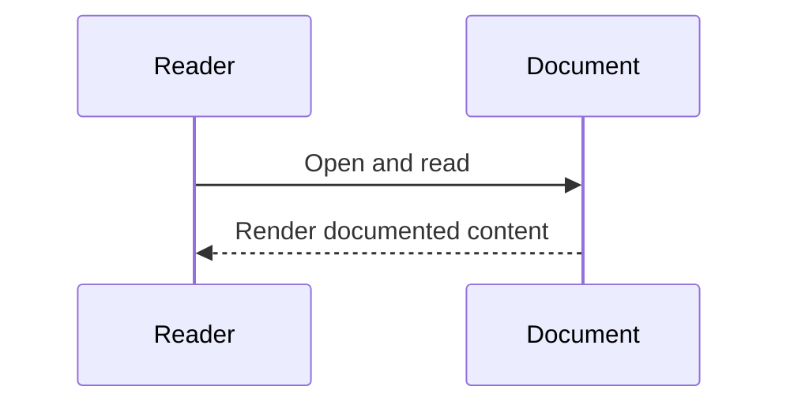

# Diagram Title
System Architecture from app.js

## Diagram Type
System Architecture Diagram

## Scope
Express app composition and router mounting sequence.

## Verification Summary
Verified from backend app bootstrap and router registration order.

## Evidence Sources
- backend/src/app.js:4-25
- backend/src/routes/health-routes.js:5-7
- backend/src/routes/auth-routes.js:17-98
- backend/src/routes/scholarship-routes.js:20-131

## Mermaid Diagram

## Confidence Level
High

## Unverified/Missing Areas
- No additional app-level services are registered in this file.

## Sequence Diagram

