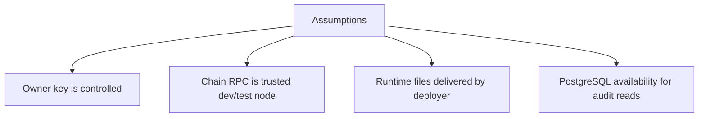
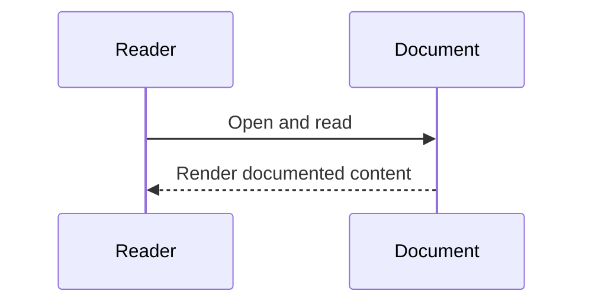

# Assumptions and Limitations

## Context
This document captures operational assumptions and known limitations of the current implementation.

## Scope
- Security assumptions
- Runtime assumptions
- Design limitations
- Practical future improvements

## Architecture / Flow

## Components / Interfaces
### Assumptions
- `ADMIN_PRIVATE_KEY` is securely controlled in deployment environment.
- Chain environment (`CHAIN_ID`, RPC URL) is correctly configured and trusted for intended use.
- `runtime_data` volume handoff from deployer to backend is intact.
- PostgreSQL is available for audit-history endpoints when enabled.

### Limitations
- Single-owner governance model (no multi-admin role system).
- Student claim path is direct wallet-to-contract; backend does not broker claim submissions.
- Audit DB reflects backend-observed operations, not full chain-indexed history.
- UI tests are smoke-level and do not yet cover full interactive browser behavior.

## Failure Modes and Recovery
- Lost/compromised owner key:
  - critical operational risk; requires governance redesign to mitigate.
- Chain outages:
  - backend admin transactions fail with timeout/dependency errors.
- DB outages:
  - contract operations can still proceed; audit endpoints fail.

## Validation Checklist
1. Confirm environment variables are set correctly per mode (local/docker).
2. Verify runtime contract files are produced and readable by backend.
3. Verify deterministic dependency errors for chain/DB outages.

## Open Questions
- Should ownership migrate to multisig for production safety?
- Should a dedicated indexer be introduced for complete chain audit coverage?

## Sequence Diagram

