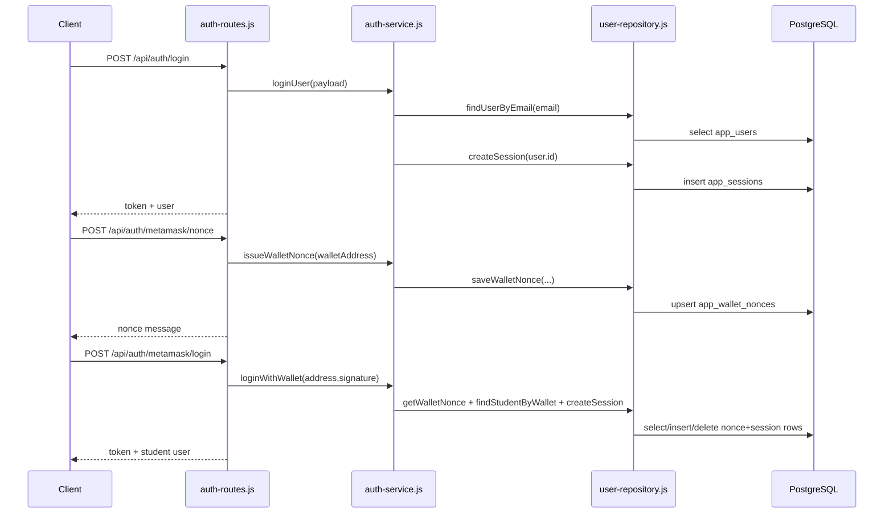

# Diagram Title
Authentication Sequence from auth-routes.js

## Diagram Type
Sequence Diagram

## Scope
Email/password login, MetaMask nonce login, student verification endpoints.

## Verification Summary
Derived from implemented routes and called auth-service functions.

## Evidence Sources
- backend/src/routes/auth-routes.js:19-98
- backend/src/services/auth-service.js:39-120
- backend/src/repositories/user-repository.js:29-122

## Mermaid Diagram

## Confidence Level
High

## Unverified/Missing Areas
- No JWT issuance path implemented.
