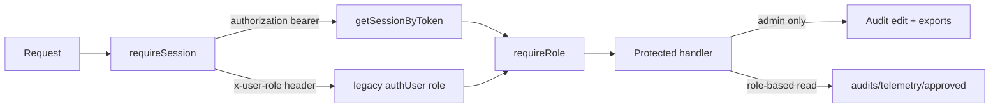
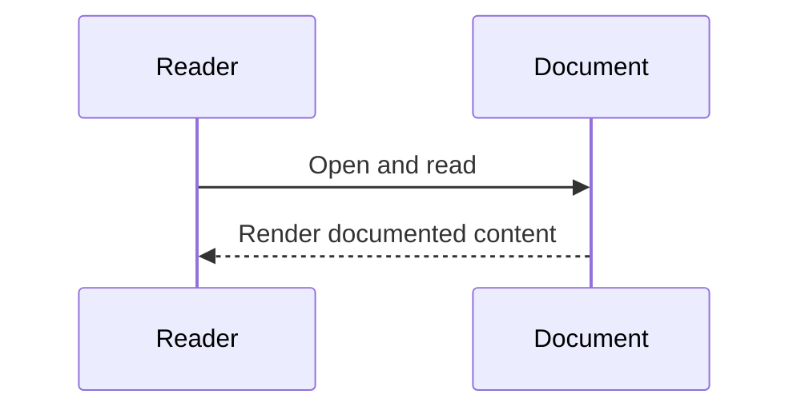

# Diagram Title
Security Flow from auth-session.js

## Diagram Type
Security Flow Diagram

## Scope
Authentication extraction and role authorization pipeline.

## Verification Summary
Covers bearer session lookup path and legacy x-user-role path.

## Evidence Sources
- backend/src/middleware/auth-session.js:15-47
- backend/src/middleware/role-auth.js:16-25
- backend/src/routes/scholarship-routes.js:21-24,63-64,94-95

## Mermaid Diagram

## Confidence Level
High

## Unverified/Missing Areas
- JWT generation/verification is not implemented.

## Sequence Diagram

