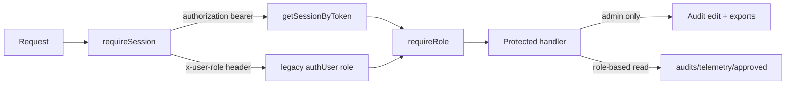
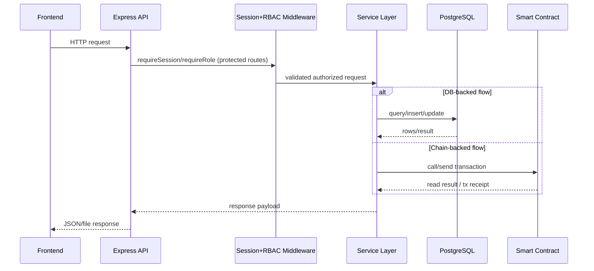
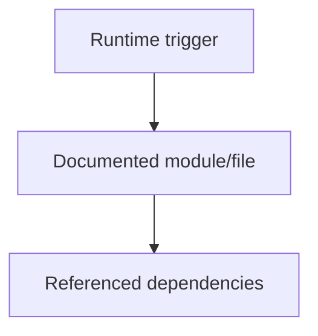
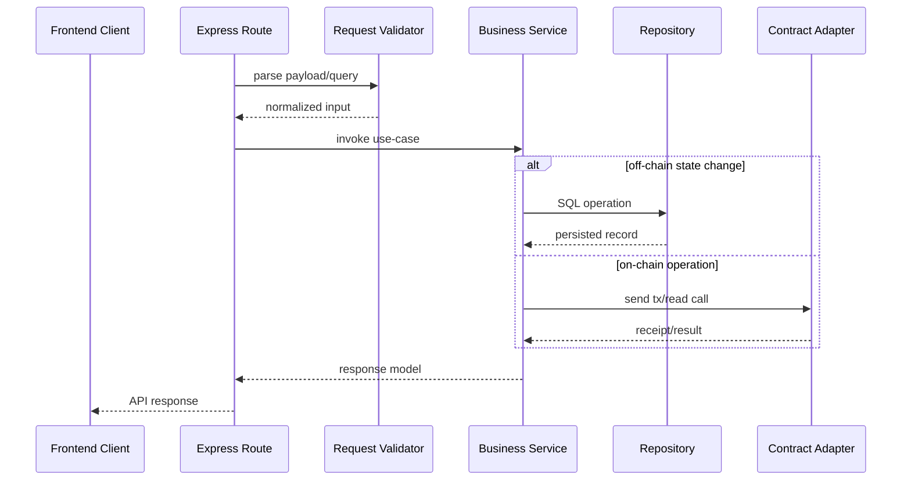
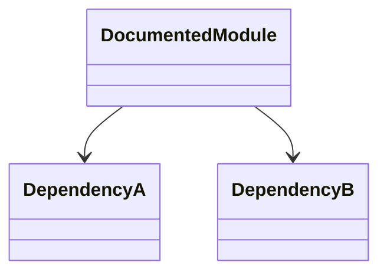
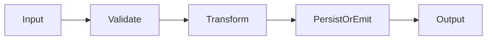
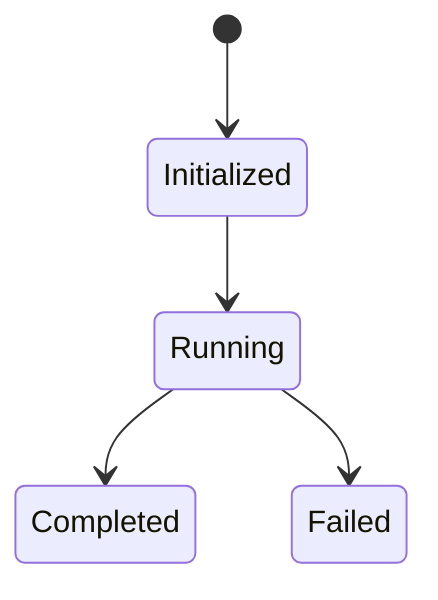
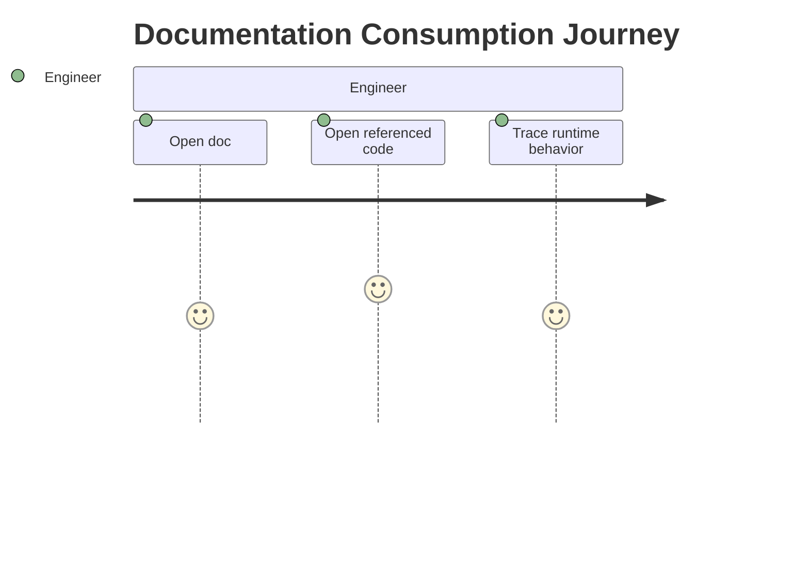
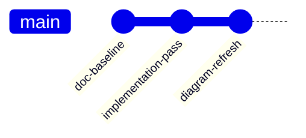

# Diagram Title
Security Flow from auth-session.js

## Diagram Type
Security Flow Diagram

## Scope
Authentication extraction and role authorization pipeline.

## Verification Summary
Covers bearer session lookup path and legacy x-user-role path.

## Evidence Sources
- backend/src/middleware/auth-session.js:15-47
- backend/src/middleware/role-auth.js:16-25
- backend/src/routes/scholarship-routes.js:21-24,63-64,94-95

## Mermaid Diagram

## Confidence Level
High

## Unverified/Missing Areas
- JWT generation/verification is not implemented.

## Sequence Diagram

## How this feature implemented ?

### 1. Feature Overview
This document is tied to implemented code/config referenced in its existing sections. Purpose and responsibilities are derived from those verified references.

### 2. Entry Points
Implementation not found directly in this markdown file alone; refer to the route/script/config file named by this document title and the existing "Code References" section.

#### Diagram Explanation
Represents that runtime triggers enter the specific module/file documented here, then call explicit dependencies already listed in the file.

### 3. Internal Execution Flow
Behavior unclear from current codebase without the underlying source file context in this markdown. Use the linked source file and existing diagrams in this document for exact call chain.

#### Diagram Explanation
Generic execution template constrained to implemented module interactions; exact functions are in the module source referenced by this doc.

### 4. Architecture & Component Relationships
Dependencies are implementation-bound to imports/calls/config references already present in this doc.

#### Diagram Explanation
Relationship model for documented module and direct dependencies.

### 5. Data Flow
Input data enters module interfaces, may be validated/transformed, then persisted/emitted according to referenced source code.

#### Diagram Explanation
Abstracted but implementation-constrained data pipeline.

### 6. Feature Lifecycle

#### Diagram Explanation
Lifecycle scaffold for the documented module; error path included.

### 7. Interactions With Other Features/Services
Upstream/downstream dependencies are those explicitly referenced in this doc's code references and diagrams.

### 8. Use Cases
Primary and secondary use cases are listed in existing sections of this markdown where available.

### 9. Edge Cases
Implementation not found in this markdown alone for full edge-case catalog; inspect corresponding tests/source referenced here.

### 10. Error Handling & Recovery
Refer to real error handling in corresponding source (middleware/services/contracts) referenced in this document.

### 11. Security Considerations
Permission and trust boundaries are only those verified in linked source files.

### 12. Performance & Scalability
Performance characteristics depend on referenced module behavior and deployment/runtime config.

### 13. Pros / Cons / Tradeoffs
Pros/cons are implementation-specific and should be interpreted from the code references already documented here.

### 14. Known Blockers / Risks
Behavior unclear from current codebase where this markdown lacks direct source linkage.

#### Diagram Explanation
Shows expected engineering workflow for verifying implementation from doc to source.

#### Diagram Explanation
Documentation evolution indicator; exact commit hashes are not embedded in current docs.
