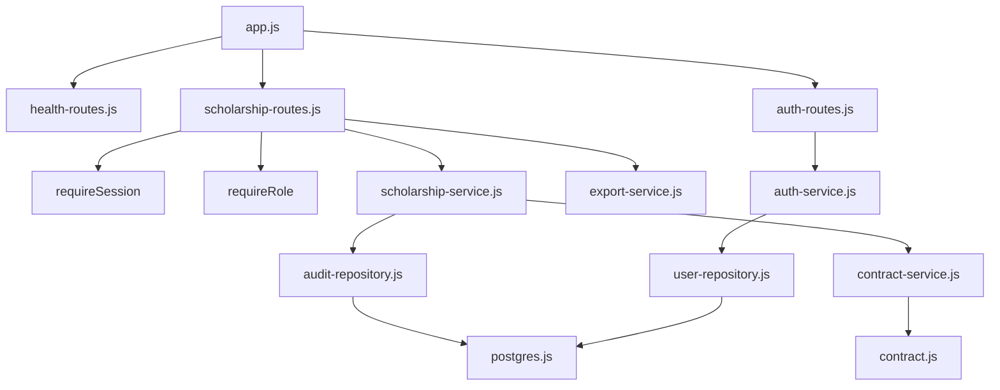
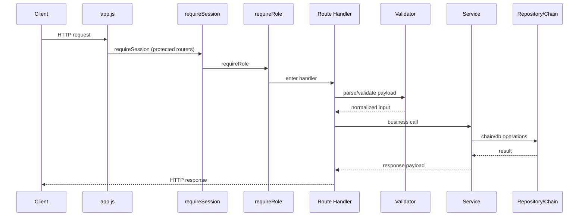

# Backend Architecture (Verified)

## Overview
Backend is an Express API exposing auth/user routes and scholarship/audit/export routes.

## Responsibilities
- Parse/validate requests.
- Enforce authentication and RBAC.
- Execute chain transactions for admin actions.
- Persist and query audit/user/session data in PostgreSQL.
- Provide telemetry and file exports.

## Internal Interactions

### Diagram Explanation
- Route handlers call service functions; services call repositories/contract adapter.
- `scholarshipRouter.use(requireSession)` applies auth before route-specific role checks.
- Export routes call export-service directly.
- Inputs: HTTP requests and params.
- Outputs: JSON or binary export responses.
- Error handling path converges through `errorHandler` middleware.

## Request Lifecycle

### Diagram Explanation
- This sequence is implemented in `scholarship-routes.js` and validators/services modules.
- If any stage throws, `normalizeRouteError` and `errorHandler` return error JSON.

## External Dependencies
- `ethers` for chain provider/wallet/contract calls.
- `pg` for DB pool and queries.
- `pdfkit` and `xlsx` for export generation.

## Data Flow
- Approval/release: request -> chain tx -> tx hash -> audit insert.
- Audit history: query two audit tables -> merge by created_at in frontend.
- Session auth: Bearer token -> session lookup join with users.

## Failure/Error Flow
- Missing token and no legacy role header -> `Authentication required`.
- Expired/nonexistent session -> `Invalid or expired session`.
- DB unconfigured -> `PostgreSQL not configured` (`503`).
- Contract not configured -> dependency unavailable (`503`).

## Security Considerations
- RBAC roles: `admin`, `auditor`, `student`.
- Admin-only endpoints: approve/release/audit edit/export/student verify.
- Legacy `x-user-role` shortcut exists in `requireSession` for compatibility.

## Scalability Considerations
- Pagination cap in audit history query parser (`max 50`).
- Telemetry and movement lookback bounded by query parameter caps.

## Performance Considerations
- Contract transaction waits are timeout guarded.
- Uses cached contract client and pooled DB connections.

## Code References
- `backend/src/app.js`
- `backend/src/routes/auth-routes.js`
- `backend/src/routes/scholarship-routes.js`
- `backend/src/services/*.js`
- `backend/src/repositories/*.js`
- `backend/src/middleware/*.js`
