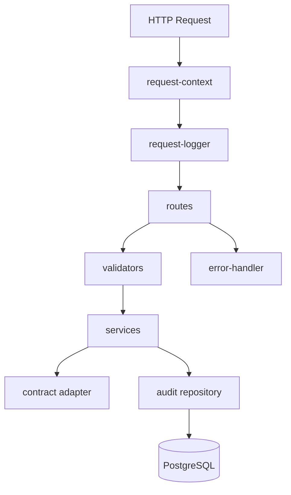
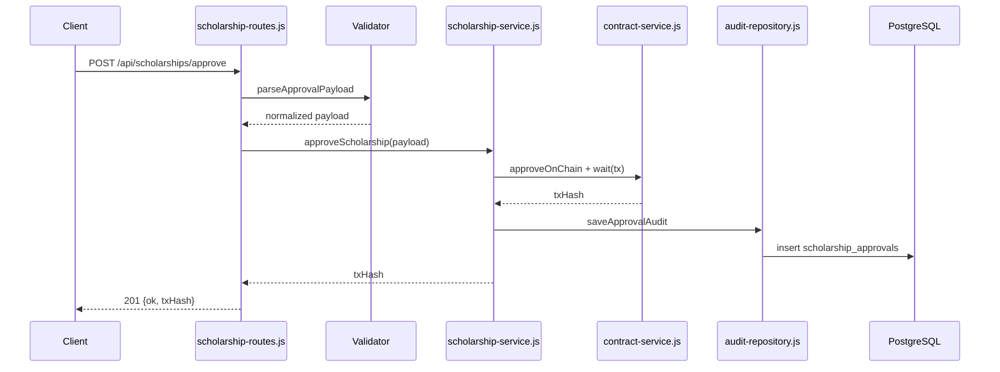

# Backend Technical Documentation

## Context
Backend is the orchestration boundary between admin actions and blockchain state transitions, with optional PostgreSQL audit persistence.

## Scope
- `backend/src/app.js`
- `backend/src/routes/*`
- `backend/src/services/*`
- `backend/src/repositories/*`
- `backend/src/validators/*`
- `backend/src/contract.js`
- `backend/src/postgres.js`
- `backend/src/middleware/*`

## Architecture / Flow

- Validation and dependency checks happen before side effects.
- Service layer keeps chain operations and repository operations explicit.
- Error handler normalizes API response shape.

## Components / Interfaces
- Health:
  - `GET /api/health`
- Scholarship operations:
  - `POST /api/scholarships/approve`
  - `POST /api/scholarships/release`
  - `GET /api/scholarships/approved`
- Audit history:
  - `GET /api/audits/history?page=&pageSize=&studentAddress=`

- Route/validator/service/repository boundaries match current implementation files.
- Error normalization is centralized and preserves `{ error }` response shape.

## Failure Modes and Recovery
- Contract client unavailable:
  - return `503` with deterministic message.
- PostgreSQL unavailable:
  - audit endpoints and write paths fail clearly.
- Invalid inputs:
  - `400` validation errors with explicit field expectations.
- Slow chain confirmations:
  - tx wait guarded by timeout in contract service.

## Validation Checklist
1. Start backend: `npm.cmd run start:backend`
2. Check health: `GET /api/health`
3. Submit invalid payloads and confirm `400`
4. Confirm dependency failures return deterministic `503`
5. Run `npm.cmd run test:backend`

## Open Questions
- Add request metrics export (latency histograms)?
- Introduce retry policy for transient RPC errors?
