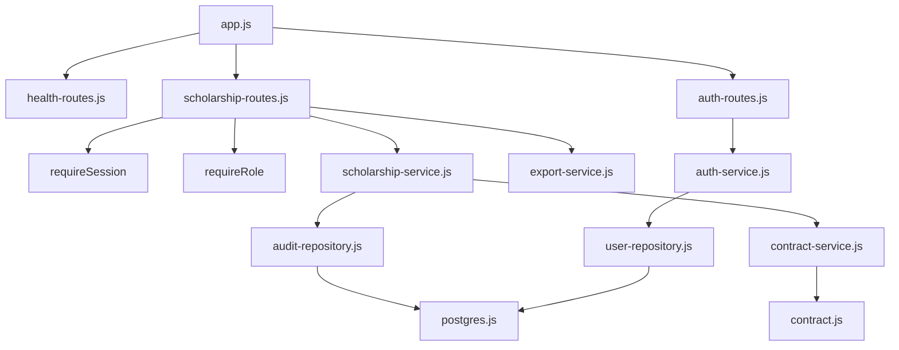
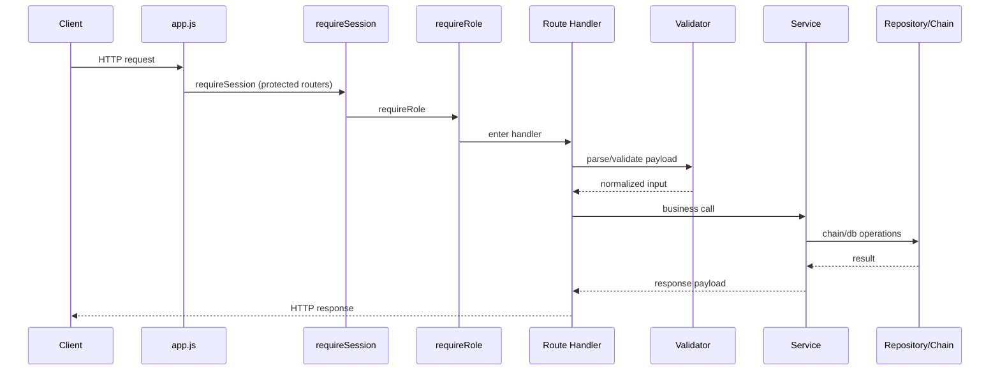
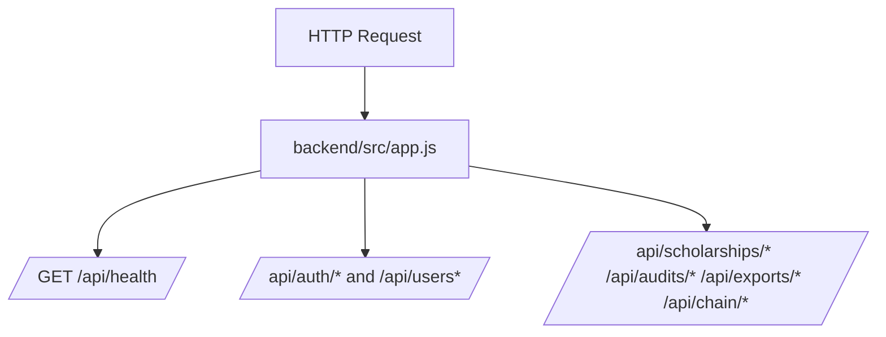
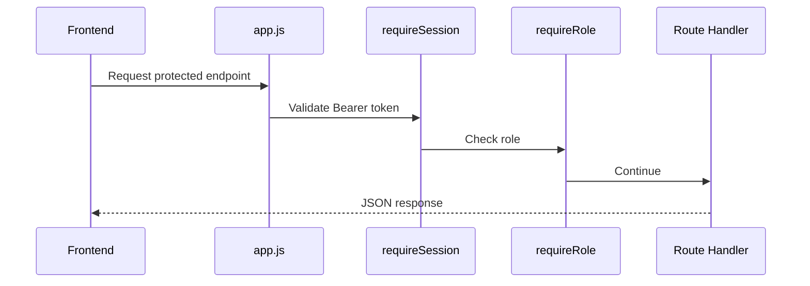
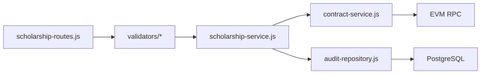
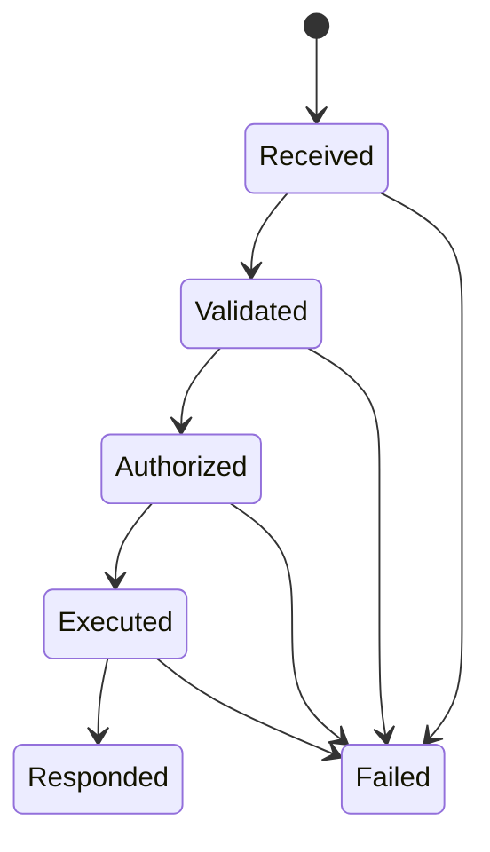
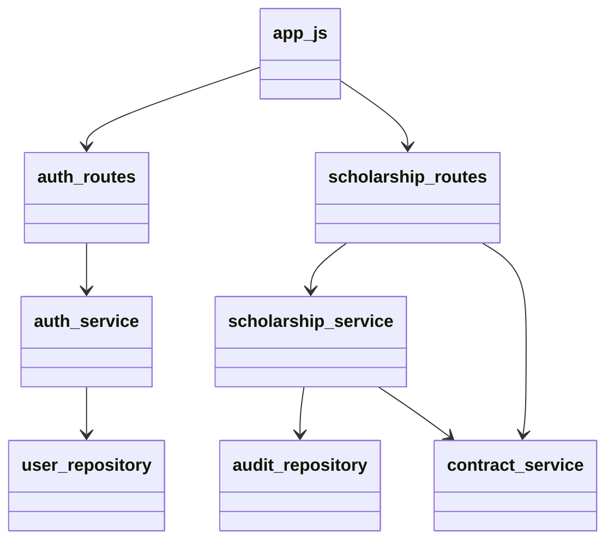
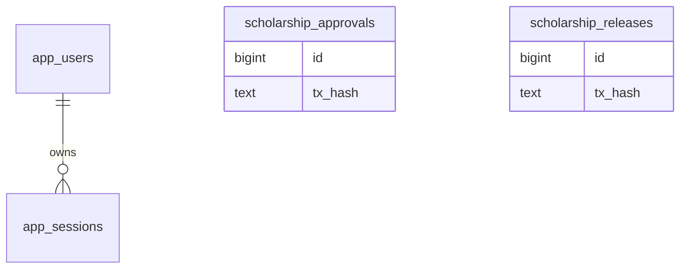
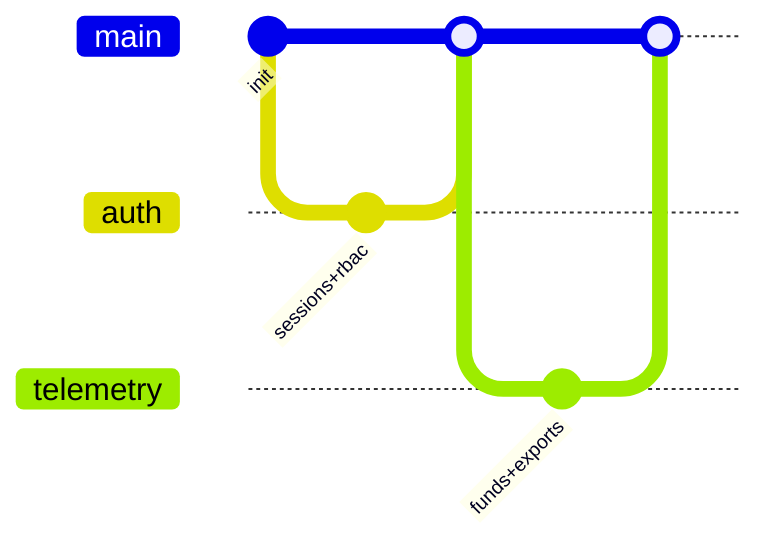

# Backend Architecture (Verified)

## Overview
Backend is an Express API exposing auth/user routes and scholarship/audit/export routes.

## Responsibilities
- Parse/validate requests.
- Enforce authentication and RBAC.
- Execute chain transactions for admin actions.
- Persist and query audit/user/session data in PostgreSQL.
- Provide telemetry and file exports.

## Internal Interactions

### Diagram Explanation
- Route handlers call service functions; services call repositories/contract adapter.
- `scholarshipRouter.use(requireSession)` applies auth before route-specific role checks.
- Export routes call export-service directly.
- Inputs: HTTP requests and params.
- Outputs: JSON or binary export responses.
- Error handling path converges through `errorHandler` middleware.

## Request Lifecycle

### Diagram Explanation
- This sequence is implemented in `scholarship-routes.js` and validators/services modules.
- If any stage throws, `normalizeRouteError` and `errorHandler` return error JSON.

## External Dependencies
- `ethers` for chain provider/wallet/contract calls.
- `pg` for DB pool and queries.
- `pdfkit` and `xlsx` for export generation.

## Data Flow
- Approval/release: request -> chain tx -> tx hash -> audit insert.
- Audit history: query two audit tables -> merge by created_at in frontend.
- Session auth: Bearer token -> session lookup join with users.

## Failure/Error Flow
- Missing token and no legacy role header -> `Authentication required`.
- Expired/nonexistent session -> `Invalid or expired session`.
- DB unconfigured -> `PostgreSQL not configured` (`503`).
- Contract not configured -> dependency unavailable (`503`).

## Security Considerations
- RBAC roles: `admin`, `auditor`, `student`.
- Admin-only endpoints: approve/release/audit edit/export/student verify.
- Legacy `x-user-role` shortcut exists in `requireSession` for compatibility.

## Scalability Considerations
- Pagination cap in audit history query parser (`max 50`).
- Telemetry and movement lookback bounded by query parameter caps.

## Performance Considerations
- Contract transaction waits are timeout guarded.
- Uses cached contract client and pooled DB connections.

## Code References
- `backend/src/app.js`
- `backend/src/routes/auth-routes.js`
- `backend/src/routes/scholarship-routes.js`
- `backend/src/services/*.js`
- `backend/src/repositories/*.js`
- `backend/src/middleware/*.js`

## How this feature implemented ?

### 1. Feature Overview
Backend feature is implemented as an Express application in `backend/src/app.js` that mounts `healthRouter`, `authRouter`, and `scholarshipRouter`. Purpose: enforce authentication/RBAC, run admin blockchain actions, and persist off-chain audit/auth records.
Core files: `backend/src/app.js`, `backend/src/routes/*.js`, `backend/src/services/*.js`, `backend/src/repositories/*.js`, `backend/src/middleware/*.js`.

### 2. Entry Points

#### Diagram Explanation
Represents real route registration in `app.js`. Inputs are HTTP requests. Outputs are JSON/binary responses. Failure path goes to `errorHandler` in `backend/src/middleware/error-handler.js`.

#### Diagram Explanation
Execution order is middleware-first then handler. Missing/expired session stops at `requireSession`. Unauthorized role stops at `requireRole`.

### 3. Internal Execution Flow

#### Diagram Explanation
For approve/release, payload is parsed, chain tx executes first, then DB audit write occurs (`saveApprovalAudit`/`saveReleaseAudit`). If chain fails, no audit row is saved.

#### Diagram Explanation
State transitions model request lifecycle implemented by middleware + handlers. Failure can happen at parse, auth, RBAC, chain call, or DB call.

### 4. Architecture & Component Relationships

#### Diagram Explanation
This mirrors imports/calls in route/service files. Coupling: routes depend on service APIs; services depend on repositories and chain adapter.

### 5. Data Flow

#### Diagram Explanation
Auth data persists in `app_users/app_sessions`. Blockchain actions persist transaction hashes into audit tables.

### 6. Feature Lifecycle
Initialization in `app.js`: middleware -> routers -> error handler. Runtime handles per-request pipeline. Completion returns JSON or files. Cleanup is process-level only; no per-request custom shutdown logic found.

### 7. Interactions With Other Features/Services
Depends on frontend API callers, PostgreSQL (`postgres.js`), and contract adapter (`contract.js`). Exports combine telemetry from chain and DB audit rows in `export-service.js`.

### 8. Use Cases
Primary: admin approve/release; student/auditor/admin read audits/telemetry; admin export and verify users. Secondary: MetaMask nonce auth for students.

### 9. Edge Cases
Invalid payloads -> validator errors (`400`), expired sessions -> auth error, non-admin on admin endpoints -> forbidden, unavailable DB/RPC -> dependency failures.

### 10. Error Handling & Recovery
`normalizeError`/`normalizeRouteError` convert unknown errors to controlled `AppError`. No queue retries or circuit breaker implementation found.

### 11. Security Considerations
Bearer-token session auth via `app_sessions`; RBAC through `requireRole`; note legacy fallback header in `requireSession` remains implemented for compatibility.

### 12. Performance & Scalability
Pagination caps in query validators; bounded telemetry windows; pooled DB connections via `pg` pool.

### 13. Pros / Cons / Tradeoffs
Pros: clear route-service-repo split, explicit RBAC, audit persistence after confirmed tx. Cons: legacy role header path increases trust surface; no background worker for heavy exports.

### 14. Known Blockers / Risks
No message queue/dead-letter pattern implemented; localStorage token model (frontend) increases session theft risk if XSS happens.

#### Diagram Explanation
Repository history concept for implemented features; exact commit IDs are not documented in current codebase.
