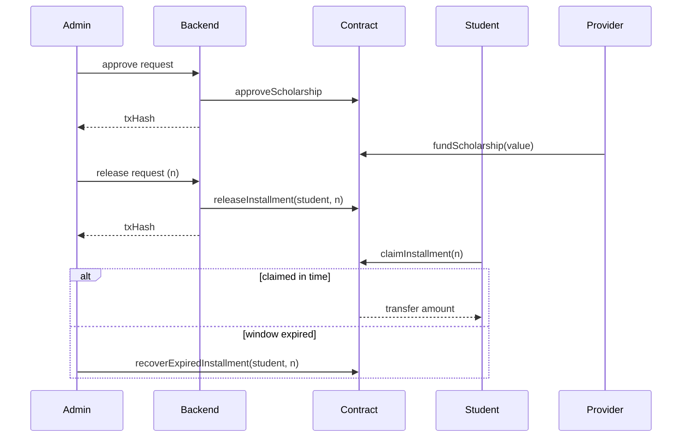

# Blockchain Lifecycle Documentation

## Context
This document describes the end-to-end on-chain lifecycle from approval to final claim/recovery.

## Scope
- Contract lifecycle semantics
- Deployer and runtime handoff
- Chain-dependent backend operations

## Architecture / Flow

- Backend controls approve/release.
- Student controls claim with wallet signer.
- Recovery is explicit admin fallback after deadline.

## Components / Interfaces
- Runtime inputs:
  - `RPC_URL`, `CHAIN_ID`, `ADMIN_PRIVATE_KEY`
  - `CONTRACT_ADDRESS` or `CONTRACT_ADDRESS_FILE`
  - `CONTRACT_METADATA_FILE`
- Deployment output files:
  - `runtime/contract-address`
  - `runtime/contract-metadata.json`

## Failure Modes and Recovery
- RPC unreachable:
  - deployer waits with bounded retries and fails explicitly.
- Contract address mismatch:
  - backend resolves metadata/address file fallback.
- Confirmation timeout:
  - backend returns deterministic timeout errors.

## Validation Checklist
1. Start chain (`docker compose up chain`)
2. Run deployer (`docker compose up deployer`)
3. Verify runtime files exist
4. Execute approve/release/claim path
5. Simulate expiry and test recovery path

## Open Questions
- Do we need chain reorg-safe finality rules beyond one confirmation?
- Should claim include optional backend attestation for analytics?
