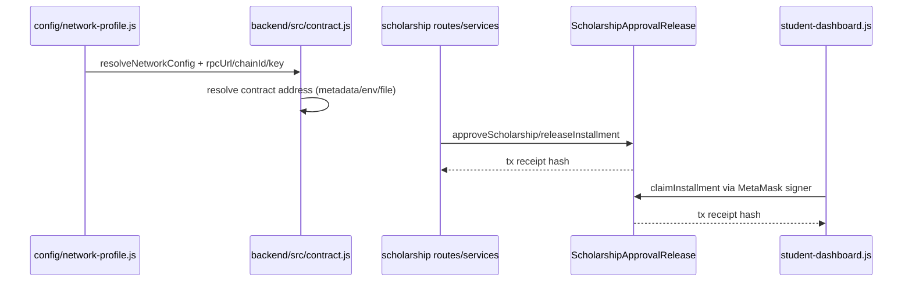
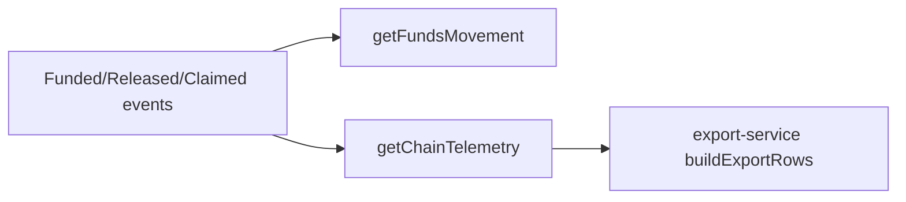

# Blockchain Lifecycle (Verified)

## Overview
Lifecycle covers contract deployment resolution, admin tx orchestration, student claim, and telemetry reads.

## Responsibilities
- Network profile resolution (`hardhat` or `sepolia`).
- Contract address resolution from metadata/env/file.
- Admin tx flows: approve/release.
- Student wallet tx flow: claim.

## Lifecycle Sequence

### Diagram Explanation
- Backend contract adapter is signer-based (`ethers.Wallet`) for admin actions.
- Student claim path uses browser signer and does not proxy claim tx through backend.

## Event Consumption Flow

### Diagram Explanation
- Telemetry and funds APIs query on-chain logs via `contract.queryFilter`.
- Export service includes telemetry-derived chain rows plus DB audit rows.

## Internal Interactions
- `backend/src/config.js` uses `resolveNetworkConfig`.
- `backend/src/contract.js` builds/returns cached contract client.
- `backend/src/services/contract-service.js` executes tx and event queries.

## External Dependencies
- RPC endpoint from resolved profile.
- MetaMask for student-side claim submission.

## Failure/Error Flow
- Missing/invalid contract address or key -> adapter returns null -> dependency error.
- Tx confirmation timeout -> explicit error from timeout wrapper.

## Security Considerations
- Admin tx signer key is backend-side.
- Student claim signer is wallet-side.

## Scalability Considerations
- Event lookback is bounded.

## Performance Considerations
- Contract client cache by rpc/chain/address/key tuple.

## Code References
- `config/network-profile.js`
- `backend/src/config.js`
- `backend/src/contract.js`
- `backend/src/services/contract-service.js`
- `frontend/js/student-dashboard.js`
