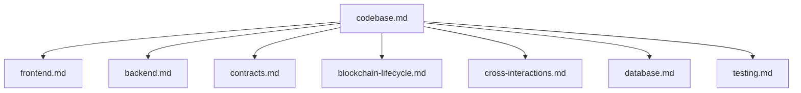
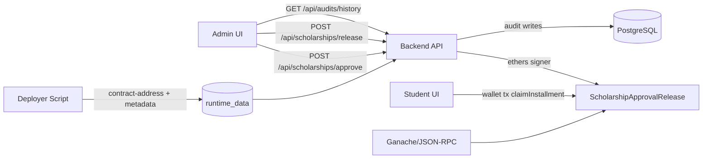
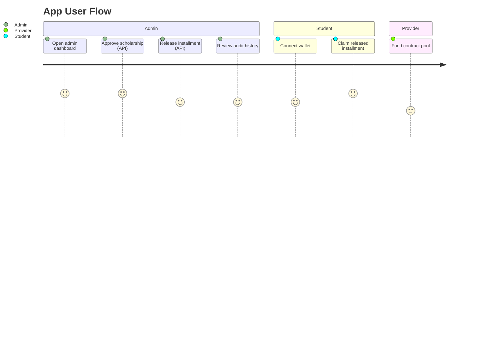

# ScholarshipDisbursement Codebase

## Context
This repository implements a scholarship approval-and-disbursement platform with:
- Solidity smart contract lifecycle (approve, fund, release, claim, recover).
- Express backend for admin orchestration and audit persistence.
- Static frontend (admin + student) and wallet-driven claim path.
- Dockerized runtime topology (postgres, chain, deployer, backend, frontend).
- Multi-layer tests (unit, integration, system, backend API, frontend smoke).

## Scope
This document is the master map for technical docs in this folder.

- Read this file first for navigation.
- Each linked doc follows the same structure and terminology.
- API contracts and naming are preserved from implementation.

## Architecture / Flow

- Backend is the control plane for approval and release.
- Student claim executes directly on-chain from wallet signer.
- Database is for audit history, not contract state authority.

- Admin actions are backend-mediated and persisted to DB audits.
- Student claim is wallet-mediated and not routed through backend submission.

## Components / Interfaces
- Frontend: `frontend/index.html`, `frontend/admin.html`, `frontend/student-dashboard.html`
- Backend: `backend/src/app.js`, routes/services/repositories/validators
- Contract: `contracts/ScholarshipApprovalRelease.sol`
- Deployment: `scripts/deploy.js`, `scripts/deployer.js`
- DB schema: `postgres/init/001_schema.sql`
- Tests: `test/unit`, `test/integration`, `test/system`, `test/backend`, `test/frontend`

## Failure Modes and Recovery
- Chain not ready / contract not configured:
  - Backend returns `503` with deterministic message.
- DB not configured:
  - Audit endpoints return `503`.
- Expired claim windows:
  - Admin can call `recoverExpiredInstallment`.
- Runtime handoff mismatch:
  - Deployer writes both contract address and metadata to shared runtime volume.

## Validation Checklist
1. `npm.cmd run compile`
2. `npm.cmd run test:unit`
3. `npm.cmd run test:integration`
4. `npm.cmd run test:system`
5. `npm.cmd run test:backend`
6. `npm.cmd run test:frontend`
7. `docker compose up -d --build`
8. Verify `/api/health` and frontend `/health`

## Open Questions
- Should student claim path also be mirrored through backend for a unified audit source?
- Do we want contract event indexing jobs (off-chain indexer) in addition to DB writes?
- Is multi-admin or role-based governance needed beyond single `owner`?

## Detailed Documents
- `docs/frontend.md`
- `docs/backend.md`
- `docs/contracts.md`
- `docs/blockchain-lifecycle.md`
- `docs/cross-interactions.md`
- `docs/database.md`
- `docs/testing.md`
