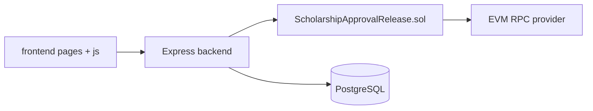
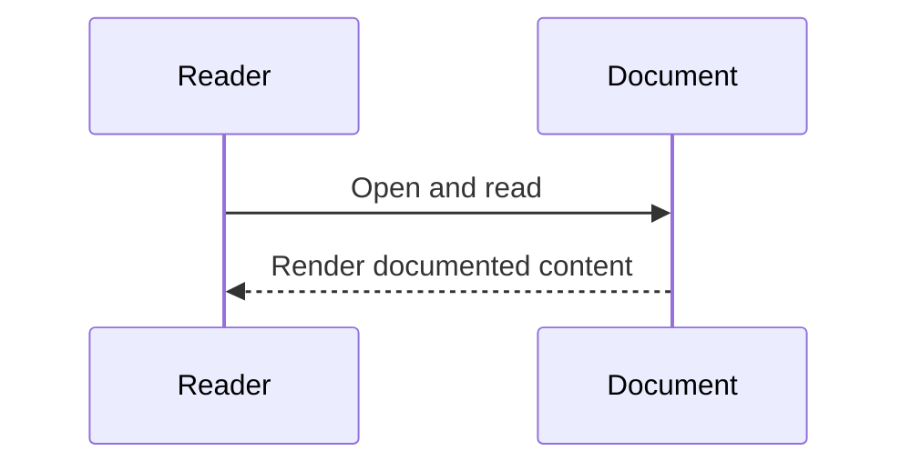

# Codebase Architecture (Verified)

## Overview
This repository implements a scholarship disbursement system with:
- Solidity contract (`contracts/ScholarshipApprovalRelease.sol`)
- Express backend (`backend/src/*`)
- Static frontend pages/scripts (`frontend/*`)
- PostgreSQL schema (`postgres/init/001_schema.sql`)
- Docker Compose runtime profiles (`docker-compose.yml`)

## Responsibilities
- Frontend: role login/register pages, admin operations, student MetaMask claim flow.
- Backend: auth/session/RBAC, chain transaction orchestration, audit persistence, telemetry, exports.
- Contract: approval/release/claim/recovery invariants and event emission.
- Database: audit history, app users/sessions, wallet nonce challenges.

## Internal Interactions


### Diagram Explanation
- `frontend/js/admin-dashboard.js` and `frontend/js/auth-pages.js` issue HTTP requests to backend (`fetch(...)`).
- `backend/src/routes/scholarship-routes.js` invokes service layer methods.
- `backend/src/services/contract-service.js` uses `ethers.Contract` calls through provider/signer.
- `backend/src/repositories/*` writes and reads PostgreSQL tables.
- Inputs: HTTP payloads, auth tokens, wallet signatures, query params.
- Outputs: JSON responses, export binary payloads, blockchain tx hashes.
- Error paths: validation errors (400), auth errors (403/401), dependency errors (503), server fallback (500).
- Security: `requireSession` + `requireRole` protect APIs; student MetaMask login uses nonce challenge.
- Performance: audit pagination with page/pageSize caps; telemetry bounded by block lookback.

## External Dependencies
- Node.js runtime
- `ethers`, `express`, `pg`, `helmet`, `cors`, `pdfkit`, `xlsx`
- Docker services: postgres, frontend, backend, optional chain/deployer in hardhat profile

## Data Flow
```mermaid
flowchart TD
  A[Admin approve/release API call] --> B[Backend service]
  B --> C[On-chain tx confirm]
  C --> D[Audit row insert]
  D --> E[Audit history/read/export]

  F[Student MetaMask sign-in] --> G[Nonce + signature verification]
  G --> H[Session token]
  H --> I[Student claim tx (wallet to contract)]
```

### Diagram Explanation
- Admin action flow: routes -> services -> contract tx wait -> repository insert.
- Student login flow: nonce issue -> signature verify -> create DB session.
- Student claim is direct contract interaction from browser signer.
- Export flow merges chain telemetry events and DB audit rows before rendering CSV/XLSX/PDF.

## Failure/Error Flow
- Contract not configured or RPC unreachable -> dependency unavailable error and `503`.
- DB absent/unconfigured -> audit/user endpoints fail with deterministic `503`.
- Invalid auth/signature/role -> `401`/`403`.

## Security Considerations
- Session token required on protected routes (`authorization: Bearer ...`).
- RBAC enforces role-specific operations.
- Nonce-based MetaMask login prevents replay without nonce lifecycle.
- **UNVERIFIED**: no CSRF token system implemented for browser sessions.

## Scalability Considerations
- Telemetry/event queries are bounded by lookback block count.
- Audit reads are paginated and filtered by student address.
- Export pulls max 5000 audit rows per export call.

## Performance Considerations
- Transaction confirmation is timeout-wrapped.
- DB operations use pooled connections.
- Telemetry groups events in memory by block/day.

## Code References
- `backend/src/app.js`
- `backend/src/routes/*.js`
- `backend/src/services/*.js`
- `backend/src/repositories/*.js`
- `frontend/js/*.js`
- `contracts/ScholarshipApprovalRelease.sol`
- `postgres/init/001_schema.sql`
- `docker-compose.yml`

## Sequence Diagram

