# ScholarshipDisbursement Codebase

## 1) Repository Overview
This repository implements a scholarship approval and installment-disbursement system with:
- A Solidity smart contract for approval, funding, release, claim, and expired-claim recovery.
- A Node/Express backend exposing admin APIs that call the contract and optionally persist audit records in Supabase.
- Static frontend pages for admin and student interactions.
- Local/Docker runtime orchestration for chain + deployer + backend + frontend.
- Multi-layer tests (unit feature, integration, system/e2e, backend API, frontend structure).

## 2) Top-Level Structure
- `contracts/`: on-chain source (`ScholarshipApprovalRelease.sol`).
- `backend/src/`: backend app, contract adapter, config, Supabase adapter, server bootstrap.
- `scripts/`: deployment scripts for local Hardhat and Docker deployer flow.
- `test/`: smart contract + API + frontend tests.
- `supabase/`: SQL schema for approval/release audit tables.
- `types/ethers-contracts/`: generated ethers typings/factories.
- `chain/`, `deployer/`, `backend/` Dockerfiles + root `Dockerfile`: containerized services.
- `frontend/index.html`, `frontend/admin.html`, `frontend/student-dashboard.html`: UI pages.
- `frontend/js/admin-dashboard.js`, `frontend/js/student-dashboard.js`: frontend behavior scripts.
- `server.js`: static frontend host.
- `docker-compose.yml`: full stack orchestration.
- `reference Labs/`: lab/reference materials, separate from main runtime path.

## 3) Runtime Architecture
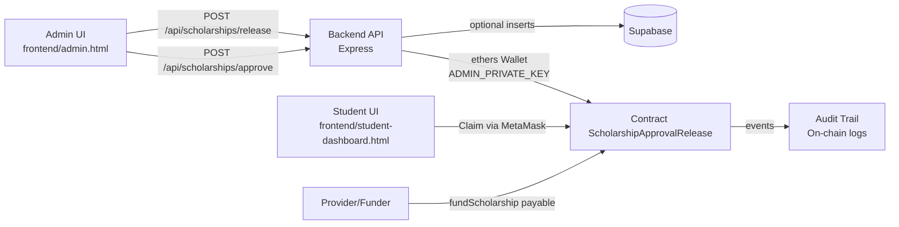

## 4) Docker Deployment Topology
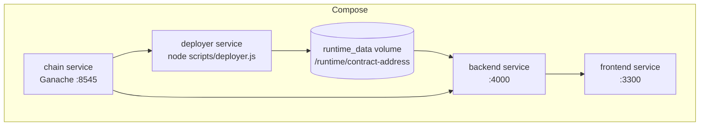

## 5) Main Data Model (Contract)
### Contract: `contracts/ScholarshipApprovalRelease.sol`
Core state:
- `owner`: admin address (only approver/releaser/recoverer).
- `fundedBalance`: available pooled contract funds for release.
- `scholarships[student]`: scholarship-level state.
- `installmentRecords[student][n]`: installment-level release/claim/deadline state.
- `approvedStudents[]` + `hasBeenListed`: list/indexing support.

### Structs
- `Scholarship`: approval status, total/released/claimed amounts, installment counts, claim window seconds.
- `Installment`: released/claimed flags, amount, release time, claim deadline.

### Rules
- Only owner can approve/release/recover expired installments.
- Installments must be released strictly in order.
- Claim must occur before deadline.
- Final installment uses remainder math to avoid division truncation loss.

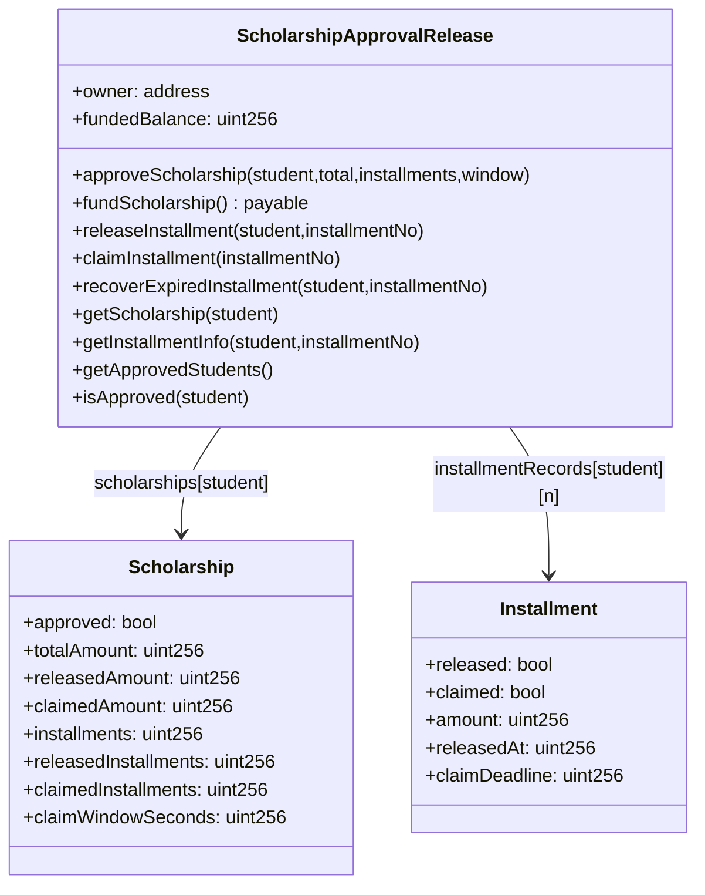

## 6) API Surface (Backend)
### Files
- `backend/src/app.js`: routes + validation + contract calls + optional Supabase insert.
- `backend/src/contract.js`: ethers contract client, address resolution from env/file.
- `backend/src/config.js`: env-backed config + defaults.
- `backend/src/supabase.js`: optional client creation.
- `backend/src/server.js`: starts backend listener.

### Endpoints
- `GET /api/health`
- `POST /api/scholarships/approve`
- `POST /api/scholarships/release`
- `GET /api/scholarships/approved`

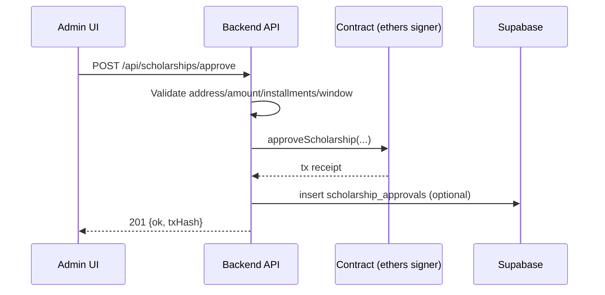

## 7) Frontend Code Paths
- `frontend/index.html`: landing links.
- `frontend/admin.html`: submit approval/release forms to backend.
- `frontend/student-dashboard.html`: MetaMask connect + direct claim transaction (`claimInstallment`) using `window.CONTRACT_ADDRESS`.
- `frontend/js/admin-dashboard.js`: admin form wiring + API calls + status rendering.
- `frontend/js/student-dashboard.js`: wallet connect + claim flow + status rendering.
- `server.js`: serves static files and `/health`.

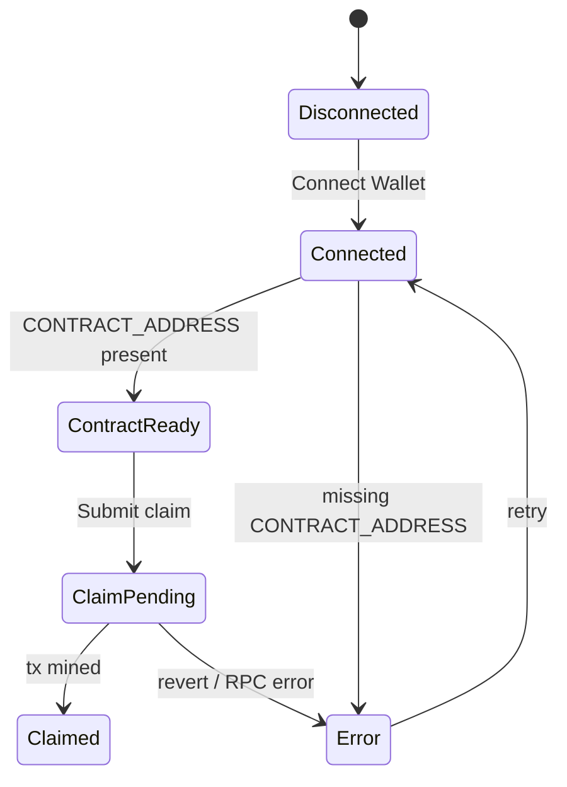

## 8) Database Schema (Supabase)
`supabase/schema.sql` defines two audit tables:
- `scholarship_approvals`
- `scholarship_releases`

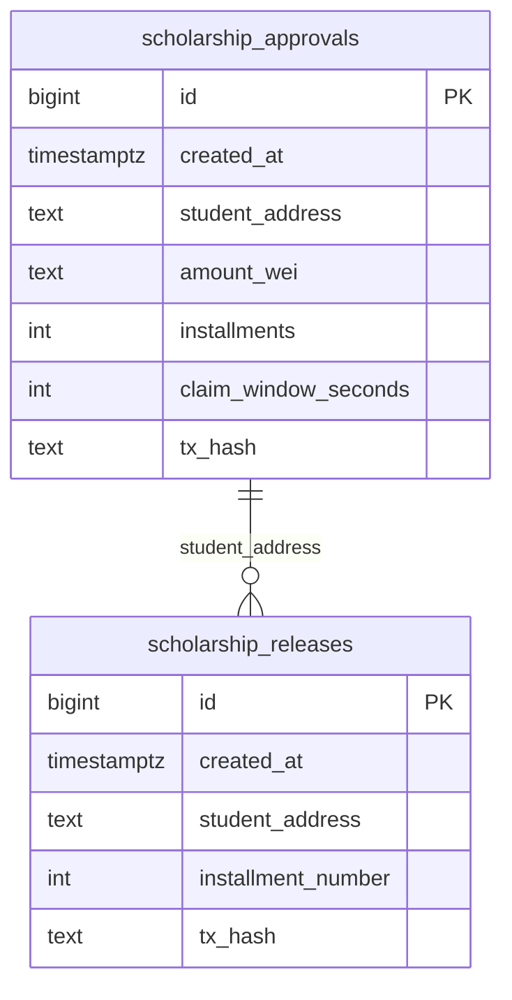

## 9) Smart Contract Workflow
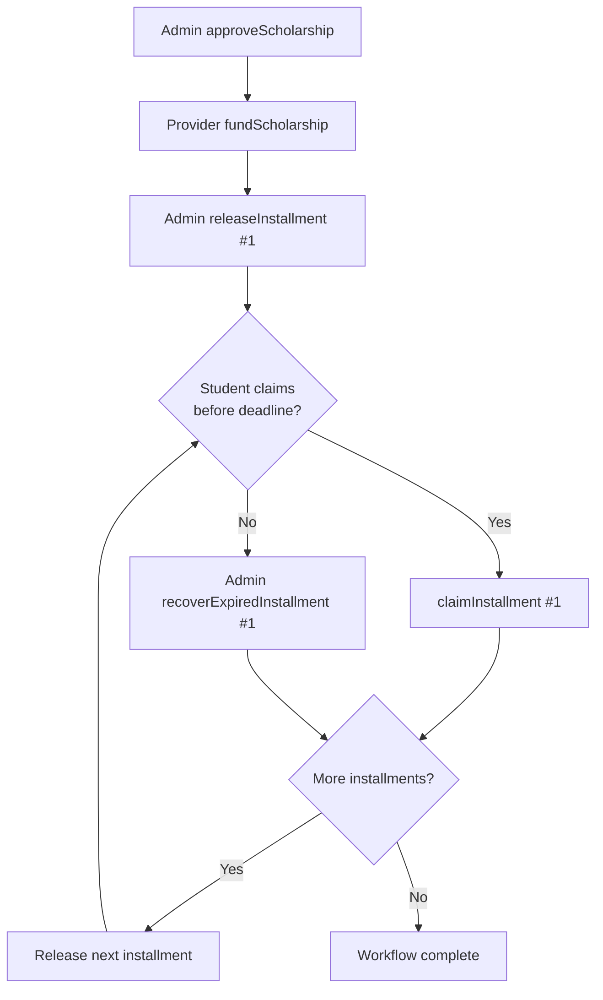

## 10) Tests and Coverage Model
- Unit feature tests (`test/unit/*`): approval, release, claim-window, audit events.
- Integration test (`test/integration/workflow.integration.test.js`): full 3-installment path.
- System/e2e (`test/system/system-wide.e2e.test.js`): access control + insufficient funds + expired claim.
- Backend tests (`test/backend/api.test.js`): health + validation.
- Frontend tests (`test/frontend/pages.test.js`): static page content checks.

```mermaid
gantt
  title Test Layers by Scope
  dateFormat  X
  axisFormat %s
  section Contract
  Unit features          :done, u1, 0, 2
  Integration workflow   :done, i1, 2, 2
  System-wide edge cases :done, s1, 4, 2
  section App
  Backend API tests      :done, b1, 2, 2
  Frontend page tests    :done, f1, 3, 1
```

## 11) Contract Lifecycle (Timeline)
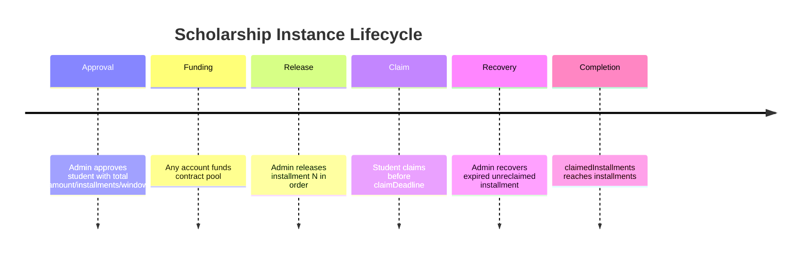

## 12) Event Distribution (Conceptual)
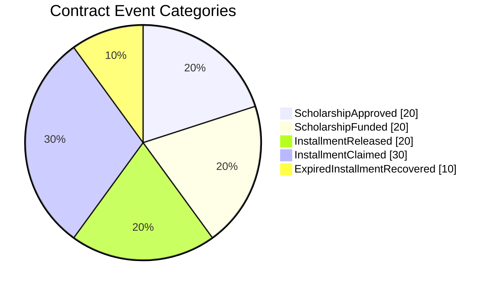

## 13) User Journey
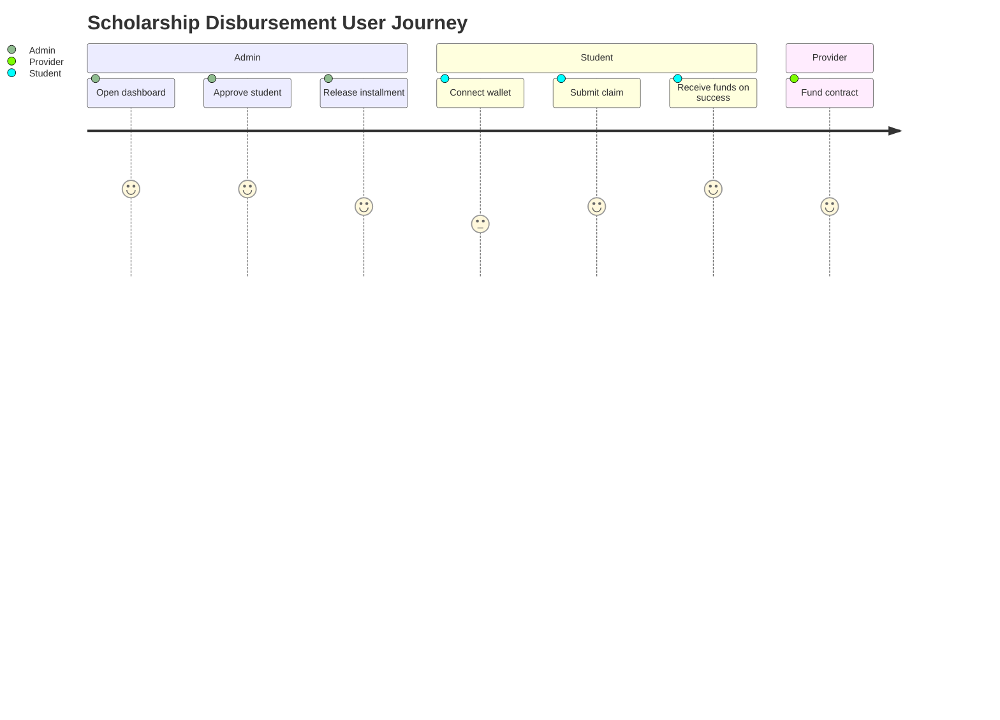

## 14) Delivery History View
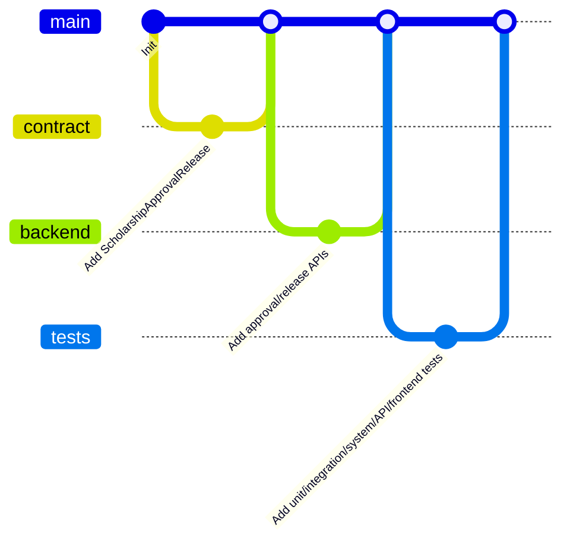

## 15) Requirements Traceability (Conceptual)
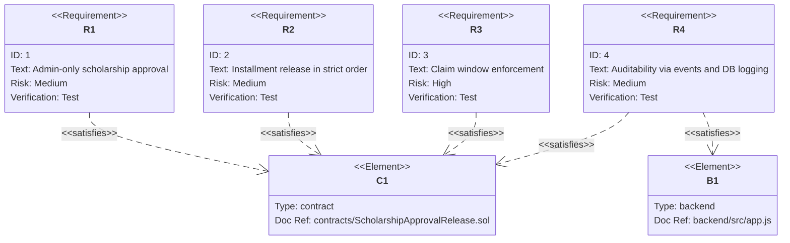

## 16) Codebase Mindmap
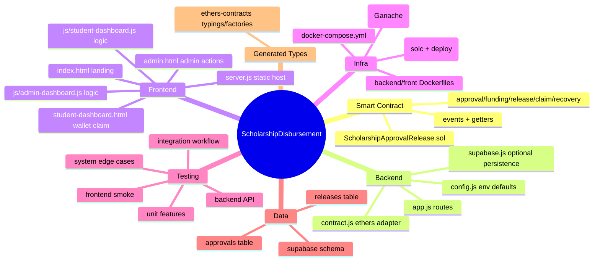

## 17) Notable Implementation Details
- `backend/src/config.js` includes a default Hardhat private key for dev convenience; production should override `ADMIN_PRIVATE_KEY`.
- Backend can resolve contract address from env (`CONTRACT_ADDRESS`) or runtime file (`CONTRACT_ADDRESS_FILE`), enabling Docker deployer handoff.
- `scripts/deployer.js` compiles with `solc` directly and writes deployed address to shared volume.
- Student page claims directly on-chain with wallet signer and does not currently query backend for tx submission.

## 18) Active vs Reference Scope
- Active production/runtime scope is the root project files listed above.
- `reference Labs/` is educational/reference content and not in main runtime flow (`docker-compose.yml`, backend server, or root scripts).
