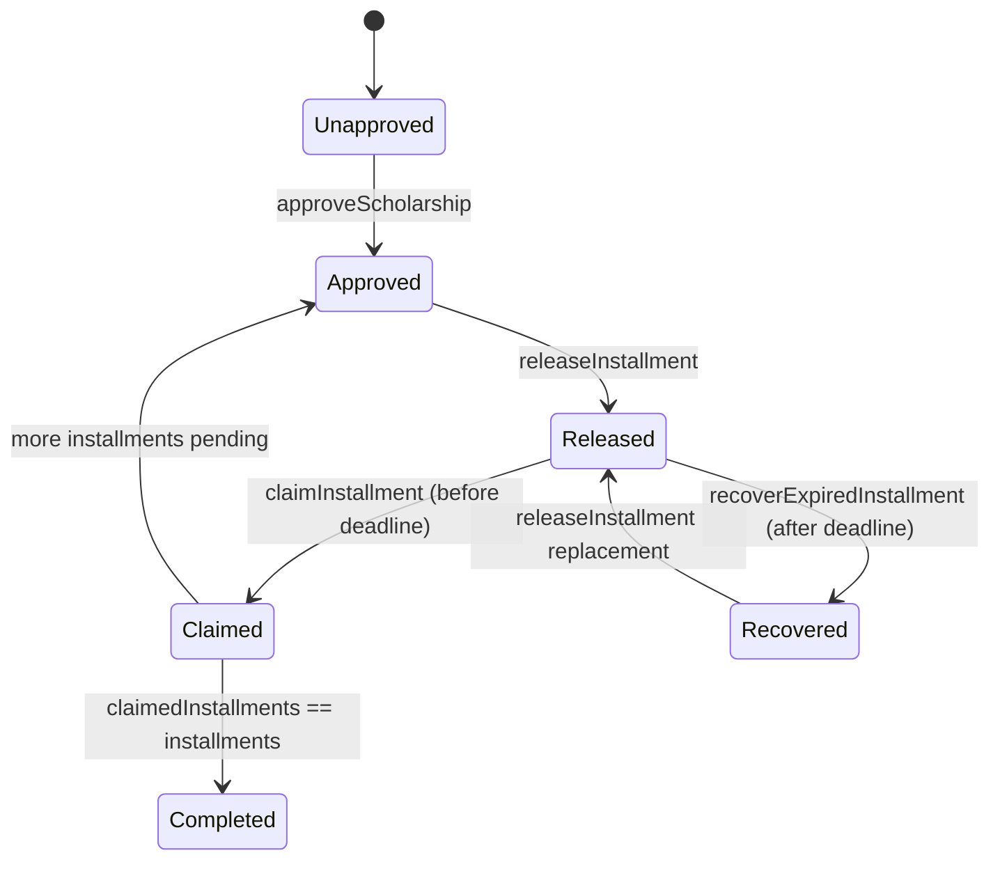
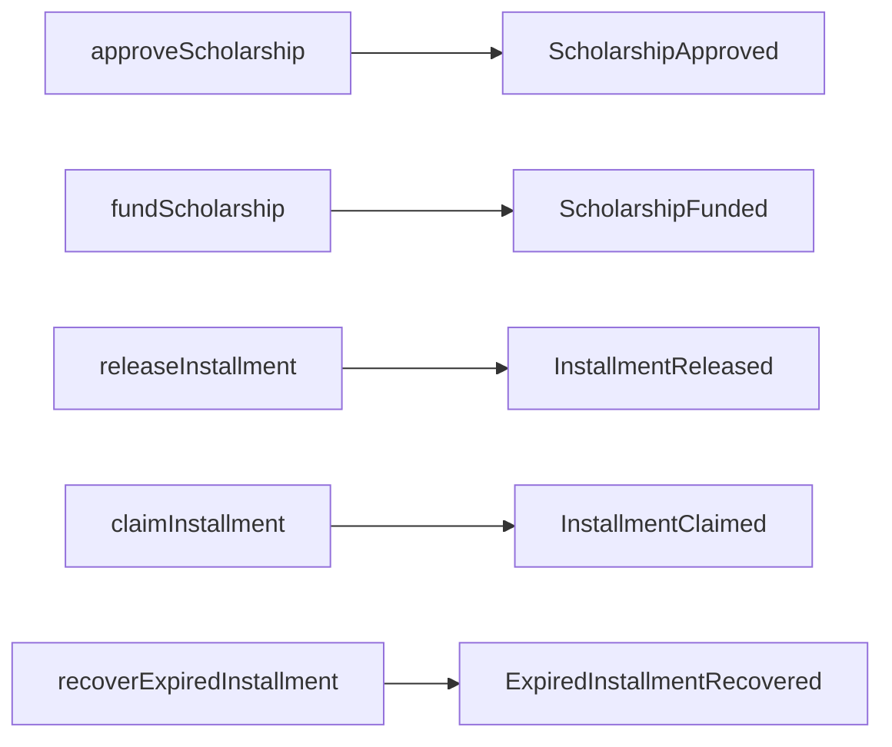
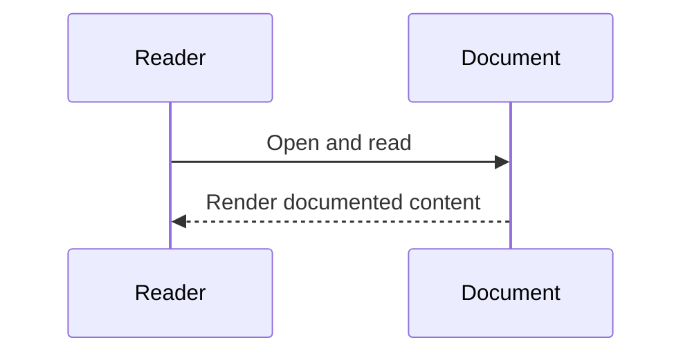
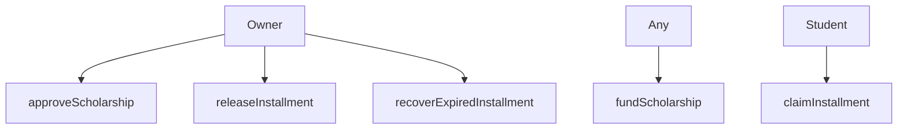
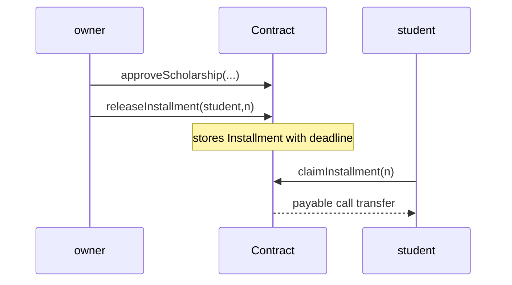
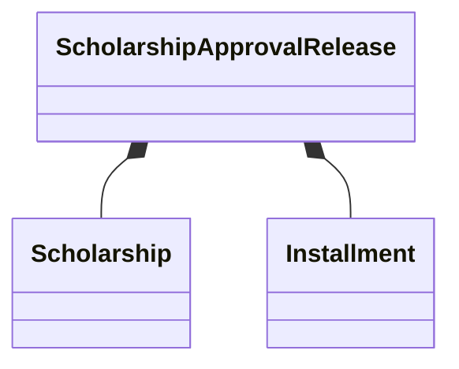
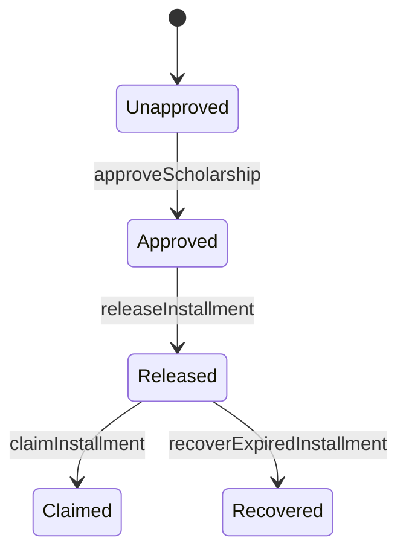
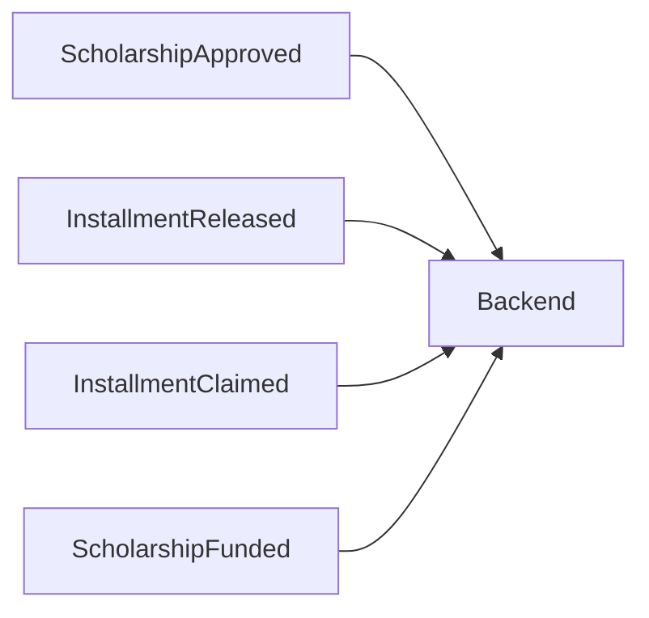

# Smart Contract Architecture (Verified)

## Overview
`ScholarshipApprovalRelease.sol` enforces scholarship approval, installment release, claim windows, and recovery.

## Responsibilities
- Owner-gated admin operations: approve, release, recover.
- Student claim operation bounded by release state and deadline.
- Emit lifecycle events for observability.

## State Diagram

### Diagram Explanation
- Transition guards are implemented via `require(...)` checks in write methods.
- Release order invariant: installment number must be `releasedInstallments + 1`.
- Recovery decreases release counters to allow replacement release.

## Event Flow

### Diagram Explanation
- Backend telemetry uses funded/released/claimed events through `queryFilter`.
- Recovery event exists in contract but current telemetry API does not consume it.

## Internal Interactions
- Uses structs `Scholarship` and `Installment`.
- Uses mappings for per-student scholarship/installment records.
- Uses `fundedBalance` as contract-level pool balance.

## External Dependencies
- None on-chain beyond Solidity runtime.

## Failure/Error Flow
- Unauthorized admin caller -> custom error `OwnableUnauthorizedAccount`.
- Invalid params/order/range/window -> revert messages.
- Failed payout transfer -> revert `Transfer failed`.

## Security Considerations
- `onlyOwner` gate on privileged functions.
- Pull-payment claim pattern with call and revert-on-failure.

## Scalability Considerations
- Per-student mapping lookups are O(1)-style storage access.
- Approved student list grows append-only.

## Performance Considerations
- Minimal arithmetic and state writes per operation.

## Code References
- `contracts/ScholarshipApprovalRelease.sol`

## Sequence Diagram

## How this feature implemented ?

### 1. Feature Overview
Contract `contracts/ScholarshipApprovalRelease.sol` implements scholarship approval, funding pool, ordered installment release, student claim window, and expired installment recovery.

### 2. Entry Points

#### Diagram Explanation
Public/external Solidity functions are the only contract entry points.

### 3. Internal Execution Flow

#### Diagram Explanation
Approval initializes `Scholarship`; release writes `Installment`; claim checks released/not-claimed/deadline and transfers funds.

### 4. Architecture & Component Relationships

#### Diagram Explanation
Contract composes two structs and mapping-based storage.

### 5. Data Flow

#### Diagram Explanation
Explicit state guards are implemented with `require` checks.

### 6. Feature Lifecycle
Deploy with constructor admin -> funded over time -> repeated release/claim cycles until all installments claimed.

### 7. Interactions With Other Features/Services
Backend contract-service executes admin writes and telemetry reads; student dashboard executes claim directly via MetaMask signer.

### 8. Use Cases
Primary: admin controlled disbursement; student claims before deadline. Edge: recovery of expired unclaimed installment.

### 9. Edge Cases
Installment out of range, release out of order, insufficient funded balance, duplicate claim, late claim.

### 10. Error Handling & Recovery
Reverts rollback state atomically; no partial writes on failure.

### 11. Security Considerations
`onlyOwner` protects privileged functions; payout uses call + revert check.

### 12. Performance & Scalability
Storage is mapping-based; approved student array grows append-only.

### 13. Pros / Cons / Tradeoffs
Pros: deterministic rules and auditable events. Cons: no on-chain user verification workflow for off-chain role verification.

### 14. Known Blockers / Risks
Implementation not found: on-chain RBAC for app users (admin/student/auditor roles are off-chain DB roles).

#### Diagram Explanation
Backend telemetry and reports derive from on-chain event queries in `contract-service.js`.
