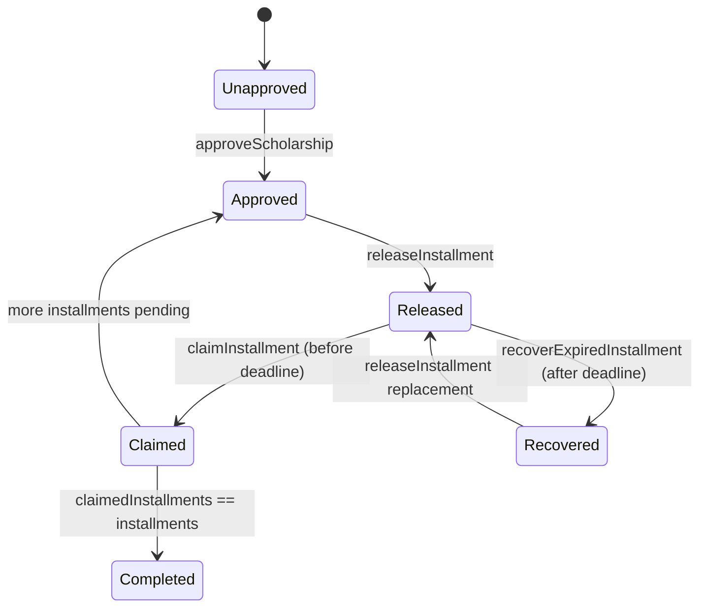
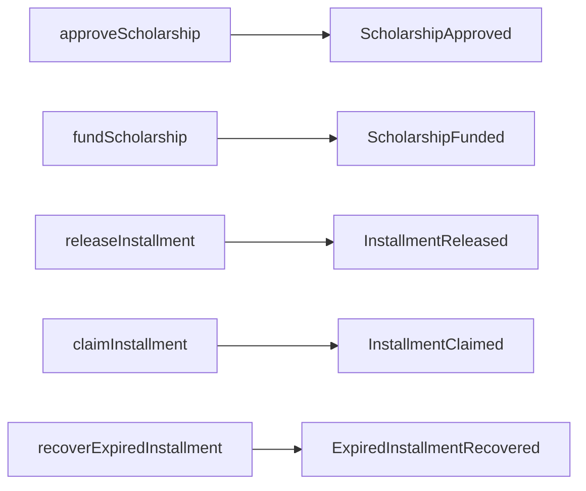
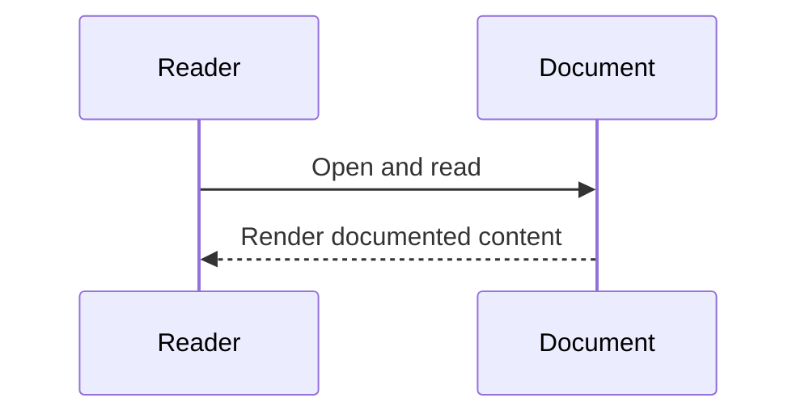

# Smart Contract Architecture (Verified)

## Overview
`ScholarshipApprovalRelease.sol` enforces scholarship approval, installment release, claim windows, and recovery.

## Responsibilities
- Owner-gated admin operations: approve, release, recover.
- Student claim operation bounded by release state and deadline.
- Emit lifecycle events for observability.

## State Diagram

### Diagram Explanation
- Transition guards are implemented via `require(...)` checks in write methods.
- Release order invariant: installment number must be `releasedInstallments + 1`.
- Recovery decreases release counters to allow replacement release.

## Event Flow

### Diagram Explanation
- Backend telemetry uses funded/released/claimed events through `queryFilter`.
- Recovery event exists in contract but current telemetry API does not consume it.

## Internal Interactions
- Uses structs `Scholarship` and `Installment`.
- Uses mappings for per-student scholarship/installment records.
- Uses `fundedBalance` as contract-level pool balance.

## External Dependencies
- None on-chain beyond Solidity runtime.

## Failure/Error Flow
- Unauthorized admin caller -> custom error `OwnableUnauthorizedAccount`.
- Invalid params/order/range/window -> revert messages.
- Failed payout transfer -> revert `Transfer failed`.

## Security Considerations
- `onlyOwner` gate on privileged functions.
- Pull-payment claim pattern with call and revert-on-failure.

## Scalability Considerations
- Per-student mapping lookups are O(1)-style storage access.
- Approved student list grows append-only.

## Performance Considerations
- Minimal arithmetic and state writes per operation.

## Code References
- `contracts/ScholarshipApprovalRelease.sol`

## Sequence Diagram

