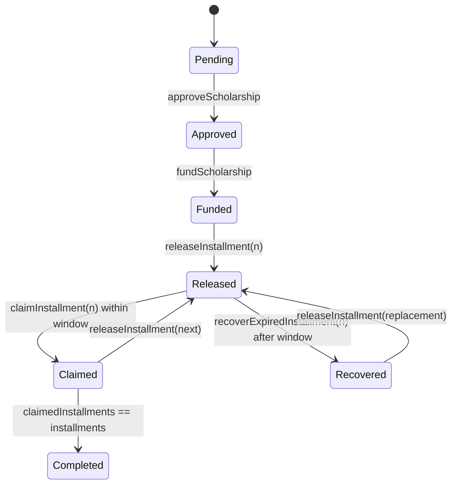

# Smart Contract Technical Documentation

## Context
`ScholarshipApprovalRelease.sol` defines scholarship lifecycle rules and enforces owner-gated administrative actions.

## Scope
- `contracts/ScholarshipApprovalRelease.sol`
- On-chain events and state transitions consumed by frontend/backend/tests.

## Architecture / Flow

- Release order is strict (`n == releasedInstallments + 1`).
- Final installment carries integer division remainder.
- Recovery reopens release sequence for replacement installment.

## Components / Interfaces
Public write functions:
- `approveScholarship(address,uint256,uint256,uint256)`
- `fundScholarship() payable`
- `releaseInstallment(address,uint256)`
- `claimInstallment(uint256)`
- `recoverExpiredInstallment(address,uint256)`

Public read functions:
- `getScholarship(address)`
- `getInstallmentInfo(address,uint256)`
- `getApprovedStudents()`
- `isApproved(address)`

Events:
- `ScholarshipApproved`
- `ScholarshipFunded`
- `InstallmentReleased`
- `InstallmentClaimed`
- `ExpiredInstallmentRecovered`

## Failure Modes and Recovery
- Unauthorized admin operations:
  - `OwnableUnauthorizedAccount` custom error.
- Out-of-order or out-of-range release:
  - explicit revert reasons.
- Missed claim window:
  - claim reverts; admin recovery path available.
- Transfer failure on claim:
  - revert ensures accounting consistency.

## Validation Checklist
1. `npm.cmd run compile`
2. `npm.cmd run test:feature:approval`
3. `npm.cmd run test:feature:release`
4. `npm.cmd run test:feature:claim`
5. `npm.cmd run test:feature:recovery`
6. `npm.cmd run test:feature:audit`

## Open Questions
- Should owner transfer/renounce semantics be added?
- Should recipient whitelist lifecycle include explicit revocation?
