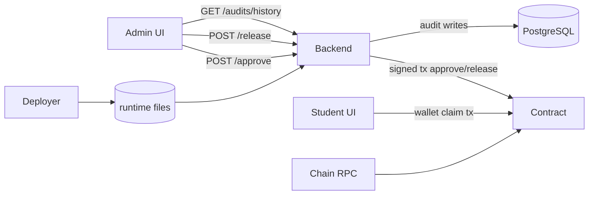
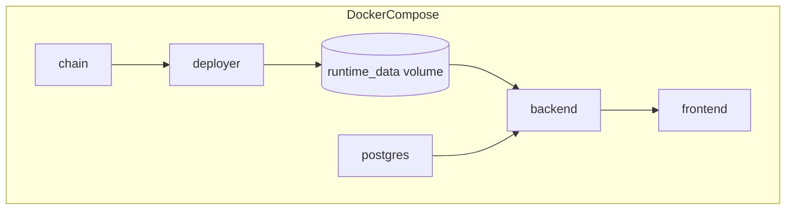

# Cross Interactions Documentation

## Context
This doc maps interactions across frontend, backend, blockchain, and database boundaries.

## Scope
- Admin interaction chain
- Student interaction chain
- Audit data flow
- Docker runtime dependencies

## Architecture / Flow

- Frontend has two control planes: API-driven admin and wallet-driven student.
- Backend bridges off-chain intent to on-chain admin transactions.
- DB stores operational audit, not source-of-truth balances.

- `backend` depends on healthy `postgres` and `chain`, plus successful `deployer`.
- Runtime volume handoff is required for contract address/metadata resolution.

## Components / Interfaces
- Frontend -> Backend:
  - JSON HTTP API calls for admin/audit.
- Backend -> Contract:
  - ethers signer calls with admin private key.
- Student -> Contract:
  - wallet signer calls direct from browser.
- Backend -> DB:
  - insert/query approvals/releases audit tables.

## Failure Modes and Recovery
- Backend down:
  - admin operations unavailable; student direct claim path still chain-dependent.
- DB down:
  - contract operations may still complete; audit endpoints fail.
- Runtime file absent:
  - backend returns contract-not-ready `503`.

## Validation Checklist
1. Bring stack up with docker compose
2. Verify all service healthchecks
3. Run one admin approve + release + student claim
4. Verify audit rows are queryable
5. Simulate DB outage and confirm deterministic API failure

## Open Questions
- Should student claims also trigger backend webhook logging?
- Should deploy/runtime files be versioned with startup checksum validation?
