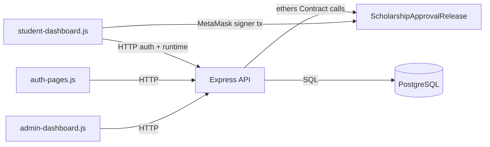
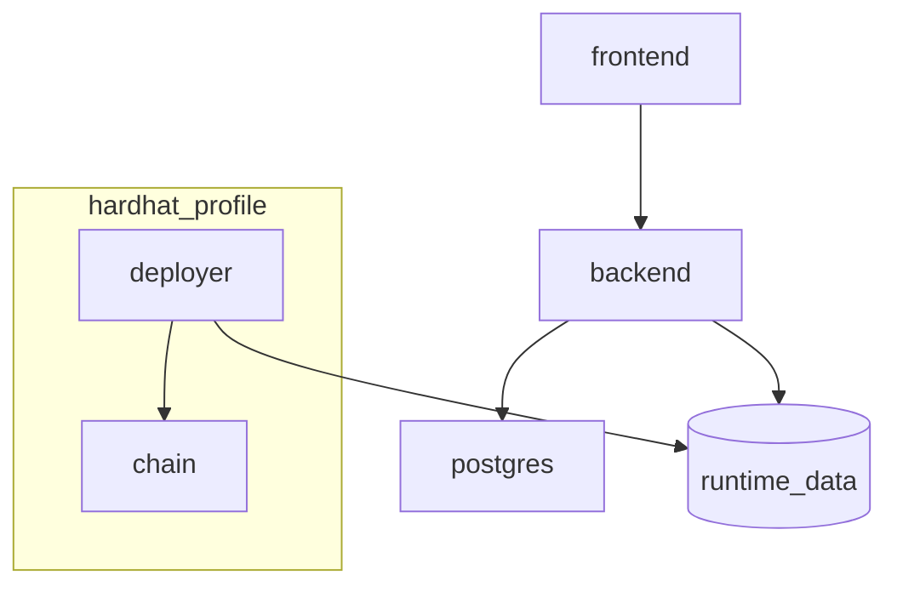
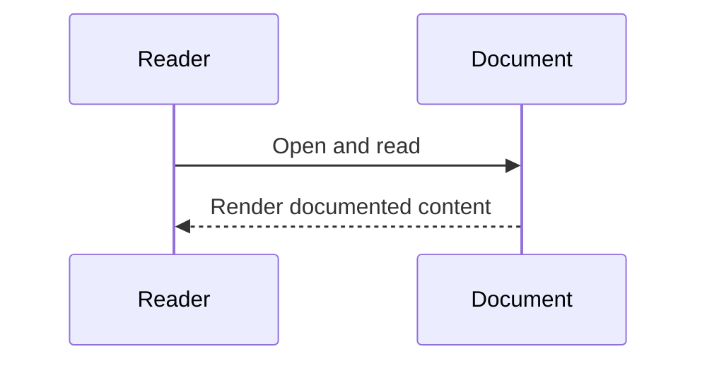
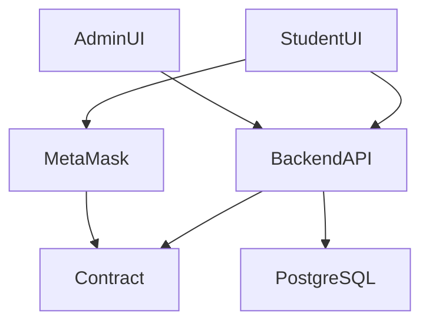
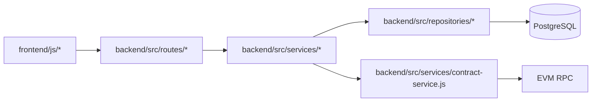
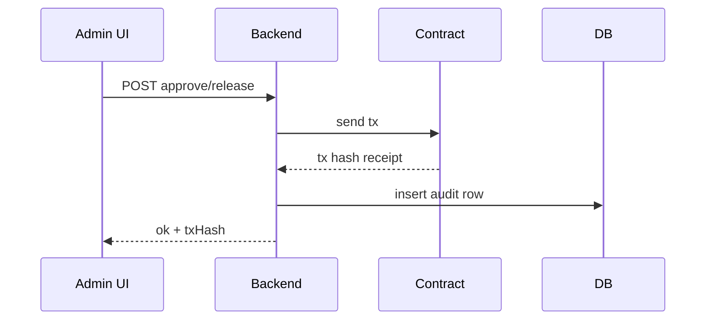

# Cross-System Interactions (Verified)

## Overview
This document maps implemented request/data interactions across frontend, backend, blockchain, and database.

## Responsibilities
- Frontend drives API and wallet interactions.
- Backend enforces auth, orchestrates chain tx for admin flows, and persists audit/auth data.
- Contract enforces on-chain scholarship rules.
- PostgreSQL stores off-chain audit and auth/session state.

## Runtime Interaction Diagram

### Diagram Explanation
- Admin approval/release flows are backend-mediated and write audits.
- Student claim bypasses backend transaction submission and executes wallet->contract.
- Backend still participates in student authentication via nonce/signature endpoints.

## Docker Profile Interaction Diagram

### Diagram Explanation
- `chain` and `deployer` are profile-scoped to `hardhat` only.
- In sepolia profile, backend uses external RPC configured by env and no local chain/deployer service starts.

## Internal Interactions
- Backend route -> service -> repository/contract adapter.
- Export service merges telemetry and DB audit rows.

## External Dependencies
- MetaMask provider in browser.
- EVM RPC endpoint (local chain or configured Sepolia RPC).

## Failure/Error Flow
- DB unavailable -> backend dependency errors for audit/auth reads/writes.
- RPC/contract unavailable -> scholarship operations and telemetry fail.
- Missing/invalid session -> protected routes reject requests.

## Security Considerations
- Protected APIs require session and role checks.
- Admin-only edit/export/verify paths.

## Scalability Considerations
- Pagination on audit history.
- Telemetry lookback limits.

## Performance Considerations
- Parallel DB queries for audit table reads.
- Cached contract client instance in adapter.

## Code References
- `frontend/js/admin-dashboard.js`
- `frontend/js/student-dashboard.js`
- `backend/src/routes/*.js`
- `backend/src/services/*.js`
- `backend/src/repositories/*.js`
- `docker-compose.yml`

## Sequence Diagram

## How this feature implemented ?

### 1. Feature Overview
Cross-system behavior is implemented through frontend fetch/wallet calls, backend Express APIs, PostgreSQL repositories, and on-chain contract calls.

### 2. Entry Points

#### Diagram Explanation
Shows actual runtime entry points and data directions from implemented code.

### 3. Internal Execution Flow
Admin write flow: UI -> `/api/scholarships/approve|release` -> service -> contract tx -> audit insert. Student claim flow: UI -> MetaMask signer -> `claimInstallment`.

### 4. Architecture & Component Relationships

#### Diagram Explanation
Reflects import and call-chain boundaries in code.

### 5. Data Flow
Session token and role travel from frontend localStorage to backend headers; DB persists auth/audit state; chain stores authoritative scholarship execution state.

### 6. Feature Lifecycle
Startup from Docker or local npm scripts, then continuous API and wallet interactions.

### 7. Interactions With Other Features/Services
Strong coupling points: backend config (`NETWORK_PROFILE`), contract address provisioning, session auth middleware, export service combining DB and chain telemetry.

### 8. Use Cases
Admin disbursement, auditor monitoring, student claims, admin export.

### 9. Edge Cases
RPC down, DB down, missing contract address, stale frontend session.

### 10. Error Handling & Recovery
APIs normalize errors; frontend surfaces status; contract reverts rollback on-chain writes.

### 11. Security Considerations
Role enforcement in backend middleware; student claim requires wallet key ownership.

### 12. Performance & Scalability
Windowed telemetry/history queries; chart polling interval on frontend.

### 13. Pros / Cons / Tradeoffs
Pros: clear separation between on-chain and off-chain concerns. Cons: two-state consistency management required (chain + DB).

### 14. Known Blockers / Risks
Implementation not found: event queue or eventual-consistency reconciler between chain and DB.

#### Diagram Explanation
Actual ordering from `scholarship-service.js` ensures DB record writes after chain confirmation path.
