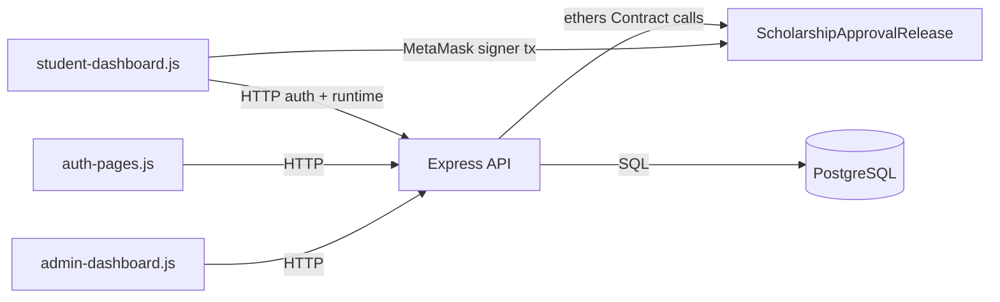
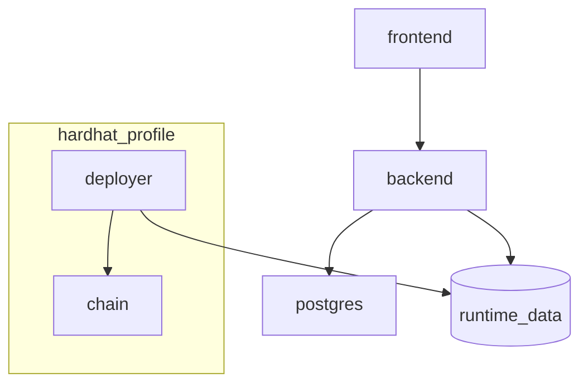
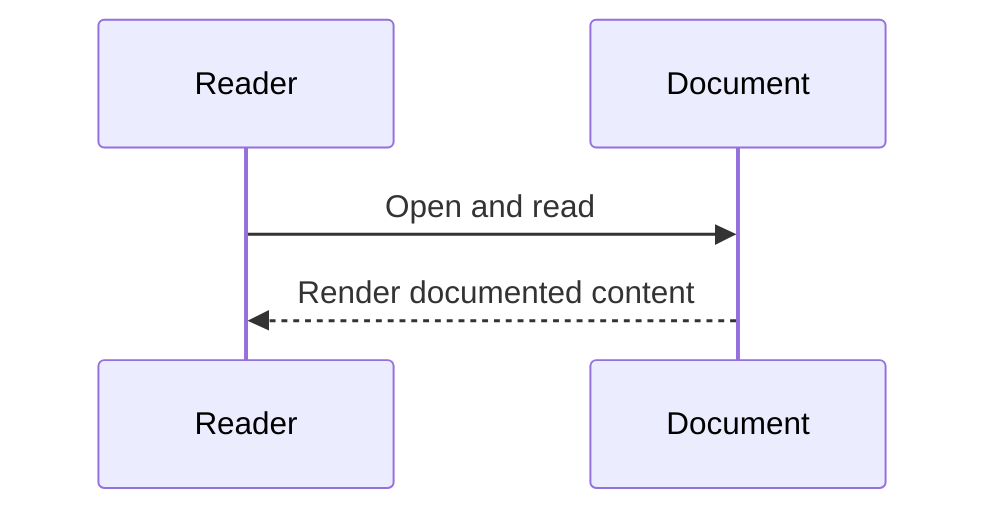

# Cross-System Interactions (Verified)

## Overview
This document maps implemented request/data interactions across frontend, backend, blockchain, and database.

## Responsibilities
- Frontend drives API and wallet interactions.
- Backend enforces auth, orchestrates chain tx for admin flows, and persists audit/auth data.
- Contract enforces on-chain scholarship rules.
- PostgreSQL stores off-chain audit and auth/session state.

## Runtime Interaction Diagram

### Diagram Explanation
- Admin approval/release flows are backend-mediated and write audits.
- Student claim bypasses backend transaction submission and executes wallet->contract.
- Backend still participates in student authentication via nonce/signature endpoints.

## Docker Profile Interaction Diagram

### Diagram Explanation
- `chain` and `deployer` are profile-scoped to `hardhat` only.
- In sepolia profile, backend uses external RPC configured by env and no local chain/deployer service starts.

## Internal Interactions
- Backend route -> service -> repository/contract adapter.
- Export service merges telemetry and DB audit rows.

## External Dependencies
- MetaMask provider in browser.
- EVM RPC endpoint (local chain or configured Sepolia RPC).

## Failure/Error Flow
- DB unavailable -> backend dependency errors for audit/auth reads/writes.
- RPC/contract unavailable -> scholarship operations and telemetry fail.
- Missing/invalid session -> protected routes reject requests.

## Security Considerations
- Protected APIs require session and role checks.
- Admin-only edit/export/verify paths.

## Scalability Considerations
- Pagination on audit history.
- Telemetry lookback limits.

## Performance Considerations
- Parallel DB queries for audit table reads.
- Cached contract client instance in adapter.

## Code References
- `frontend/js/admin-dashboard.js`
- `frontend/js/student-dashboard.js`
- `backend/src/routes/*.js`
- `backend/src/services/*.js`
- `backend/src/repositories/*.js`
- `docker-compose.yml`

## Sequence Diagram

