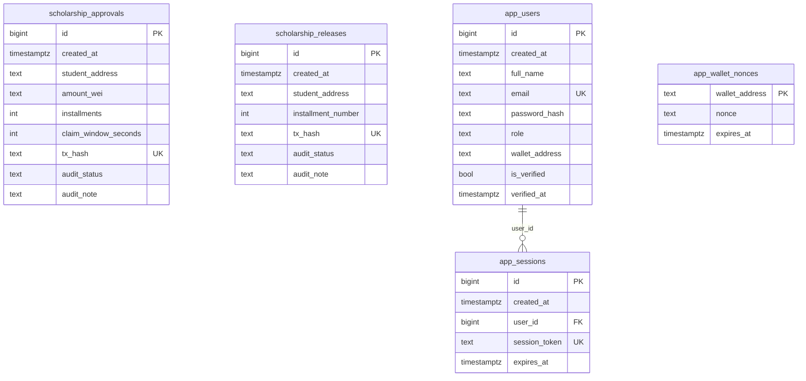
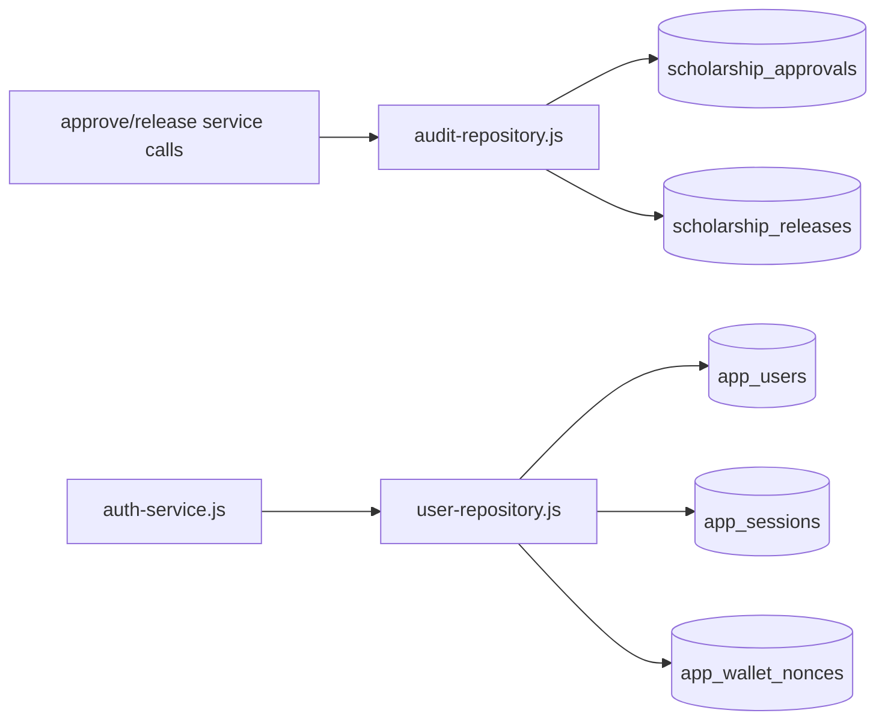
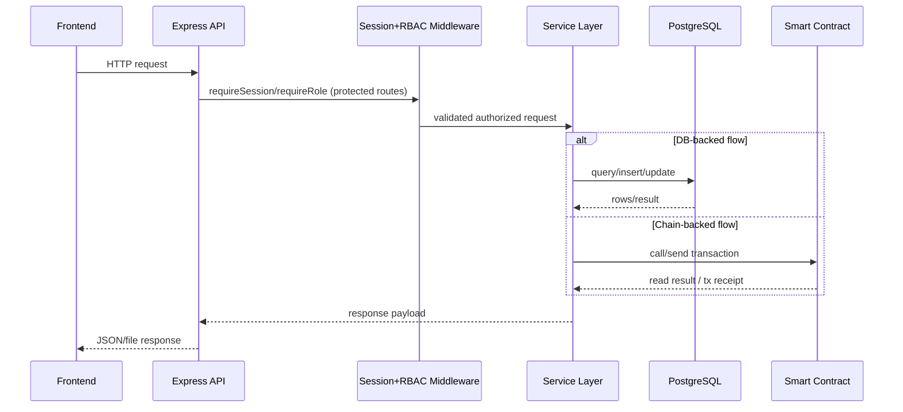
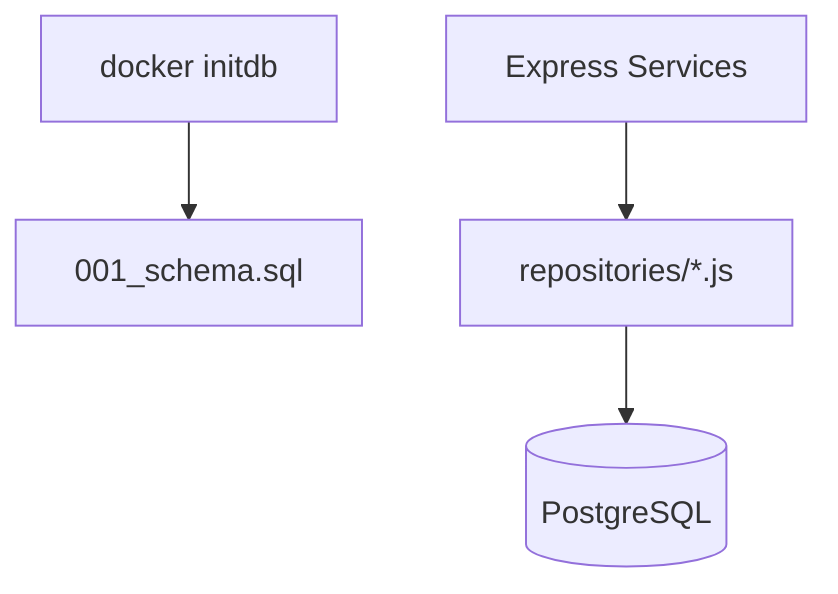
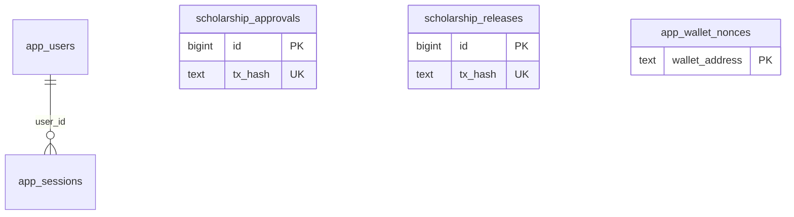
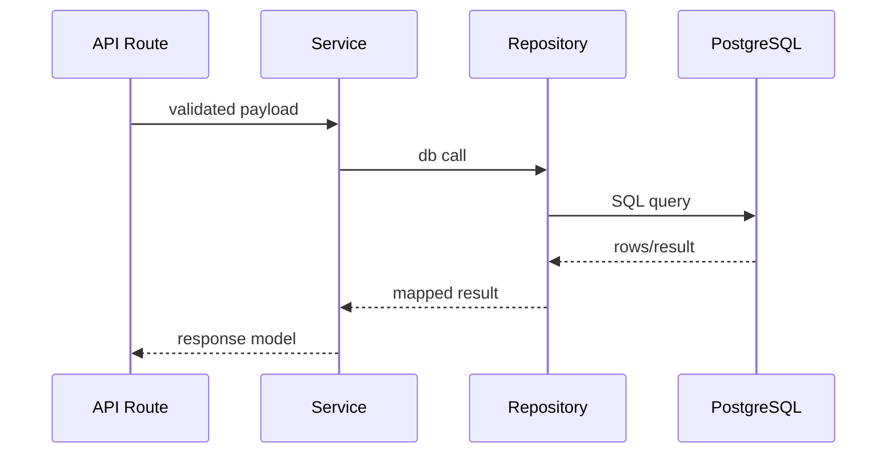

# Database Architecture (Verified)

## Overview
PostgreSQL stores audit logs and application identity/session data.

## Responsibilities
- Persist scholarship approval/release audit rows.
- Persist users, sessions, and wallet nonce challenges.
- Provide query surfaces for history and student verification flows.

## Entity Relationship Diagram

### Diagram Explanation
- `app_sessions.user_id` is the only explicit FK (`references app_users(id)`).
- `app_wallet_nonces` is keyed by wallet string; no explicit FK to users.
- Audit tables are independent and queried in parallel then merged by API.

## Internal Interactions
- Audit writes: `saveApprovalAudit`, `saveReleaseAudit`.
- Audit reads: `getAuditHistory`, `getAuditRowsForExport`.
- Auth/session: `findUserByEmail`, `createSession`, `findSession`.
- Wallet login: `saveWalletNonce`, `getWalletNonce`, `deleteWalletNonce`, `findStudentByWallet`.

## External Dependencies
- PostgreSQL via `pg` Pool.

## Data Flow

### Diagram Explanation
- Admin chain actions write tx-backed audit rows.
- Auth uses users+sessions; MetaMask login uses nonce table.

## Failure/Error Flow
- Missing `DATABASE_URL` -> dependency unavailable error path.
- Duplicate unique keys (email/session_token/tx_hash) can reject writes.

## Security Considerations
- Passwords stored as hash format (`scrypt:*`) for registered users; seeded admin uses `plain:` bootstrap value.
- Sessions expire by `expires_at` and are validated in queries.

## Scalability Considerations
- Indexes on audit tables for `student_address` and `created_at`.
- History endpoint is paginated.

## Performance Considerations
- DB pool reuse.
- Parallel queries for approvals/releases in history and export read paths.

## Code References
- `postgres/init/001_schema.sql`
- `backend/src/repositories/audit-repository.js`
- `backend/src/repositories/user-repository.js`
- `backend/src/postgres.js`

## Sequence Diagram

## How this feature implemented ?

### 1. Feature Overview
Database schema is implemented in `postgres/init/001_schema.sql`. Runtime DB access is through repositories using `backend/src/postgres.js` pool.

### 2. Entry Points

#### Diagram Explanation
Schema loads at container initialization; repositories execute parameterized SQL queries during runtime.

### 3. Internal Execution Flow
`auth-service.js` uses `user-repository.js`; `scholarship-service.js` uses `audit-repository.js`; export-service reads audit rows for file generation.

### 4. Architecture & Component Relationships

#### Diagram Explanation
Only explicit FK is `app_sessions.user_id -> app_users.id`.

### 5. Data Flow
Registration inserts user; login creates session; MetaMask login writes nonce then consumes/deletes it; approve/release append immutable tx-hash audit rows (editable status/note fields).

### 6. Feature Lifecycle
Schema init -> seed initial admin -> runtime CRUD through repositories.

### 7. Interactions With Other Features/Services
Used by auth, session middleware, audit history endpoints, export endpoints, and admin verification flow.

### 8. Use Cases
User onboarding, session tracking, audit trace persistence.

### 9. Edge Cases
Duplicate email/wallet/tx hash, missing DB URL, not-found verify/audit update targets.

### 10. Error Handling & Recovery
Repository throws are normalized by service/route layers to API errors.

### 11. Security Considerations
Parameterized queries reduce injection risk; password hash field exists but seeded admin is `plain:` bootstrap value.

### 12. Performance & Scalability
Indexes on `student_address`, `created_at`, and unique `tx_hash` improve read/query integrity.

### 13. Pros / Cons / Tradeoffs
Pros: minimal clear schema. Cons: no FK from wallet nonce to users; audit tables not relationally tied to user ids.

### 14. Known Blockers / Risks
Behavior unclear from current codebase: no migration framework/version table beyond init SQL file.

#### Diagram Explanation
This is the actual call layering used by auth and audit services.
