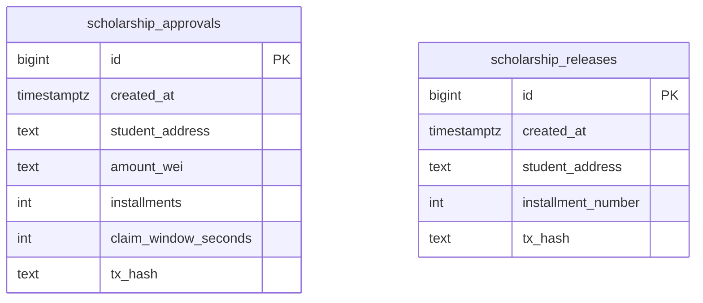

# Database Documentation

## Context
PostgreSQL stores audit records for approval and release actions initiated through backend orchestration.

## Scope
- `postgres/init/001_schema.sql`
- backend audit repository query model
- pagination and filtering semantics

## Architecture / Flow

- `tx_hash` is unique per table for idempotency protection.
- `student_address` and `created_at` indexes support filtering and recency views.
- Data is append-only audit history (no mutable business state).

## Components / Interfaces
- Insert paths:
  - approval tx receipt -> `scholarship_approvals`
  - release tx receipt -> `scholarship_releases`
- Read path:
  - `GET /api/audits/history` merges both tables in backend response.

## Failure Modes and Recovery
- `DATABASE_URL` missing:
  - backend returns deterministic `503`.
- write conflict on duplicate tx hash:
  - backend surfaces safe write-failure message.
- connectivity disruption:
  - request fails; no partial success in DB for that request.

## Validation Checklist
1. Start `postgres` container and ensure healthy
2. Confirm schema auto-applied at startup
3. Trigger approval/release and verify inserted rows
4. Call audit history endpoint with pagination
5. Call audit history with `studentAddress` filter

## Open Questions
- Do we need archival/retention policy for old audit rows?
- Should combined view materialization be added for large datasets?
