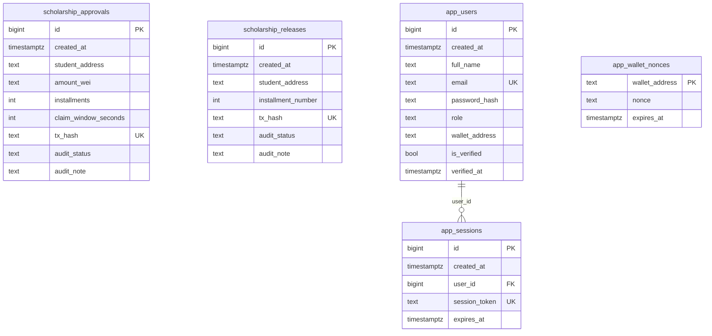
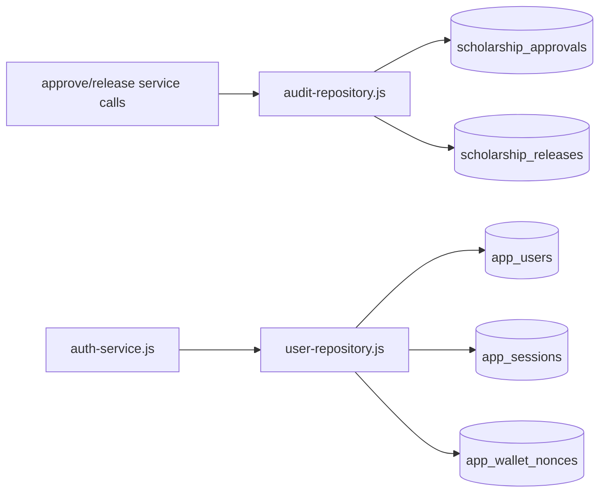
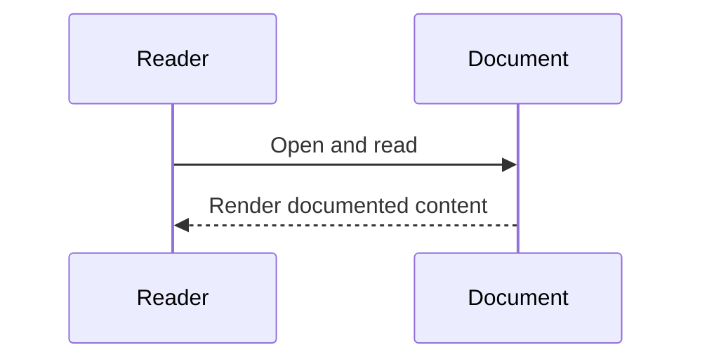

# Database Architecture (Verified)

## Overview
PostgreSQL stores audit logs and application identity/session data.

## Responsibilities
- Persist scholarship approval/release audit rows.
- Persist users, sessions, and wallet nonce challenges.
- Provide query surfaces for history and student verification flows.

## Entity Relationship Diagram

### Diagram Explanation
- `app_sessions.user_id` is the only explicit FK (`references app_users(id)`).
- `app_wallet_nonces` is keyed by wallet string; no explicit FK to users.
- Audit tables are independent and queried in parallel then merged by API.

## Internal Interactions
- Audit writes: `saveApprovalAudit`, `saveReleaseAudit`.
- Audit reads: `getAuditHistory`, `getAuditRowsForExport`.
- Auth/session: `findUserByEmail`, `createSession`, `findSession`.
- Wallet login: `saveWalletNonce`, `getWalletNonce`, `deleteWalletNonce`, `findStudentByWallet`.

## External Dependencies
- PostgreSQL via `pg` Pool.

## Data Flow

### Diagram Explanation
- Admin chain actions write tx-backed audit rows.
- Auth uses users+sessions; MetaMask login uses nonce table.

## Failure/Error Flow
- Missing `DATABASE_URL` -> dependency unavailable error path.
- Duplicate unique keys (email/session_token/tx_hash) can reject writes.

## Security Considerations
- Passwords stored as hash format (`scrypt:*`) for registered users; seeded admin uses `plain:` bootstrap value.
- Sessions expire by `expires_at` and are validated in queries.

## Scalability Considerations
- Indexes on audit tables for `student_address` and `created_at`.
- History endpoint is paginated.

## Performance Considerations
- DB pool reuse.
- Parallel queries for approvals/releases in history and export read paths.

## Code References
- `postgres/init/001_schema.sql`
- `backend/src/repositories/audit-repository.js`
- `backend/src/repositories/user-repository.js`
- `backend/src/postgres.js`

## Sequence Diagram

