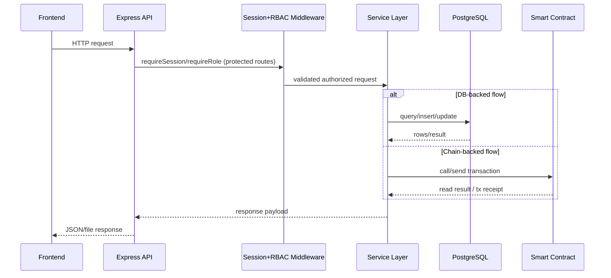

# Demo Evidence Log

## Capture Session
- Captured at: `2026-05-12`
- Environment: Docker Compose local stack

## Service Health Evidence
- `docker compose ps` showed healthy:
  - `postgres`
  - `chain`
  - `backend`
  - `frontend`
- Health endpoints:
  - `GET http://localhost:4000/api/health` -> `{ "ok": true, "service": "scholarship-backend" }`
  - `GET http://localhost:3300/health` -> `{ "ok": true, "service": "scholarship-frontend" }`

## Transaction Evidence
- Approval tx (student address):  
  `0x1cae9ef7085fe88b496cd1bb870536ae75f631caa8fa8ca36ade9990ab8a919d`
- Release tx (installment 1):  
  `0x58b17f0c057fc0c585c83a7eea051c6efb038f16840c2b65db2ef8a2fe59d876`
- Additional approval tx:  
  `0xfb02051f16691854875ea9b1a1d7d8717433d1cb1493e6495708f64f0a13c518`
- Claim tx (on-chain signer script):  
  `0x82fcaf3f7b7d157f3637b43a847b68b1bb66dffce5a725efbc77bd5cebf68f53`

## Audit History Evidence
- Endpoint used:  
  `GET /api/audits/history?page=1&pageSize=10&studentAddress=...`
- Observed:
  - approval rows with tx hashes matching backend responses
  - release rows with tx hashes matching backend responses

Raw payload snapshot:
- `docs/demo/api-evidence.json`

## Screenshot Evidence
- `docs/demo/screenshots/01_admin_dashboard_loaded.png`
- `docs/demo/screenshots/02_student_dashboard_loaded.png`
- `docs/demo/screenshots/03_home_dashboard_loaded.png`

## Notes
- Student claim screenshot with wallet popup is not auto-capturable in headless mode; tx-level claim proof is included via on-chain receipt hash above.

## Sequence Diagram

