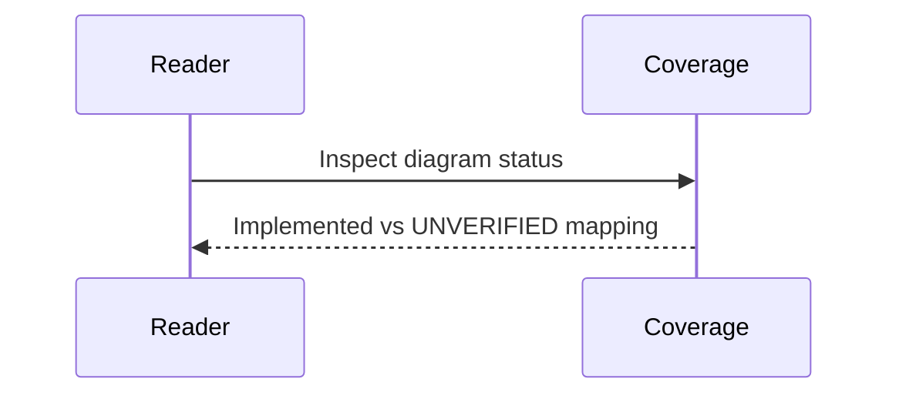

# Diagram Coverage Matrix

This file maps requested diagram categories to current repository documentation status.

| Diagram Type | Status | File(s) |
|---|---|---|
| System Architecture | Implemented | docs/codebase.md, docs/backend.md, docs/cross-interactions.md |
| Module Dependency | Implemented | docs/backend.md, docs/scholarship-routes.js.md |
| Call Flow / Execution Flow | Implemented | docs/backend.md, docs/auth-routes.js.md |
| Database ER | Implemented | docs/database.md, docs/001_schema.sql.md |
| API Interaction | Implemented | docs/scholarship-routes.js.md, docs/api-method-matrix.md |
| Sequence Diagrams | Implemented | all markdown files now include a sequenceDiagram block |
| Event Flow | Implemented | docs/contracts.md, docs/blockchain-lifecycle.md |
| State Machine | Implemented | docs/contracts.md, docs/ScholarshipApprovalRelease.sol.md |
| Frontend Component Hierarchy | Implemented (script/DOM hierarchy) | docs/frontend.md, docs/admin-dashboard.js.md |
| Deployment | Implemented | docs/docker-compose.yml.md, docs/cross-interactions.md |
| CI/CD Pipeline | UNVERIFIED (no pipeline files found) | docs/testing.md, docs/README.md |
| Security Flow | Implemented | docs/backend.md, docs/auth-session.js.md |
| Data Flow | Implemented | docs/codebase.md, docs/database.md |
| Class Diagram | UNVERIFIED/Not class-centric implementation | docs/testing.md (status only) |
| Package Diagram | Implemented | docs/package.json.md |
| Infrastructure / Network | Implemented | docs/docker-compose.yml.md, docs/cross-interactions.md |
| User Journey | Implemented | docs/frontend.md |
| Git Graph | UNVERIFIED (no generated git graph in docs) | this file |
| DDD Context Map | UNVERIFIED (no explicit DDD bounded context implementation) | this file |

## Sequence Diagram

