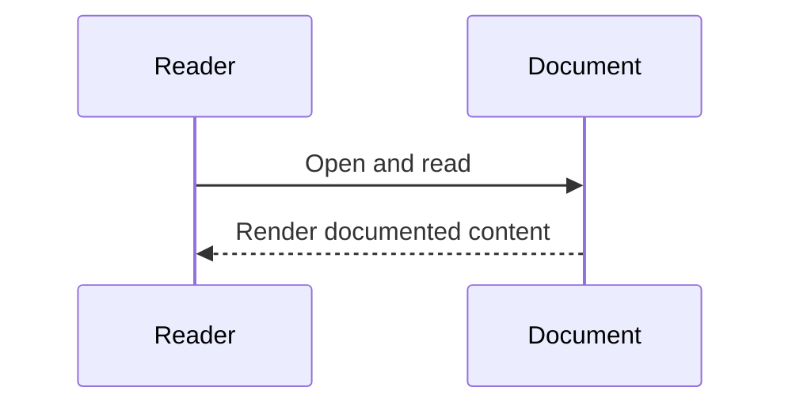

# Diagram Title
Deployment Topology from docker-compose.yml

## Diagram Type
Deployment Diagram

## Scope
Compose services, profile-scoped services, runtime volume dependencies.

## Verification Summary
Derived from service definitions, depends_on, profiles, and shared volumes.

## Evidence Sources
- docker-compose.yml:1-131
- backend/Dockerfile
- deployer/Dockerfile
- chain/Dockerfile
- Dockerfile

## Mermaid Diagram
```mermaid
flowchart TB
  subgraph Compose
    postgres[postgres]
    backend[backend]
    frontend[frontend]
    chain[chain (profile: hardhat)]
    deployer[deployer (profile: hardhat)]
    runtime_data[(runtime_data)]
    pg_data[(pg_data)]
  end

  postgres --> pg_data
  deployer --> chain
  deployer --> runtime_data
  backend --> runtime_data
  backend --> postgres
  frontend --> backend
```

## Confidence Level
High

## Unverified/Missing Areas
- No Kubernetes/Terraform manifests found in this repository.

## Sequence Diagram

