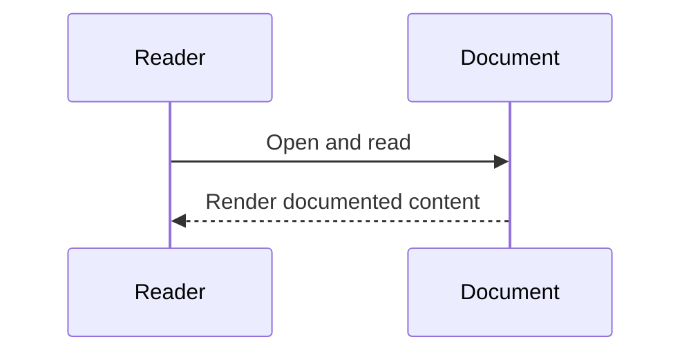
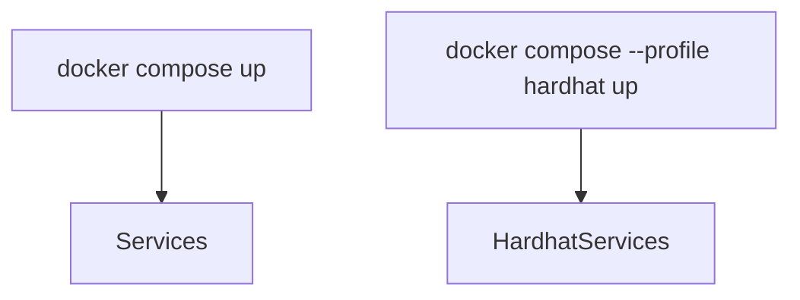
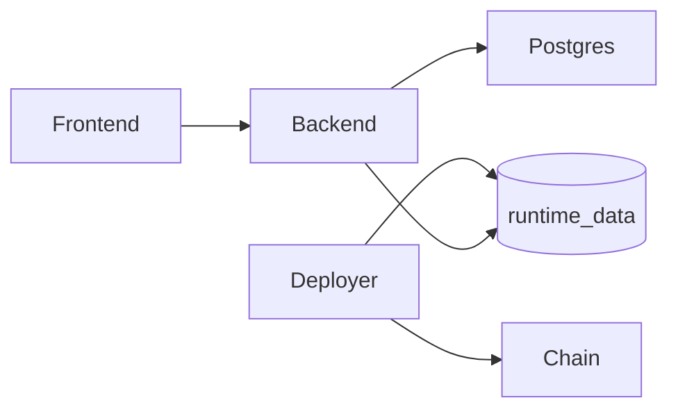
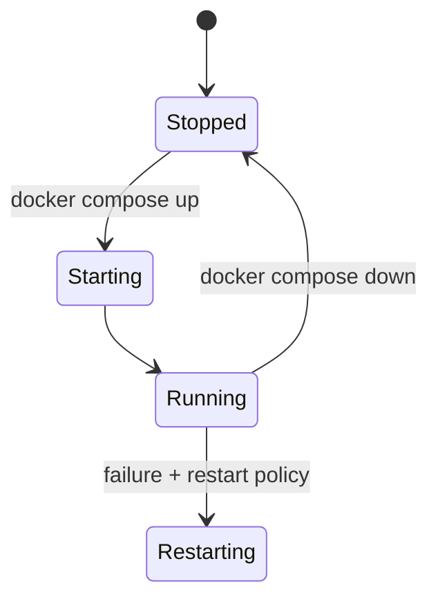

# Diagram Title
Deployment Topology from docker-compose.yml

## Diagram Type
Deployment Diagram

## Scope
Compose services, profile-scoped services, runtime volume dependencies.

## Verification Summary
Derived from service definitions, depends_on, profiles, and shared volumes.

## Evidence Sources
- docker-compose.yml:1-131
- backend/Dockerfile
- deployer/Dockerfile
- chain/Dockerfile
- Dockerfile

## Mermaid Diagram
```mermaid
flowchart TB
  subgraph Compose
    postgres[postgres]
    backend[backend]
    frontend[frontend]
    chain[chain (profile: hardhat)]
    deployer[deployer (profile: hardhat)]
    runtime_data[(runtime_data)]
    pg_data[(pg_data)]
  end

  postgres --> pg_data
  deployer --> chain
  deployer --> runtime_data
  backend --> runtime_data
  backend --> postgres
  frontend --> backend
```

## Confidence Level
High

## Unverified/Missing Areas
- No Kubernetes/Terraform manifests found in this repository.

## Sequence Diagram


## How this feature implemented ?

### 1. Feature Overview
`docker-compose.yml` implements two runtime modes: default external RPC mode and `hardhat` profile mode with local chain/deployer.

### 2. Entry Points

#### Diagram Explanation
Compose command is operational entry point; profile flag toggles local chain/deployer service activation.

### 3. Internal Execution Flow
Compose starts `postgres`, `backend`, `frontend`; with profile hardhat it also starts `chain` and `deployer` that writes `runtime_data/contract-address.json` consumed by backend.

### 4. Architecture & Component Relationships

#### Diagram Explanation
Edges come from `depends_on`, shared volume mounts, and backend runtime address read logic.

### 5. Data Flow
Env vars feed backend network config; volume shares deployed contract address file.

### 6. Feature Lifecycle
Container init -> health checks/dependencies -> runtime service operations -> stop/restart via compose policies.

### 7. Interactions With Other Features/Services
Directly influences backend contract connectivity and frontend API availability.

### 8. Use Cases
Local deterministic testing (hardhat profile) and public testnet integration (sepolia/external RPC).

### 9. Edge Cases
Profile mismatch, missing RPC vars, chain not ready before deployer.

### 10. Error Handling & Recovery
Restart policies and dependency ordering exist; no advanced orchestration retry controller found.

### 11. Security Considerations
Secrets provided via environment variables; no secret-manager integration found.

### 12. Performance & Scalability
Single-compose local topology; no horizontal scaling config in compose file.

### 13. Pros / Cons / Tradeoffs
Pros: simple switchable environments. Cons: local compose not equivalent to production orchestrator.

### 14. Known Blockers / Risks
Implementation not found: Kubernetes/Terraform deployment artifacts.


#### Diagram Explanation
Operational container lifecycle as implemented by compose behavior and restart policies.
