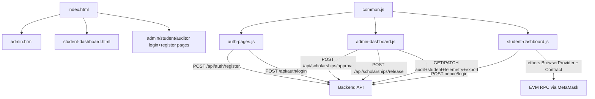
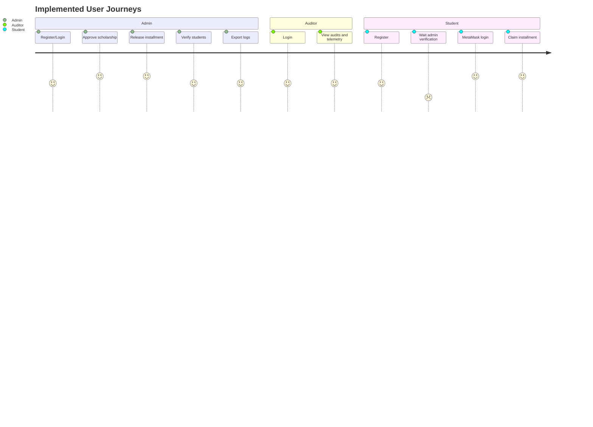
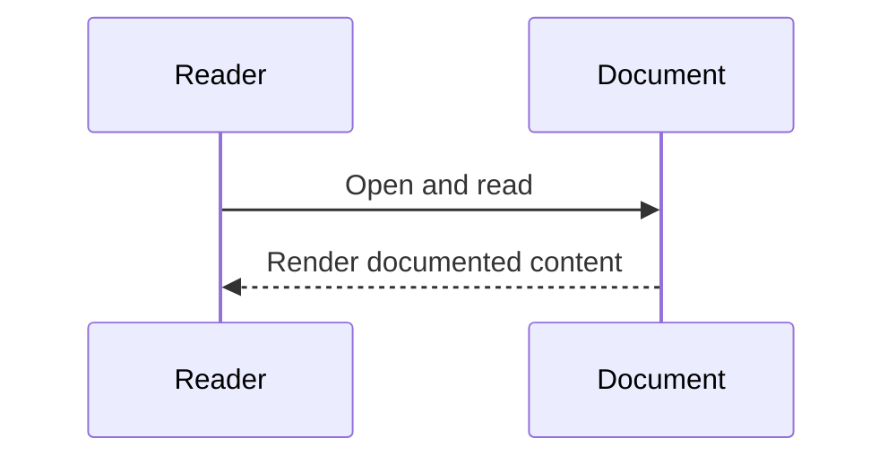
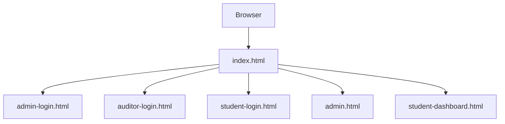
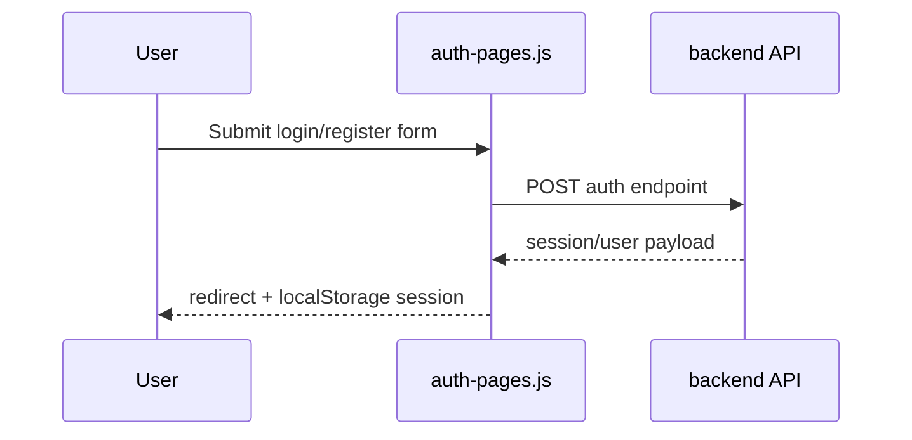
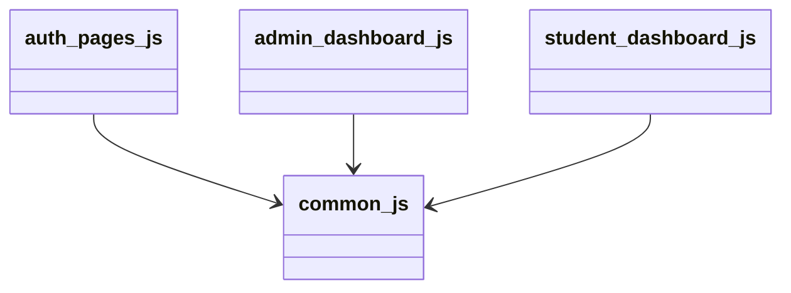
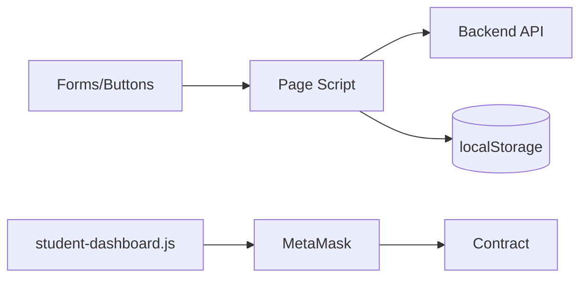
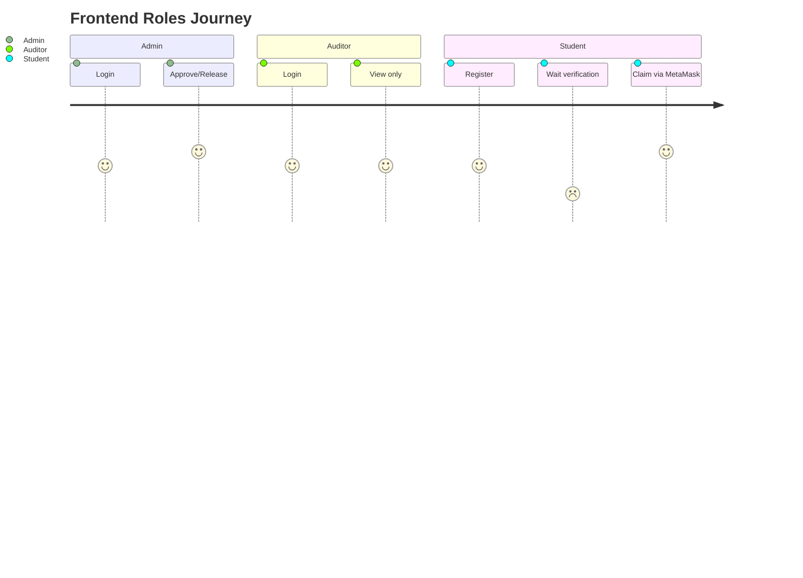

# Frontend Architecture (Verified)

## Overview
Frontend is static HTML served by `server.js`, with browser-side JavaScript modules handling auth/session, admin operations, and student wallet claim flow.

## Responsibilities
- Auth pages: register/login and session storage.
- Admin dashboard: approval/release actions, student verification, audit edits, telemetry, funds graph, exports.
- Student dashboard: MetaMask connect/sign-in, claimable installment loading, claim tx submission.

## Internal Interactions

### Diagram Explanation
- `common.js` provides shared session/auth header utilities.
- `auth-pages.js` persists session after successful login.
- `admin-dashboard.js` uses `fetch` to backend only.
- `student-dashboard.js` mixes backend auth endpoints with direct contract calls via MetaMask signer.

## User Journey

### Diagram Explanation
- Student login depends on admin verification (`is_verified` check in backend).
- Student claim path is wallet-based contract interaction.
- Auditor has view-only API access enforced by role checks.

## External Dependencies
- Browser `fetch` API
- MetaMask (`window.ethereum`)
- `ethers` UMD in student page
- Chart.js UMD in admin page

## Data Flow
- Session in localStorage key `scholarship_session`.
- Admin UI state in localStorage key `scholarship_admin_ui_state`.
- Student UI state in localStorage key `scholarship_student_ui_state`.

## Failure/Error Flow
- Missing/invalid session -> redirect to role login page.
- Missing MetaMask -> explicit error alert.
- Wrong chainId -> prompt to switch network.
- API error -> alert with backend error message.

## Security Considerations
- Uses bearer token from localStorage for protected APIs.
- Adds `x-user-role` header from session role.
- **UNVERIFIED**: no client-side token encryption/storage hardening beyond localStorage.

## Scalability Considerations
- Audit and telemetry queries are paginated/windowed via backend.
- Charts refresh every 8 seconds in admin dashboard.

## Performance Considerations
- Async refresh and incremental UI updates.
- Silent wallet reconnect avoids unnecessary account prompt on refresh.

## Code References
- `server.js`
- `frontend/js/common.js`
- `frontend/js/auth-pages.js`
- `frontend/js/admin-dashboard.js`
- `frontend/js/student-dashboard.js`
- `frontend/*.html`

## Sequence Diagram

## How this feature implemented ?

### 1. Feature Overview
Frontend is implemented as static pages in `frontend/*.html` with behavior in `frontend/js/common.js`, `frontend/js/auth-pages.js`, `frontend/js/admin-dashboard.js`, and `frontend/js/student-dashboard.js`.

### 2. Entry Points

#### Diagram Explanation
User enters through static pages; scripts bind forms/buttons on DOM load and call backend APIs or MetaMask.

#### Diagram Explanation
Login/register execution path from UI to backend is implemented in `auth-pages.js` handlers.

### 3. Internal Execution Flow
`admin-dashboard.js` loads users/audits/telemetry/funds and renders tables/charts; `student-dashboard.js` verifies runtime network, handles MetaMask nonce/sign-in, and claims installments.

### 4. Architecture & Component Relationships

#### Diagram Explanation
All major pages depend on shared helpers from `common.js` for status rendering/session header logic.

### 5. Data Flow

#### Diagram Explanation
Data enters from user input and wallet signer; localStorage stores session and page UI state.

### 6. Feature Lifecycle
Page load -> session guard -> fetch initial data -> periodic refresh (admin telemetry/funds) -> user actions -> API/wallet updates.

### 7. Interactions With Other Features/Services
Frontend depends on backend auth/session and scholarship APIs; student flow also depends on MetaMask + chain RPC.

### 8. Use Cases
Admin workflow, auditor read-only workflow, student self-registration + verified-login + claim workflow.

### 9. Edge Cases
No MetaMask installed, wrong chain, empty student list dropdown, expired session, failed exports.

### 10. Error Handling & Recovery
Errors surfaced via alert/status blocks; role-login redirects on auth failures.

### 11. Security Considerations
Role data in session object; bearer token in localStorage; no client-side secret storage besides browser storage.

### 12. Performance & Scalability
Charts refresh at interval; paginated audit reads via backend query params.

### 13. Pros / Cons / Tradeoffs
Pros: simple deploy and explicit role pages. Cons: localStorage token model and browser-heavy state management.

### 14. Known Blockers / Risks
Behavior unclear from current codebase: no service worker/offline mode; no frontend rate-limiting.

#### Diagram Explanation
Reflects implemented UI paths and role boundaries in frontend scripts and backend role checks.
