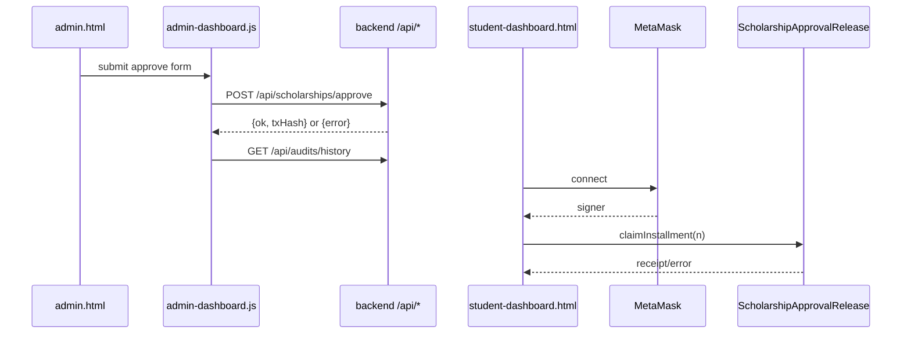

# Frontend Technical Documentation

## Context
Frontend provides operator and student interfaces:
- Admin path: approve and release via backend APIs.
- Student path: wallet connect and on-chain claim.

## Scope
- `frontend/index.html`
- `frontend/admin.html`
- `frontend/student-dashboard.html`
- `frontend/js/common.js`
- `frontend/js/admin-dashboard.js`
- `frontend/js/student-dashboard.js`
- `frontend/css/app.css`
- `server.js` static host

## Architecture / Flow
```mermaid
flowchart TD
  IDX[index.html] --> ADM[admin.html]
  IDX --> STU[student-dashboard.html]
  ADM --> ADMJS[admin-dashboard.js]
  STU --> STUJS[student-dashboard.js]
  ADMJS -->|fetch| API[/api/scholarships/*]
  ADMJS -->|fetch| AUDIT[/api/audits/history]
  STUJS -->|ethers BrowserProvider| MM[MetaMask]
  MM --> CHAIN[Contract]
```

- Admin UI is backend-driven.
- Student claim is chain-driven.
- Shared utility functions are centralized in `common.js`.



- Admin success triggers audit refresh request.
- Student flow requires `window.CONTRACT_ADDRESS` + wallet availability.

## Components / Interfaces
- Admin APIs called by frontend:
  - `POST /api/scholarships/approve`
  - `POST /api/scholarships/release`
  - `GET /api/audits/history`
- Student chain call:
  - `claimInstallment(uint256 installmentNumber)`

## Failure Modes and Recovery
- Missing contract address on student page:
  - show actionable alert and stop claim flow.
- Backend validation errors:
  - surfaced in alert UI with message from API.
- Wallet unavailable:
  - explicit MetaMask requirement error.
- Pagination exhaustion:
  - `Prev/Next` button states computed from totals.

## Validation Checklist
1. Start frontend: `npm.cmd run start:frontend`
2. Visit `http://localhost:3300`
3. Navigate admin and student pages
4. Verify form loading states, errors, and success alerts
5. Run `npm.cmd run test:frontend`

## Open Questions
- Should wallet state be persisted between reloads?
- Should admin UI include event-log fallback when DB is unavailable?
