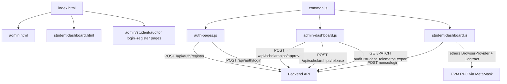
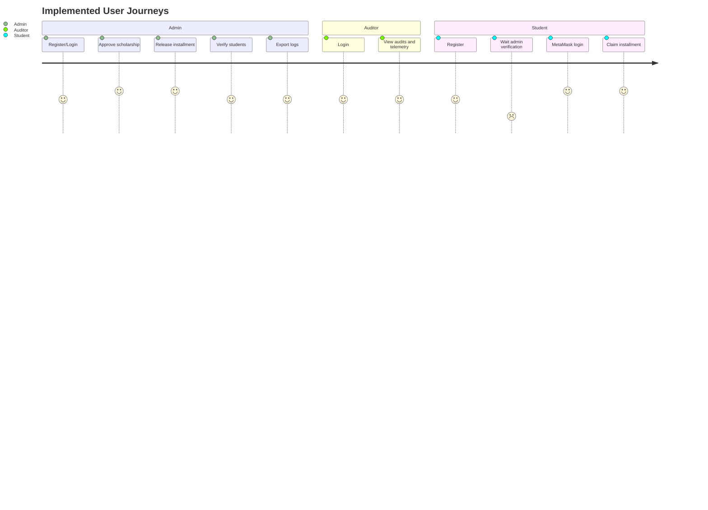
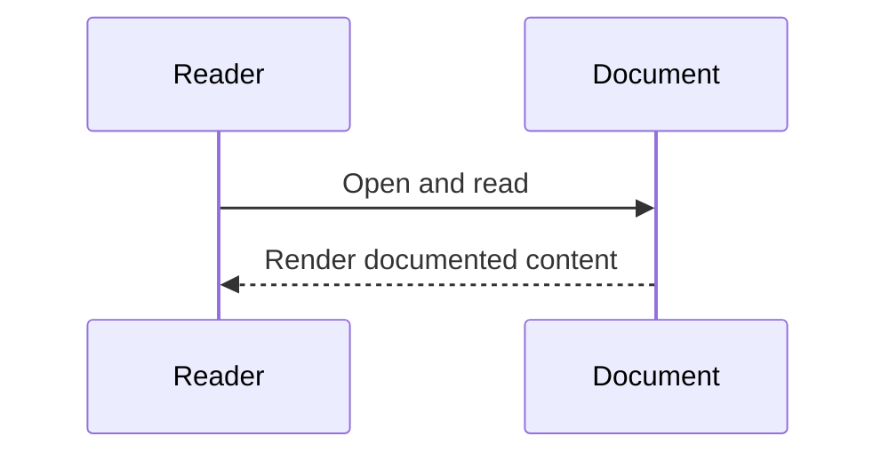

# Frontend Architecture (Verified)

## Overview
Frontend is static HTML served by `server.js`, with browser-side JavaScript modules handling auth/session, admin operations, and student wallet claim flow.

## Responsibilities
- Auth pages: register/login and session storage.
- Admin dashboard: approval/release actions, student verification, audit edits, telemetry, funds graph, exports.
- Student dashboard: MetaMask connect/sign-in, claimable installment loading, claim tx submission.

## Internal Interactions

### Diagram Explanation
- `common.js` provides shared session/auth header utilities.
- `auth-pages.js` persists session after successful login.
- `admin-dashboard.js` uses `fetch` to backend only.
- `student-dashboard.js` mixes backend auth endpoints with direct contract calls via MetaMask signer.

## User Journey

### Diagram Explanation
- Student login depends on admin verification (`is_verified` check in backend).
- Student claim path is wallet-based contract interaction.
- Auditor has view-only API access enforced by role checks.

## External Dependencies
- Browser `fetch` API
- MetaMask (`window.ethereum`)
- `ethers` UMD in student page
- Chart.js UMD in admin page

## Data Flow
- Session in localStorage key `scholarship_session`.
- Admin UI state in localStorage key `scholarship_admin_ui_state`.
- Student UI state in localStorage key `scholarship_student_ui_state`.

## Failure/Error Flow
- Missing/invalid session -> redirect to role login page.
- Missing MetaMask -> explicit error alert.
- Wrong chainId -> prompt to switch network.
- API error -> alert with backend error message.

## Security Considerations
- Uses bearer token from localStorage for protected APIs.
- Adds `x-user-role` header from session role.
- **UNVERIFIED**: no client-side token encryption/storage hardening beyond localStorage.

## Scalability Considerations
- Audit and telemetry queries are paginated/windowed via backend.
- Charts refresh every 8 seconds in admin dashboard.

## Performance Considerations
- Async refresh and incremental UI updates.
- Silent wallet reconnect avoids unnecessary account prompt on refresh.

## Code References
- `server.js`
- `frontend/js/common.js`
- `frontend/js/auth-pages.js`
- `frontend/js/admin-dashboard.js`
- `frontend/js/student-dashboard.js`
- `frontend/*.html`

## Sequence Diagram

