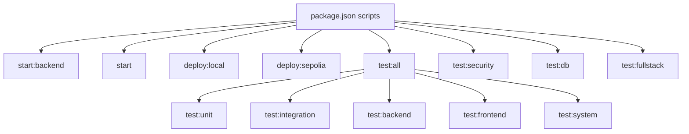
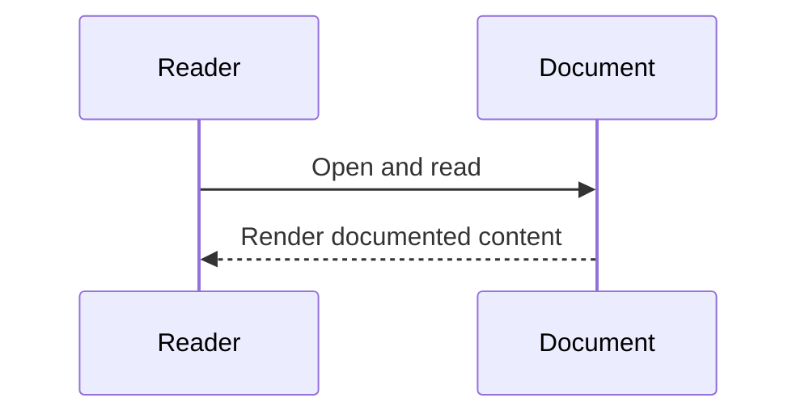

# Diagram Title
Package and Test Boundary from package.json

## Diagram Type
Package Diagram

## Scope
Runtime packages, dev tools, and script-level execution groupings.

## Verification Summary
Directly extracted from package.json scripts and dependencies.

## Evidence Sources
- package.json:7-56

## Mermaid Diagram

## Confidence Level
High

## Unverified/Missing Areas
- No CI pipeline definitions in package.json itself.

## Sequence Diagram

