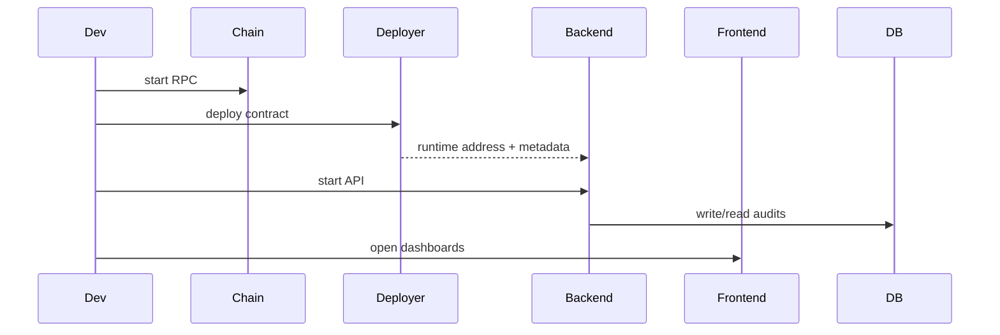

# End-to-End Runbook

## Context
This runbook provides deterministic local and Docker execution steps for demo and validation.

## Scope
- Local execution
- Docker execution
- Expected outputs
- Known troubleshooting paths

## Architecture / Flow

## Components / Interfaces
### Local Mode
1. `npm.cmd run compile`
2. `npx hardhat node`
3. `npm.cmd run deploy:local`
4. Set `CONTRACT_ADDRESS` in `.env`
5. `npm.cmd run start:backend`
6. `npm.cmd run start:frontend`

### Docker Mode
1. `docker compose up -d --build`
2. `docker compose ps`
3. Validate service health:
  - backend: `http://localhost:4000/api/health`
  - frontend: `http://localhost:3300/health`

## Failure Modes and Recovery
- Hardhat compiler lock:
  - use `tools/run-hardhat.js` (already wired in npm scripts).
- RPC not reachable:
  - ensure `chain` is healthy before deployer/backend operations.
- Contract not configured:
  - verify `/runtime/contract-address` and `/runtime/contract-metadata.json` in volume handoff.
- DB unavailable:
  - verify `postgres` health and `DATABASE_URL`/`DOCKER_DATABASE_URL`.

## Validation Checklist
1. Approve flow returns `201 { ok: true, txHash }`
2. Release flow returns `200 { ok: true, txHash }`
3. Student claim succeeds from wallet
4. `GET /api/audits/history` returns paginated rows
5. Backend/frontend tests pass

## Open Questions
- Should we add a single command script to auto-run health + smoke assertions?
