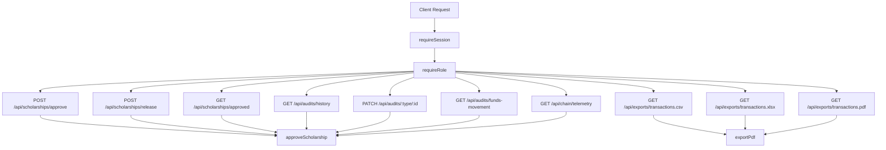

# Diagram Title
API Interaction from scholarship-routes.js

## Diagram Type
API Interaction Diagram

## Scope
All scholarship/audit/telemetry/export routes and middleware guards.

## Verification Summary
All nodes and edges are from route handlers, requireSession, and requireRole usage.

## Evidence Sources
- backend/src/routes/scholarship-routes.js:20-131
- backend/src/middleware/auth-session.js:15-47
- backend/src/middleware/role-auth.js:16-25
- backend/src/services/scholarship-service.js:16-79
- backend/src/services/export-service.js:6-100

## Mermaid Diagram

## Confidence Level
High

## Unverified/Missing Areas
- No queue/event-bus handlers in this route file.
