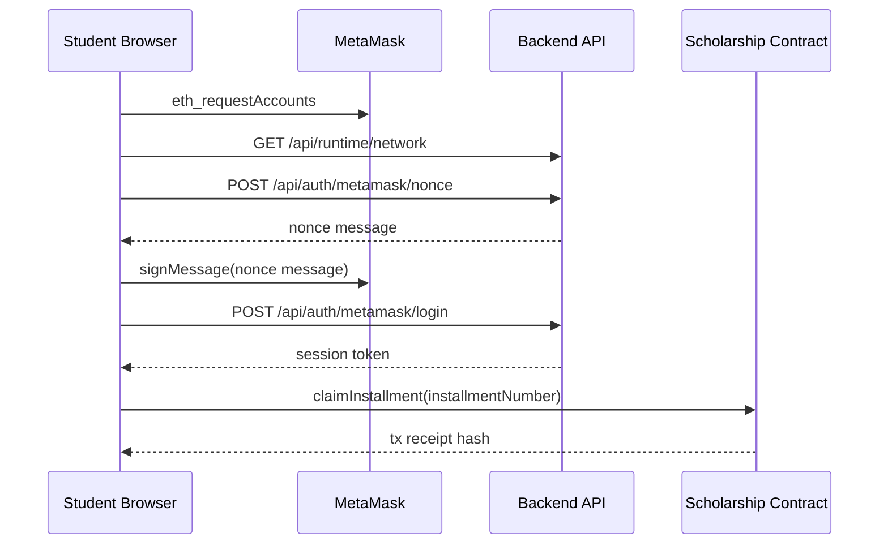

# Diagram Title
Student Wallet Flow from student-dashboard.js

## Diagram Type
Sequence Diagram

## Scope
MetaMask connect, nonce-sign login, claim transaction.

## Verification Summary
All steps from direct fetch/RPC/sign/contract calls.

## Evidence Sources
- frontend/js/student-dashboard.js:100-143
- frontend/js/student-dashboard.js:166-188
- frontend/js/student-dashboard.js:190-215
- backend/src/routes/auth-routes.js:39-64

## Mermaid Diagram

## Confidence Level
High

## Unverified/Missing Areas
- No backend endpoint writes claim rows to PostgreSQL audit tables.
