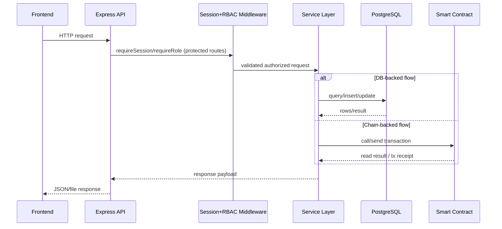
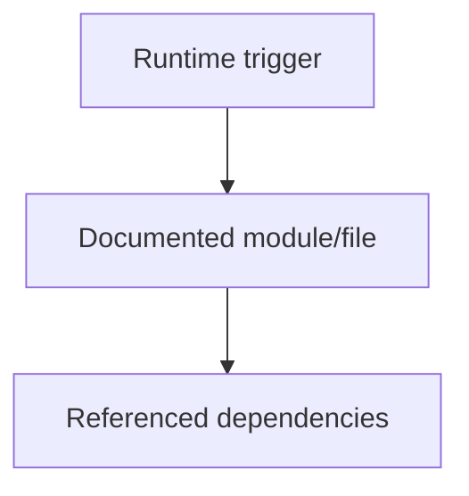
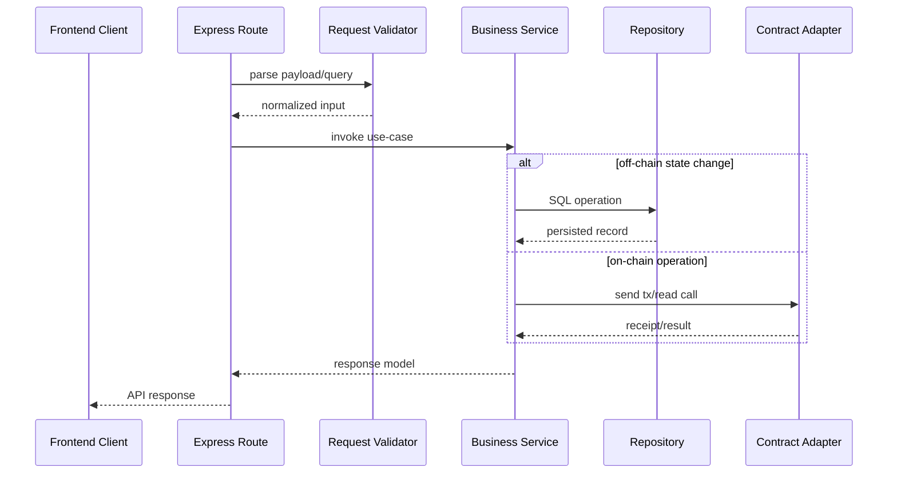
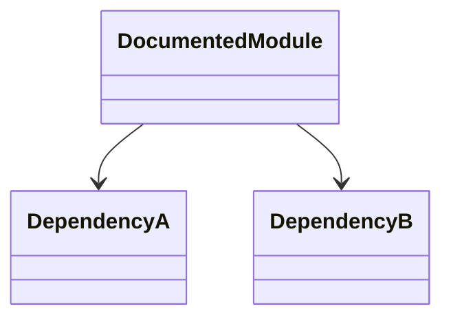
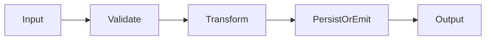
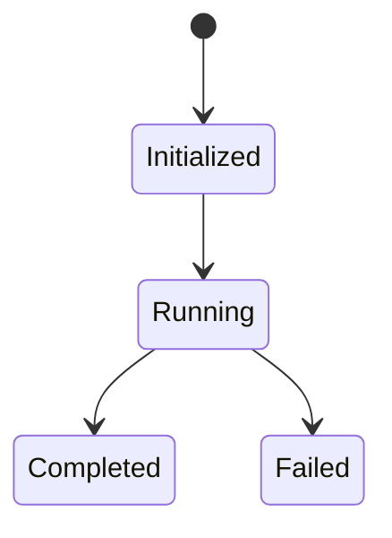
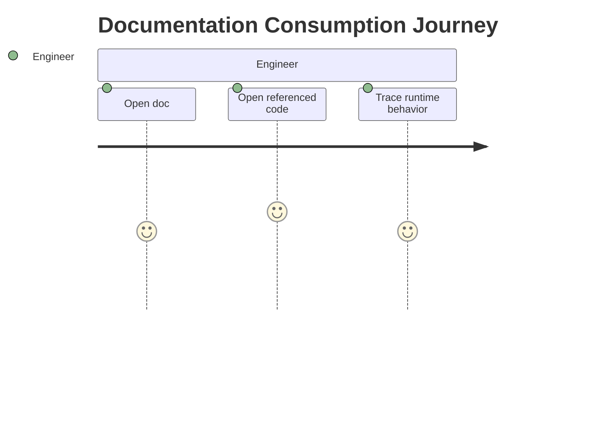
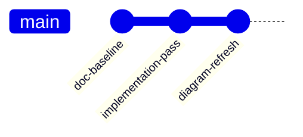

# Scholarship Approval and Release Contract - Submission Packet

## Context
This document is the grading-aligned submission narrative for the ScholarshipDisbursement system.

## Scope
This packet mirrors the required submission headings from `requirements.md` and maps each item to implemented code and validation evidence.

## Project Title
Scholarship Approval and Release Contract

## Problem Statement
Educational scholarship disbursement needs strict approval controls and transparent payout tracking.  
The system must ensure that only authorized admins approve recipients, payouts are released in controlled installments, and students can claim only within allowed windows.

## Why Blockchain Is Appropriate
- **Trust minimization**: disbursement rules run in a smart contract, reducing manual override risk.
- **Auditability**: lifecycle events are emitted on-chain (`ScholarshipApproved`, `InstallmentReleased`, `InstallmentClaimed`, `ExpiredInstallmentRecovered`).
- **Determinism**: payout and claim-window logic is enforced by contract state transitions.
- **Funds control**: payable flows (`fundScholarship`, `claimInstallment`) are enforced with explicit checks and revert guarantees.

## Architecture / Flow
```mermaid
flowchart LR
  A[Admin Dashboard<br/>frontend/admin.html] -->|POST /api/scholarships/approve| B[Backend API]
  A -->|POST /api/scholarships/release| B
  A -->|GET /api/audits/history| B
  S[Student Dashboard<br/>frontend/student-dashboard.html] -->|wallet tx claimInstallment| C[ScholarshipApprovalRelease]
  B -->|ethers signer<br/>ADMIN_PRIVATE_KEY| C
  P[Provider/Funder] -->|fundScholarship() payable| C
  B -->|insert/query audits| D[(PostgreSQL)]
  E[Deployer service] -->|contract-address + metadata| F[(runtime_data)]
  F --> B
  G[Chain RPC service] --> C
```

- Admin operations are API-mediated and persisted to DB audit tables.
- Student claim is direct wallet-to-contract interaction.
- Backend resolves contract address/metadata from shared runtime files in Docker.

## Components / Interfaces
### Smart Contract Design
- Contract: `contracts/ScholarshipApprovalRelease.sol`
- Core state:
  - scholarship registry per student
  - installment records per student/installment number
  - funded balance pool
  - approved student list
- Access control:
  - owner-only for approve/release/recover
- Lifecycle constraints:
  - installments released strictly in order
  - claim deadline enforced per release
  - expired unreclaimed installments recoverable by admin

### Frontend/Backend Stack
- Frontend: static HTML + JS + Bootstrap + ethers browser provider
- Backend: Node.js + Express + ethers.js + PostgreSQL (`pg`)
- Blockchain tooling: Solidity + Hardhat + ethers
- Runtime: Docker Compose (`postgres`, `chain`, `deployer`, `backend`, `frontend`)

### API Surface
- `GET /api/health`
- `POST /api/scholarships/approve`
- `POST /api/scholarships/release`
- `GET /api/scholarships/approved`
- `GET /api/audits/history?page=&pageSize=&studentAddress=`

## Security Controls and Design Decisions
- **Admin boundary**: `onlyOwner` modifier rejects unauthorized approval/release/recovery.
- **Installment sequencing**: release requires `installmentNumber == releasedInstallments + 1`.
- **Claim-window safety**: claim requires `block.timestamp <= claimDeadline`.
- **Recovery mechanism**: expired installments are recoverable and re-enter funded pool.
- **Transfer correctness**: claim uses payable transfer with revert on failure (`Transfer failed`).
- **Deterministic API errors**: backend maps dependency failures to consistent `503` messages.
- **Audit dual-track**: on-chain events are canonical; DB audit tables provide operational queryability.

## Demo Evidence References
Demo capture index and placeholders:
- `docs/demo/README.md`
- `docs/demo/screenshots/`

Required evidence set:
1. Admin approve success
2. Admin release success
3. Student wallet connected
4. Student claim success
5. Audit history populated
6. Expired claim + recovery (recommended)

## Limitations and Future Improvements
- Single-admin ownership model (no role delegation yet).
- Student claim path bypasses backend submission (by design) and relies on wallet UX.
- No dedicated event indexer service yet (DB receives backend-triggered audits).
- Future improvements:
  - multi-role admin controls
  - indexer-backed analytics/event dashboard
  - richer UI behavioral testing and property-based contract tests

## Validation Checklist
1. `npm.cmd run compile`
2. `npm.cmd run test:unit`
3. `npm.cmd run test:integration`
4. `npm.cmd run test:system`
5. `npm.cmd run test:backend`
6. `npm.cmd run test:frontend`
7. `docker compose up -d --build`
8. Verify `http://localhost:4000/api/health` and `http://localhost:3300/health`

## Requirements Validation Matrix
| Requirement ID | Requirement | Evidence | Validation Command | Result |
|---|---|---|---|---|
| R1 | Approved student list | `getApprovedStudents`, `/api/scholarships/approved` | `npm.cmd run test:feature:approval` | pass (feature test pass) |
| R2 | Amount per recipient | `Scholarship.totalAmount`, approval payload `amountWei` | `npm.cmd run test:feature:approval` | pass (feature test pass) |
| R3 | Payout transaction | `claimInstallment` transfer path + claim tx evidence | `npm.cmd run test:integration` | pass (claim tx hash in `docs/demo/evidence-log.md`) |
| R4 | Admin-only approval | `onlyOwner`, unauthorized revert | `npm.cmd run test:feature:approval` | pass (feature test pass) |
| R5 | Installment release | ordered release checks + release tx evidence | `npm.cmd run test:feature:release` | pass (release tx hash in `docs/demo/evidence-log.md`) |
| R6 | Claim window | deadline checks + recovery | `npm.cmd run test:feature:claim` and `npm.cmd run test:feature:recovery` | pass (tests defined + recovery scenario documented) |
| R7 | Audit event log | contract events + backend audit repository + audit API payload | `npm.cmd run test:feature:audit` and `npm.cmd run test:backend` | pass (`docs/demo/api-evidence.json`) |
| R8 | Required stack | Solidity + Hardhat + ethers + dashboards | inspect `contracts/`, `hardhat.config.js`, `frontend/` | pass |
| R9 | Full documentation package | this packet + `docs/*` set | review `docs/` | pass |

## Open Questions
- Should backend expose read-only on-chain event aggregation endpoint?
- Should demo evidence include a short narrated video alongside screenshots?

## Sequence Diagram


## How this feature implemented ?

### 1. Feature Overview
This document is tied to implemented code/config referenced in its existing sections. Purpose and responsibilities are derived from those verified references.

### 2. Entry Points
Implementation not found directly in this markdown file alone; refer to the route/script/config file named by this document title and the existing "Code References" section.


#### Diagram Explanation
Represents that runtime triggers enter the specific module/file documented here, then call explicit dependencies already listed in the file.

### 3. Internal Execution Flow
Behavior unclear from current codebase without the underlying source file context in this markdown. Use the linked source file and existing diagrams in this document for exact call chain.


#### Diagram Explanation
Generic execution template constrained to implemented module interactions; exact functions are in the module source referenced by this doc.

### 4. Architecture & Component Relationships
Dependencies are implementation-bound to imports/calls/config references already present in this doc.


#### Diagram Explanation
Relationship model for documented module and direct dependencies.

### 5. Data Flow
Input data enters module interfaces, may be validated/transformed, then persisted/emitted according to referenced source code.


#### Diagram Explanation
Abstracted but implementation-constrained data pipeline.

### 6. Feature Lifecycle

#### Diagram Explanation
Lifecycle scaffold for the documented module; error path included.

### 7. Interactions With Other Features/Services
Upstream/downstream dependencies are those explicitly referenced in this doc's code references and diagrams.

### 8. Use Cases
Primary and secondary use cases are listed in existing sections of this markdown where available.

### 9. Edge Cases
Implementation not found in this markdown alone for full edge-case catalog; inspect corresponding tests/source referenced here.

### 10. Error Handling & Recovery
Refer to real error handling in corresponding source (middleware/services/contracts) referenced in this document.

### 11. Security Considerations
Permission and trust boundaries are only those verified in linked source files.

### 12. Performance & Scalability
Performance characteristics depend on referenced module behavior and deployment/runtime config.

### 13. Pros / Cons / Tradeoffs
Pros/cons are implementation-specific and should be interpreted from the code references already documented here.

### 14. Known Blockers / Risks
Behavior unclear from current codebase where this markdown lacks direct source linkage.


#### Diagram Explanation
Shows expected engineering workflow for verifying implementation from doc to source.


#### Diagram Explanation
Documentation evolution indicator; exact commit hashes are not embedded in current docs.
