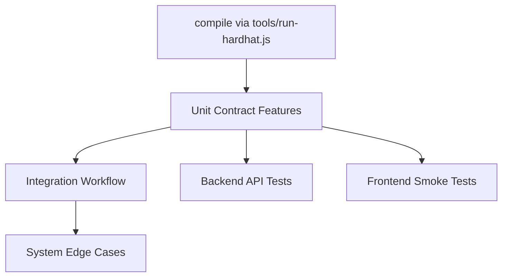
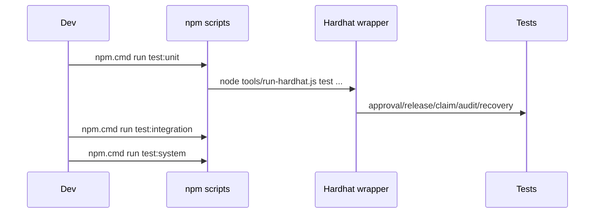

# Testing Documentation

## Context
Testing is layered to verify contract correctness, integration wiring, system edge-cases, and backend/frontend stability.

## Scope
- `test/unit/*.feature.test.js`
- `test/integration/workflow.integration.test.js`
- `test/system/system-wide.e2e.test.js`
- `test/backend/api.test.js`
- `test/frontend/pages.test.js`

## Architecture / Flow

- Unit tests target isolated contract behavior.
- Integration validates end-to-end lifecycle path.
- System tests enforce cross-cutting controls and edge conditions.

- Test commands reflect current script implementation and Hardhat-lock mitigation.

## Components / Interfaces
- Unit:
  - approval, release, claim-window, recovery, audit events
- Integration:
  - full 3-installment workflow
- System:
  - unauthorized actions, insufficient funds, window expiry
- Backend:
  - health, validation, dependency error behavior
- Frontend:
  - key page content/smoke coverage

## Failure Modes and Recovery
- Hardhat cache lock contention:
  - resolved by project-scoped Hardhat launcher wrapper.
- RPC/network dependency in tests:
  - local Hardhat network used in test runtime.
- DB unavailable:
  - backend tests assert deterministic `503`.

## Validation Checklist
1. `npm.cmd run compile`
2. `npm.cmd run test:unit`
3. `npm.cmd run test:integration`
4. `npm.cmd run test:system`
5. `npm.cmd run test:backend`
6. `npm.cmd run test:frontend`
7. `npm.cmd run test:all`

## Open Questions
- Add contract fuzz/property tests for arithmetic and ordering invariants?
- Add UI behavior tests beyond static page assertions?
