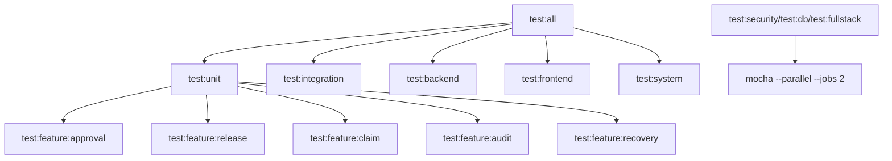
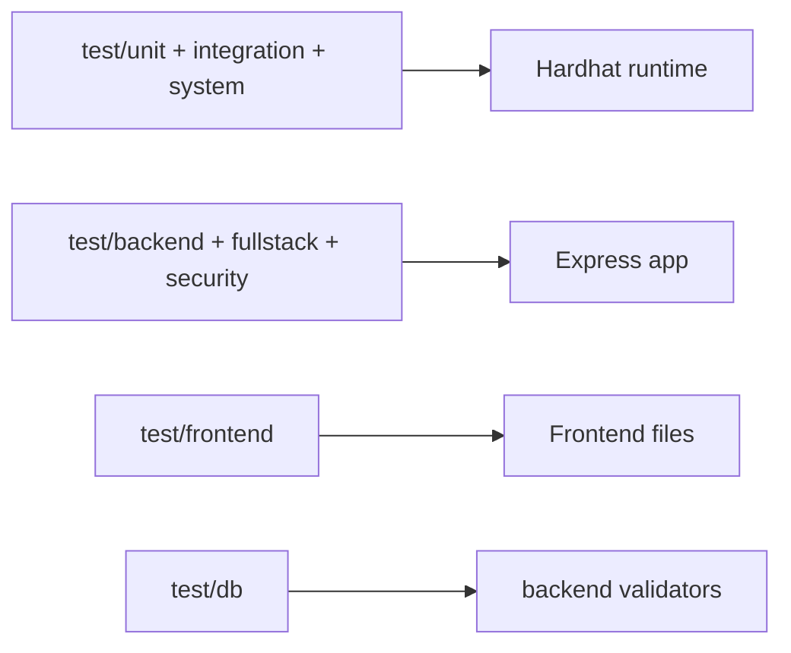
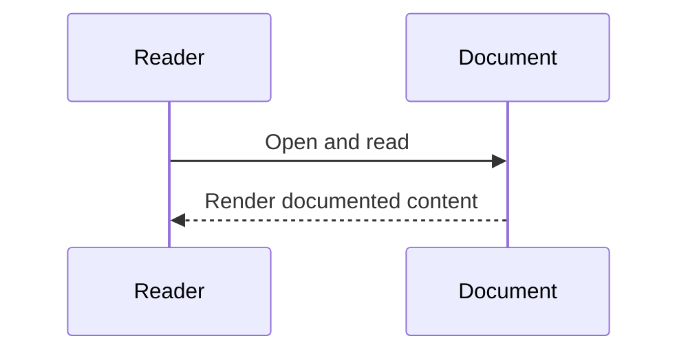

# Testing Architecture (Verified)

## Overview
Testing is implemented through npm scripts with layered scopes: unit, integration, system, backend, frontend, security, DB behavior, fullstack API.

## Responsibilities
- Unit/integration/system: contract behavior and workflow correctness.
- Backend/frontend: API and page structure behavior.
- Security: authorization boundary assertions.
- DB behavior: parser/input constraints tied to DB usage.
- Fullstack API: runtime/auth surface checks.

## Test Execution Graph

### Diagram Explanation
- `test:all` orchestrates baseline quality gates.
- Security/DB/fullstack suites are additional targeted checks.
- Several suites run with Mocha parallel worker mode.

## Runtime Coverage

### Diagram Explanation
- Contract suites execute through hardhat wrapper command.
- Backend tests instantiate app and hit route handlers.
- Frontend tests assert static page structure content.

## External Dependencies
- Mocha/Chai/Supertest
- Hardhat wrapper script

## Failure/Error Flow
- DB unavailable path is asserted in backend tests as deterministic `503`.
- Authorization boundary denials are asserted in security tests.

## Security Considerations
- Explicit tests for non-admin export denial and protected API auth requirement.

## Scalability Considerations
- Parallel jobs configured for selected suites.

## Performance Considerations
- Parallel mode reduces latency for independent mocha groups.

## CI/CD Pipeline Diagram
**UNVERIFIED**: no CI pipeline config files detected in repository scan.

## Code References
- `package.json` scripts section
- `test/unit/*`
- `test/integration/workflow.integration.test.js`
- `test/system/system-wide.e2e.test.js`
- `test/backend/api.test.js`
- `test/frontend/pages.test.js`
- `test/security/authorization.security.test.js`
- `test/db/db.behavior.test.js`
- `test/fullstack/fullstack.api.test.js`

## Sequence Diagram

