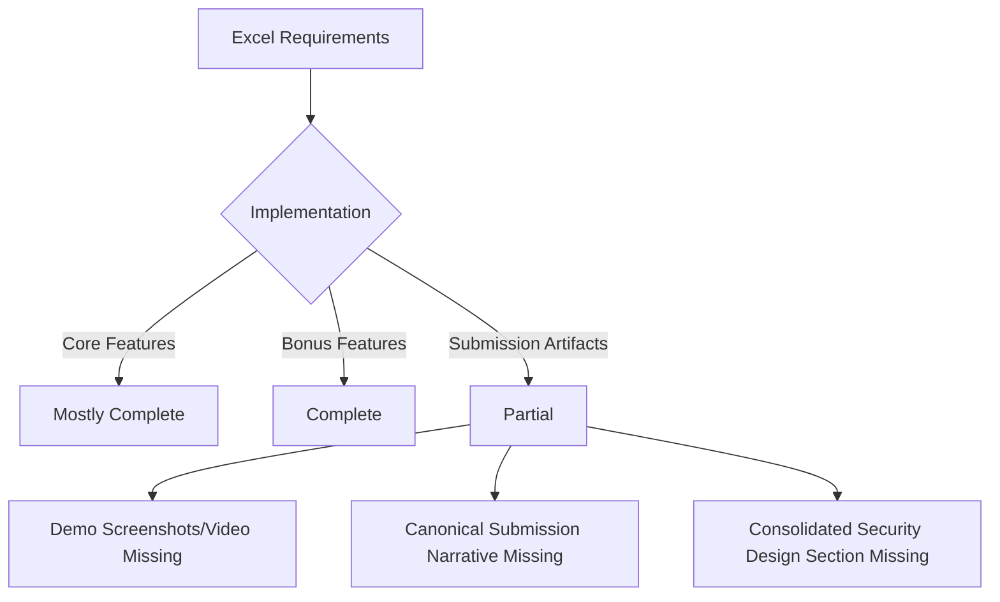
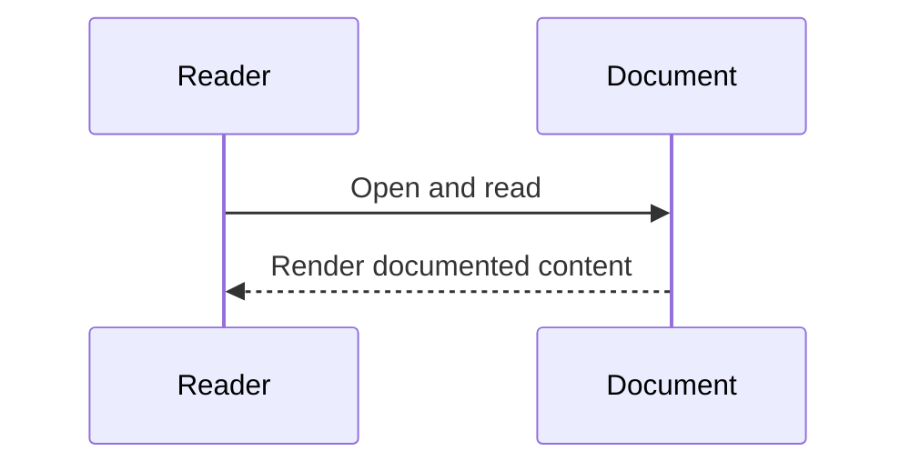

# Gap Missing Analysis (`gap_missing.md`)

This document compares current repository state to the requirements extracted in `requirements.md`.

## 1) Functional Gaps (Core + Bonus)

| ID | Requirement | Status | Gap |
|---|---|---|---|
| R1 | Approved student list | Implemented | No functional gap |
| R2 | Amount per recipient | Implemented | No functional gap |
| R3 | Payout transaction | Implemented | No functional gap |
| R4 | Admin-only approval | Implemented | No functional gap |
| R5 | Installment release | Implemented | No functional gap |
| R6 | Claim window | Implemented | No functional gap |
| R7 | Audit event log | Implemented | Minor docs gap: operational audit dashboard/reporting not formalized |

## 2) Architecture/Stack Gaps

| ID | Requirement | Status | Gap |
|---|---|---|---|
| R8 | Solidity + Hardhat + ethers + admin/student dashboards | Implemented | No architecture gap |

## 3) Delivery & Submission Gaps

From `Submission_Grading` sheet:

| Submission Item | Current Status | Gap |
|---|---|---|
| Project title | Present in docs | No gap |
| Problem statement | Present in docs | Could be standardized into one dedicated submission section |
| Why blockchain is appropriate | Partially present | Needs a focused rationale section tied to trust/audit/funds control |
| System architecture diagram | Present (Mermaid) | Need one final canonical architecture diagram for submission packet |
| Smart contract design | Present | Needs concise “design decisions + security controls” section |
| Frontend/backend stack | Present | Needs brief justification paragraph for chosen stack |
| Demo screenshots or video | Not found in repo deliverables | **Missing artifact** |
| Limitations and future improvements | Partially present | Needs a dedicated final section in submission document |

## 4) Validation & Reliability Gaps

| Area | Current Status | Gap |
|---|---|---|
| Frontend tests | Passing | No immediate gap |
| Backend tests | Passing | No immediate gap |
| Contract unit/integration/system runs | Defined | Environment lock/network issues can block reproducible local execution |
| End-to-end scripted demo runbook | Partial | Add one command-sequence runbook with expected outputs |

## 5) Documentation Gaps for “Full Dedicated Documentation with Mermaid”

| Documentation Need | Status | Gap |
|---|---|---|
| Requirements mapping | Now provided (`requirements.md`) | No gap |
| Gap analysis | Now provided (`gap_missing.md`) | No gap |
| Assumption-based residual analysis | Pending -> `assume_gap` | Will be addressed in next file |
| Unified final submission doc | Partial (`README.md`, `new_readme.md`, `docs/codebase.md`) | Need one single submission-focused narrative document |
| Mermaid breadth | Present in `docs/codebase.md` | Ensure all included diagrams render cleanly in target viewer |

## 6) Mermaid Gap Overview

## 7) Priority Gap List
1. Create a **single submission-focused document** that directly mirrors grading headings.
2. Add **demo evidence artifacts** (screenshots or video links).
3. Add a concise **security/design decision section** (access control, fund safety, claim-window logic, auditability).
4. Stabilize reproducible **full test execution runbook** under local constraints.

## Sequence Diagram

