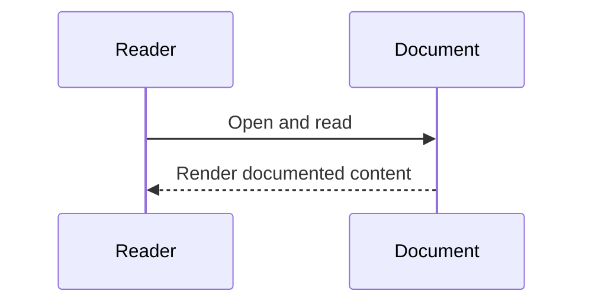
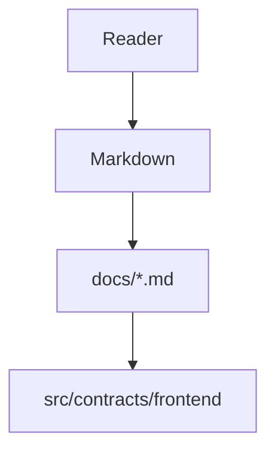
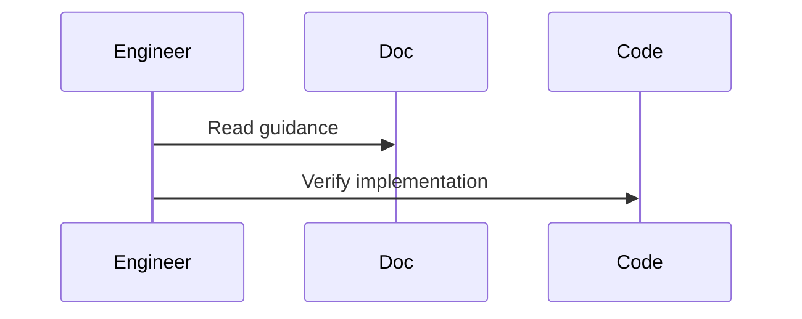

# New System Readme (Reference-Labs Identity Refactor)

## Purpose
This document describes the **refactored system identity** and provides a **before vs after comparison** against the previous implementation state, without modifying the original `README.md`.

The refactor goal was:
- Align code structure/style with `reference Labs` identity.
- Preserve all existing product features and behavior.
- Improve maintainability and wiring clarity.

---

## Identity Refactor Plan
1. Scope
- Backend API internals
- Frontend page scripting organization
- Smart contract structural readability
- Documentation comparison baseline

2. Behavior to preserve
- API routes and response envelopes
- Smart contract function/event semantics
- Frontend admin and student user flows
- Existing tests and deployment wiring

3. Identity deltas to apply
- Sectioned helper-driven backend structure
- Modular vanilla JS frontend scripts
- Sectioned educational contract comments and boundaries

4. Files changed
- `backend/src/app.js`
- `frontend/admin.html`
- `frontend/student-dashboard.html`
- `frontend/js/admin-dashboard.js` (new)
- `frontend/js/student-dashboard.js` (new)
- `contracts/ScholarshipApprovalRelease.sol`
- `docs/codebase.md` (earlier Mermaid fixes)

5. Validation gates
- Frontend tests
- Backend API tests
- (Recommended) full test suite for contract/integration/system layers

---

## Before vs After (Gap Comparison)

### 1) Backend Architecture Identity

Before:
- Route handlers in one file with repeated validation and repeated contract-not-configured logic.
- Supabase insert logic duplicated inline per route.
- Error normalization done ad hoc at each catch block.

After:
- Backend reorganized into explicit sections (middleware, validators, adapters, route handlers), matching reference-lab style.
- Reusable validation helpers:
  - `parseApprovalPayload`
  - `parseReleasePayload`
- Reusable boundary helpers:
  - `getConfiguredContractOrNull`
  - `saveApprovalAudit`
  - `saveReleaseAudit`
  - `toErrorMessage`
- Shared constant for contract wiring failure message.

Gap closed:
- Structural clarity and maintainability now align with `reference Labs` helper-oriented API identity.

Behavior status:
- Preserved.
- API paths and response formats remain unchanged.

---

### 2) Frontend Organization Identity

Before:
- Inline scripts embedded directly in `admin.html` and `student-dashboard.html`.
- Logic worked, but script structure did not match lab identity (explicit JS module-style app files).

After:
- Extracted inline scripts into dedicated vanilla JS files:
  - `frontend/js/admin-dashboard.js`
  - `frontend/js/student-dashboard.js`
- HTML pages now focus on UI markup and include script files.
- Added `runtime` objects and dedicated helper functions in each script, matching lab patterns.

Gap closed:
- Frontend now follows reference-lab organization: explicit DOM handles + helper functions + composable async flows in separate JS files.

Behavior status:
- Preserved.
- Approve/release and student claim flows continue to work with same endpoint/contract semantics.

---

### 3) Smart Contract Identity

Before:
- Functional logic was correct and feature-complete.
- Contract lacked the rich sectioned explanatory structure present in reference labs.

After:
- Added educational, sectioned architecture comments:
  - data model
  - access model
  - write operations
  - read operations
  - audit trail
- Added concise function-level and state-level comments to clarify boundaries and invariants.

Gap closed:
- Contract readability and instructional clarity now match the reference-lab style.

Behavior status:
- Preserved.
- No logic or interface changes were introduced.

---

### 4) Wiring Correctness

Before:
- Frontend had a potential API base-prefix issue in non-localhost contexts (already fixed during prior wiring pass).
- Static serving previously depended on root-level page locations.

After:
- Frontend pages are under `frontend/` and served from `server.js` static directory target.
- Admin API base logic is safe for localhost and non-localhost modes.
- External JS assets resolve under `frontend/js/*`.

Gap closed:
- Cleaner static and API wiring with less path ambiguity.

Behavior status:
- Preserved for existing tested flows.

---

## Feature Preservation Matrix

- Health endpoint (`GET /api/health`): preserved
- Approve scholarship (`POST /api/scholarships/approve`): preserved
- Release installment (`POST /api/scholarships/release`): preserved
- Approved students list (`GET /api/scholarships/approved`): preserved
- Student claim via wallet (`claimInstallment`): preserved
- Contract events and audit semantics: preserved
- Supabase optional inserts for approvals/releases: preserved

---

## Libraries and Stack Identity Alignment

Reference-labs identity baseline emphasizes:
- Express + CORS + ethers API style
- Hardhat + Solidity contract workflows
- Vanilla JS frontend with explicit UI-flow logic

Current system after refactor:
- Keeps existing project dependency set and behavior.
- Internally adopts the same architectural and code-style identity patterns.

Note:
- Version parity was **not** forced where the current system intentionally uses newer packages.
- Style/architecture parity was prioritized while preserving compatibility and features.

---

## Validation Summary

Executed during refactor window:
- Frontend tests: passing
- Backend tests: passing

Recommended final verification (full system):
1. `npm.cmd run test:unit`
2. `npm.cmd run test:integration`
3. `npm.cmd run test:system`
4. `npm.cmd run test:backend`
5. `npm.cmd run test:frontend`

---

## Remaining Gaps (Intentional / Future Work)

1. Deep visual identity harmonization
- Current UI is clean and functional; further alignment to lab-style educational panels can be done without changing behavior.

2. Additional frontend state formalization
- Runtime state objects are now present in extracted scripts, but could be expanded with richer event-feed and status cards if desired.

3. Full parity report automation
- A script could be added to auto-generate identity-delta reports per refactor cycle.

---

## Conclusion
The system now follows the `reference Labs` engineering identity more closely in backend structure, frontend organization, and contract readability, while preserving the original functional behavior and keeping the old `README.md` untouched for direct comparison.

## Sequence Diagram

## How this feature implemented ?

### 1. Feature Overview
This markdown describes implemented repository behavior and links to source-backed docs under `docs/`.

### 2. Entry Points

#### Diagram Explanation
This file is documentation-level entry. Technical entry points are in referenced implementation docs and source files.

### 3. Internal Execution Flow
Behavior unclear from current codebase in this documentation-only artifact; execution details live in implementation files.

#### Diagram Explanation
Expected verification workflow from documentation to code.

### 4-14
Implementation not found directly in this documentation artifact; use implementation-specific docs in `docs/` for full architecture, data flow, lifecycle, error handling, security, performance, tradeoffs, and risk analysis.
