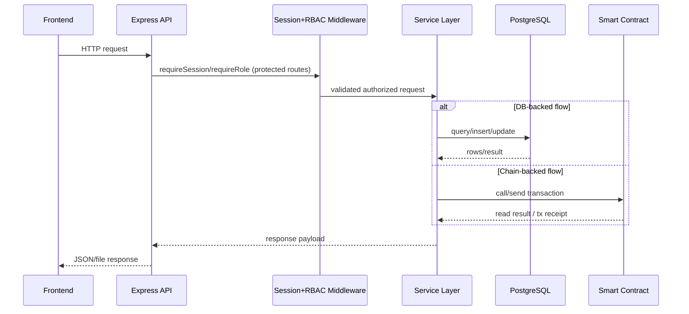

# Remaining Labs Roadmap

## Planned sequence

1. Lab 2: local Ethereum accounts and transactions.
2. Lab 3: deploy and use a classroom voting smart contract.
3. Lab 4: build the certificate registry contract and compare proof mechanisms.
4. Lab 5: add access control, security checks, and tests.
5. Lab 6: mini-project demos and presentations.

Each lab should reuse the same structure:

- concept repair
- live demo
- your reproduction
- one required modification
- short reflection

## Sequence Diagram

