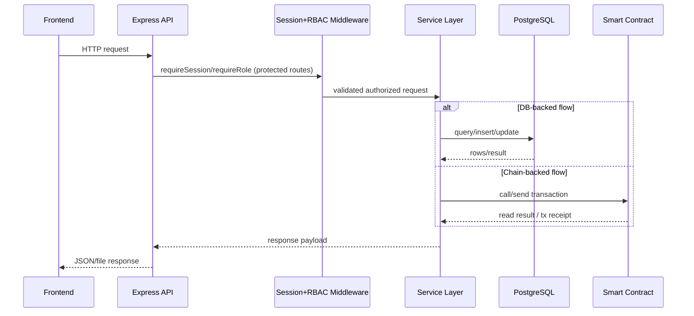

# Lab 1 Workspace

This lab is the practical entry point for the course.

## Core Documents

- [Guide guide](../../docs/lab1/LAB1.md)

## Components

- `frontend/`: static Guide UI
- `api/`: Node API that reads and writes contract state
- `blockchain/`: Hardhat config, contracts, and deployment scripts
- `python/`: hash and block simulation

## Quick Start

```bash
docker compose up -d chain api frontend pythonlab
docker compose run --rm deployer
```

## Guide Flow

1. Run the Python demo first.
2. Show the frontend health indicator.
3. Deploy the contract and refresh the page.
4. Change the stored value from the browser.
5. Preview `CertificateRegistry.sol` as the next step.

## Sequence Diagram

